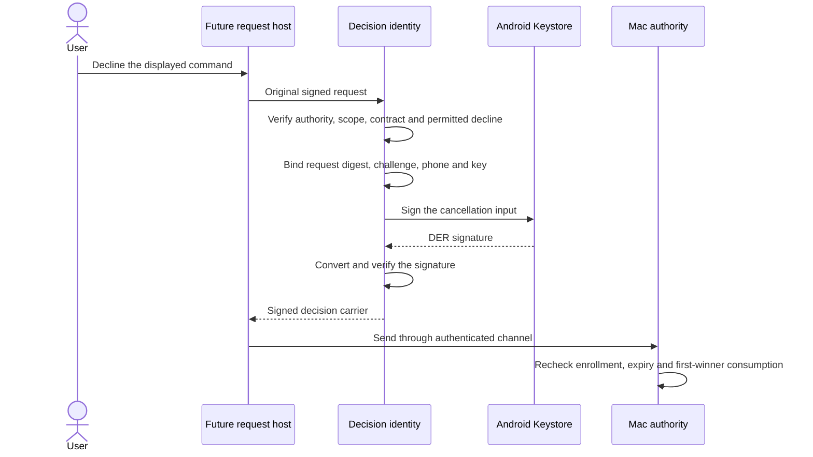

# Android decision identity

The decision key is separate from transport and biometric keys. It supplies signatures for choices that do not require biometrics. The first adapter supports an explicit command decline only.

## Key lifecycle

`AndroidDecisionKeyCreation.create` creates a fresh P-256 key with a random decision alias. It requires a worker thread and holds the shared file-owner lock throughout creation and validation. Only SHA-256 signing is enabled. No biometric prompt or authentication grace period is configured.

StrongBox is preferred. Only its typed unavailability permits a TEE attempt, and only while the alias remains absent. Existing aliases, unexpected provider errors and uncertain partial creation never trigger replacement or deletion. A failed creation can leave an unused alias for later explicit recovery.

Creation returns a public enrollment reference. It does not enroll the phone, activate a record, or grant any Mac authority. The setup flow must register it through the separately authorized enrollment transaction.

`AndroidDecisionIdentities.load` requires an active enrollment record. It checks the local alias, generated hardware custody, signing policy, P-256 curve and expected public point. Private-key encoding must be unavailable. These checks provide local evidence, not remote attestation. Missing or invalid keys fail without automatic recovery.

The self-signed certificate supplies public-key material only. It is not a transport certificate or a trust assertion. No certificate chain or certificate expiration grants decision authority.

## Signing boundary

`declineCommand` accepts the original authority-signed body. It verifies the trusted Mac/account and parses the supported command capture. Decline must appear among the captured choices. Unsupported schemas, features and request families fail before signing.

The method constructs the complete decision itself. Callers cannot select a signing purpose, key ID, phone identity or approval action. It signs the canonical cancellation input and verifies the resulting wire signature before returning a carrier. It exposes no raw signing operation. Command execution and other biometric choices remain unavailable through this key.

The enrollment host must call this method only for an explicit choice on the displayed request. It must close the identity when the enrollment is removed or its trust changes. Close prevents subsequent signatures from that handle; it does not delete the underlying key. Other active enrollments remain independent.

An issued signature proves origin, not freshness. This adapter does not discover terminal status, provide an action queue, send messages, retry decisions or consume requests. The future request host must bind UI selection to its retained session and stop stale callbacks. The Mac must independently validate current enrollment, request expiry and atomic consumption. A lost reply cannot be treated as success or retried automatically.

## Evidence and remaining work

JVM tests use disposable software keys solely to check message bindings and cryptographic conversion. They cover altered requests, wrong authorities and accounts, unsupported contracts, absent decline, invalid captures, closed handles and wrong local keys. Policy tests exercise hardware classifications and creation fallback failures.

The launcher does not create or load these keys yet. Pairing, request controls, network dispatch and phone removal integration remain separate work. Real Keystore behavior, process restart, device lock, update continuity and Pixel custody checks remain for the physical-device session.

The production biometric key and its retention policy remain separate from this decision key. The [biometric experiment](../docs/experiments/android-biometric-key.md) records those pending device checks.

Platform references: [key generation policy](https://developer.android.com/reference/android/security/keystore/KeyGenParameterSpec.Builder) and [local key information](https://developer.android.com/reference/android/security/keystore/KeyInfo).
