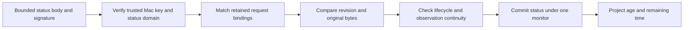

# Request status tracking

`RequestStatusTracker` reduces signed Mac status into one Android observation. It is internal, keeps state in memory, and exposes no approval or dispatch method.

## Trust boundary

Construct it only for an already authenticated issued request and the current trusted Mac authority key. The constructor keeps five bindings and the key. It does not keep the issued request or its sensitive capture.

Every update verifies a P-256 signature under the Status domain before matching the Mac, account, request, complete request digest, and challenge. A valid signature from another key or a valid status for another request cannot replace state.

The owner must discard the tracker when enrollment or the trusted authority changes. The tracker does not discover trust changes, validate enrollment, or authenticate its constructor inputs. The owner must also validate prompt-specific timing facts against the supported adapter contract.

A valid signature does not prove fresh delivery. The timing result always reports unknown delivery delay. There is no “fresh” flag or action permit. Authority-authenticated synchronization remains necessary before the application can offer live decisions after reconnect.

## Ordering and outcome rules

- Older revisions leave state unchanged.
- Equal revisions require identical canonical body bytes and do not restart timing.
- New revisions preserve the original observation, estimate, and late-observation flag. Source age cannot decrease, and reported authorization time cannot increase.
- A known deciding phone cannot change or disappear from later status.
- Coalesced updates can skip intermediate phases. Once execution is known, cancellation or expiry cannot replace its result.
- After authorization, cancellation requires explicit proof that no dispatch occurred. A confirmed executing state accepts only execution progress or a success, failure, or unknown result.
- Terminal phase, reason, event age, and deciding phone remain fixed. Later terminal snapshots may advance the displayed age, but cannot reinterpret the result.

A new terminal event cannot predate the last accepted nonterminal sample. A delayed disappearance after dispatch remains an outcome question; it is not harmless target expiry.

All checks and state replacement run under one monitor. Invalid, conflicting, and stale input cannot partially replace the accepted snapshot. Byte arrays are copied at the boundary; returned status fields expose defensive copies.

## Timing bounds

The caller supplies elapsed milliseconds from a monotonic clock that includes sleep, plus an epoch that changes when the clock origin changes. Android integration will use the platform elapsed clock; this change does not read a device clock.

The sampled Mac age plus elapsed time since receipt is a lower bound on current age. Unknown delivery time can only make the request older. The authorization time remaining is an upper bound; it never increases when a delayed update arrives.

A duplicate never replaces the timing anchor. A newer delayed sample preserves the largest known age and smallest known authorization time. Arithmetic saturates at the unsigned maximum and floors countdowns at zero.

If the clock goes backwards or its epoch differs, retain those bounds and report clock uncertainty. A status received during a regression cannot turn the backwards jump into extra elapsed time. Uncertainty remains latched even if the old clock readings return. Only a newer signed status with a valid receipt establishes a new anchor; duplicates cannot clear it. A new epoch requires a new status before timing resumes.

An elapsed target estimate remains an estimate. Neither it nor a zero authorization countdown changes the authoritative phase. The final Mac deadline still governs admission.

## Evidence and remaining integration

Eleven JVM tests use native JCA P-256 signing and the production verifier. They cover wrong keys/domains/bindings, malformed signatures, revision replay, byte isolation, timing continuity, sleep, clock changes, overflow, coalesced transitions, competing-phone metadata, and immutable terminal outcomes.

The signing helper is test-only and uses the host JDK provider. This is not evidence for Android Keystore or device cryptography.

The tracker is not yet connected to transport, an inbox, notifications, or the command inspector. Persistent trust and replay metadata, fresh synchronization, pending-capture cleanup, and UI timing remain separate integration work. It does not write an audit record or store a secret.
