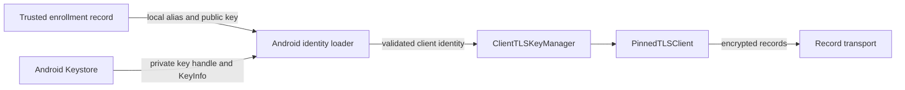

# Android transport identity

`AndroidTransportIdentities.load` reads an existing Android Keystore identity for one enrollment. It does not create keys or enable pairing.

## Local checks

The caller supplies the alias and expected local public key from trusted enrollment storage. Network messages must never select these values.

Aliases have the form `remozio.transport.v1.<32 lowercase hex digits>`. The suffix identifies a local key; it contains no account or device name.

The loader requires a generated, non-exportable P-256 key in StrongBox or the trusted execution environment. It rejects software and unknown security levels. The key must permit SHA-256 signing, with no purpose other than signing or verification. Its certificate must be current and match the expected public key exactly.

Transport keys must not require authentication, presence, or confirmation for each use. Approval and credential keys remain separate. This loader rejects such keys instead of changing their policy. It reports the existing device-unlock requirement and does not change it.

These checks are local custody evidence. They are not remote attestation. A certificate alone does not prove private key possession; the TLS handshake establishes that proof.

## TLS ownership

`ClientTLSKeyManager` offers the identity only for an EC client request with compatible issuers. It never selects a server identity. It validates the certificate lifetime at selection and gives TLS an opaque alias. Android's storage alias stays outside the manager.

The manager copies certificate arrays and uses the native private key handle without exporting it. Closing it drops owned references and prevents further selection. It cannot revoke a handle already obtained by TLS. The session owner must close existing engines and their carriers when an enrollment changes or is revoked.

A load failure returns a generic error. The loader never creates, replaces, deletes, or recovers a key. Enrollment and recovery remain future integration work.

## Evidence and limits

JVM tests cover client-only selection, issuer constraints, certificate lifetime, chain isolation, and closure. Android-module tests cover the extracted custody policy. The synthetic Swift/Kotlin TLS experiment uses this key manager for its engine connections, with disposable software keys.

These tests do not exercise Android Keystore, Conscrypt, or a physical Pixel. Hardware-backed TLS, locked-device behavior, key invalidation, and restart behavior still require the planned device session. No enrollment storage, native key generation, or app connection flow is enabled by this change.

References: [KeyInfo](https://developer.android.com/reference/android/security/keystore/KeyInfo) and [X509ExtendedKeyManager](https://developer.android.com/reference/javax/net/ssl/X509ExtendedKeyManager).
