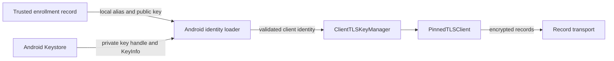

# Android transport identity

`AndroidTransportIdentities.load` reads an existing Android Keystore identity for one enrollment. `AndroidTransportKeyCreation.create` prepares a fresh local identity. Neither operation grants enrollment authority.

## Local checks

The caller supplies the alias and expected local public key from trusted enrollment storage. Network messages must never select these values.

Aliases have the form `remozio.transport.v1.<32 lowercase hex digits>`. The suffix identifies a local key; it contains no account or device name.

The loader requires a generated, non-exportable P-256 key in StrongBox or the trusted execution environment. It rejects software and unknown security levels. The key must permit SHA-256 and raw ECDSA signing (`DIGEST_NONE`), with no purpose other than signing or verification. Android TLS computes the digest before asking the hardware key to sign. The creator authorizes both digests; the loader cannot modify an existing key. Its certificate must be current and match the expected public key exactly.

Transport keys must not require authentication, presence, or confirmation for each use. Approval and credential keys remain separate. This loader rejects such keys instead of changing their policy. It reports the existing device-unlock requirement and does not change it.

These checks are local custody evidence. They are not remote attestation. A certificate alone does not prove private key possession; the TLS handshake establishes that proof.

## Fresh key creation

The creator generates a random 128-bit alias suffix for each new key. It holds a process monitor and an OS file lock through generation and custody validation. It checks for an existing alias before generation. A collision fails; it never overwrites the entry.

The generated key permits P-256 signing with SHA-256 and raw ECDSA. It requires no per-use authentication, user presence, confirmation, or unlocked device. This policy permits transport while the phone is locked. It grants no biometric approval capability. StrongBox is tried first. TEE generation follows only an explicit `StrongBoxUnavailableException` and a second check that no entry exists. Other failures and partial entries stop the operation. The loader rejects software custody even if the provider generated a key successfully.

The enrollment caller supplies the certificate validity window, which must include creation time. The creator does not select a product expiry or renew an existing identity. The certificate subject is generic and carries no account or device name.

The result contains an opaque alias, a copied public key, and the validated local identity. The authorized enrollment transaction must persist the reference with its Mac/account binding. These values alone cannot enroll a phone or replace a peer pin. Closing the result releases its key manager; it does not delete the Keystore key.

A crash or failed validation can leave an unreferenced key. The creator never guesses whether such a key was enrolled, deletes it, or retries it. Enrollment recovery and explicit key retirement need their own durable ownership records. Creation does not run automatically on load failure or app startup.

JVM tests check alias collisions, partial creation, the narrow fallback condition, failure propagation, and validity boundaries. They do not exercise real hardware generation or prove provider behavior. The planned Pixel session must verify the generated custody, raw TLS signing, locked-device use, and restart behavior.

## TLS ownership

`ClientTLSKeyManager` offers the identity only for an EC client request with compatible issuers. It never selects a server identity. It validates the certificate lifetime at selection and gives TLS an opaque alias. Android's storage alias stays outside the manager.

The manager copies certificate arrays and uses the native private key handle without exporting it. Closing it drops owned references and prevents further selection. It cannot revoke a handle already obtained by TLS. The session owner must close existing engines and their carriers when an enrollment changes or is revoked.

A load failure returns a generic error. The loader never creates, replaces, deletes, or recovers a key. Enrollment and recovery remain future integration work.

## Evidence and limits

JVM tests cover client-only selection, issuer constraints, certificate lifetime, chain isolation, and closure. Android-module tests cover the extracted custody policy. The synthetic Swift/Kotlin TLS experiment uses this key manager for its engine connections, with disposable software keys.

These tests do not exercise Android Keystore, Conscrypt, or a physical Pixel. Hardware-backed TLS, locked-device behavior, key invalidation, and restart behavior still require the planned device session. Native key generation is available to the future enrollment owner. Enrollment storage and the app connection flow remain unimplemented. No key is generated merely by starting the app.

References: [TLS digest authorization](https://developer.android.com/reference/android/security/keystore/KeyGenParameterSpec.Builder#setDigests(java.lang.String...)), [KeyInfo](https://developer.android.com/reference/android/security/keystore/KeyInfo) and [X509ExtendedKeyManager](https://developer.android.com/reference/javax/net/ssl/X509ExtendedKeyManager).
