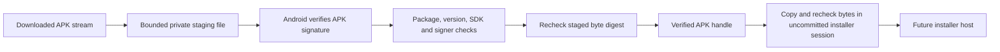

# Sideload update verification

`apkUpdateVerifier(context)` creates the Android verifier. The update host must retain one instance and close each returned handle. The host is not connected to the launcher yet. This component does not discover releases, download files, or request installation.

## Verification

The native adapter calls `PackageManager.getVerifiedSigningInfo` with APK Signature Scheme v2 as the minimum. This verifies content before package metadata is used. It separately parses the package archive and reads the installed app's signing identity. It does not trust a release-feed checksum or a certificate merely extracted from an APK.

The candidate must have the installed package name and a higher version code. It must support the current Android version, retain Android 17 as the minimum, and avoid a target SDK downgrade. Production cannot become a debug or test-only package. Split packages are rejected; release distribution must provide a standalone APK.

Unchanged signer sets are accepted. Multiple signers require exact set equality. For a single signer, the platform-verified candidate history can extend the installed signer. Returning to an ancestor signer is rejected. The installer still decides whether the rotation has the required installation capabilities. Signature continuity alone does not guarantee installation success.

## Staging and ownership

Staging runs on the IO dispatcher. It takes ownership of the input stream, including failure and cancellation. The caller must give network sources their own read deadlines; cancellation does not interrupt an arbitrary blocking stream or platform parser.

Each verifier permits one outstanding file. The default limit is 256 MiB; the host can configure it through the constructor. The copy uses a 16 KiB buffer and rejects empty or oversized input before platform parsing. The temporary directory is inside the app's private cache. The file becomes read-only before inspection. A digest recheck binds the inspected file to the original copy.

The handle exposes package metadata and size, but no file path. `copyToUncommittedSession` streams the file and checks its digest and size again. Run this blocking method off the UI thread. Its destination must be an uncommitted installer session: a failure can occur after bytes were written. The host must abandon that session on any failure and must not offer a retry that silently commits partial contents.

Closing the handle deletes its staging file and releases the slot. A cleanup failure retains the slot and reports rejection. Closing can be retried after the filesystem problem is resolved. A cleanup failure during staging requires host recovery before this verifier can accept another file. The host must also manage abandoned cache files after process death. The cache is not a durable update queue. Other code in the app process remains trusted; these checks do not defend against arbitrary code running as Remozio.

## Evidence and remaining work

JVM tests cover identity policy, forward and reverse signer rotation, multiple signers, staging bounds, changed bytes, source failures, cancellation, and handle ownership. They inject the platform inspector. They do not prove Android's native signature verification or installer behavior.

Release discovery, download policy, settings, user-facing update state, installer sessions, and production signing remain separate integration work. The Pixel session must verify tampered and incorrectly signed APKs, valid key rotation, installation refusal, cancellation, and preservation of app data and pairing keys. No real APK is installed by these tests.

Sources: [Android signature verification API](https://developer.android.com/reference/android/content/pm/PackageManager#getVerifiedSigningInfo(java.lang.String,int)), [signing history](https://developer.android.com/reference/android/content/pm/SigningInfo), and [the platform implementation](https://github.com/aosp-mirror/platform_frameworks_base/blob/main/core/java/android/content/pm/PackageManager.java).
