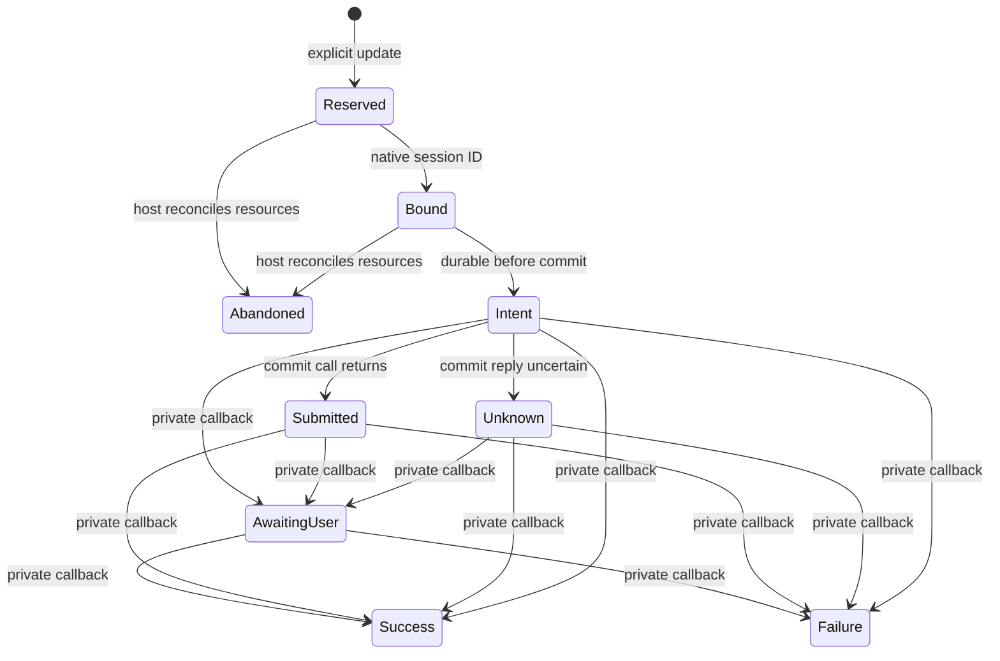
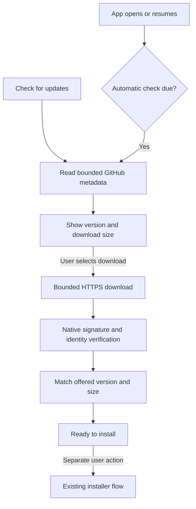

# Sideload update verification

`apkUpdateVerifier(context)` creates the Android verifier. The update host must retain one instance and close each returned handle. The application owner is connected to the launcher status card. The verifier does not discover releases or download files. The separate installer backend can submit verified bytes when a host supplies the required persistence and callback bindings.

```mermaid
flowchart LR
  Source[Downloaded APK stream] --> Private[Bounded private staging file]
  Private --> Signature[Android verifies APK signature]
  Signature --> Identity[Package, version, SDK and signer checks]
  Identity --> Binding[Recheck staged byte digest]
  Binding --> Handle[Verified APK handle]
  Handle --> Session[Copy and recheck bytes in uncommitted installer session]
  Session --> Record[Durable commit-intent record]
  Record --> Commit[PackageInstaller commit request]
  Commit --> Confirm[Android user confirmation]
```

## Verification

The native adapter calls `PackageManager.getVerifiedSigningInfo` with APK Signature Scheme v2 as the minimum. This verifies content before package metadata is used. It separately parses the package archive and reads the installed app's signing identity. It does not trust a release-feed checksum or a certificate merely extracted from an APK.

The candidate must have the installed package name and a higher version code. It must support the current Android version, retain Android 17 as the minimum, and avoid a target SDK downgrade. Production cannot become a debug or test-only package. Split packages are rejected; release distribution must provide a standalone APK.

Unchanged signer sets are accepted. Multiple signers require exact set equality. For a single signer, the platform-verified candidate history can extend the installed signer. Returning to an ancestor signer is rejected. The installer still decides whether the rotation has the required installation capabilities. Signature continuity alone does not guarantee installation success.

## Staging and ownership

Staging runs on the IO dispatcher. It takes ownership of the input stream, including failure and cancellation. The caller must give network sources their own read deadlines; cancellation does not interrupt an arbitrary blocking stream or platform parser.

Each verifier permits one outstanding file. The default limit is 256 MiB; the host can configure it through the constructor. The copy uses a 16 KiB buffer and rejects empty or oversized input before platform parsing. The temporary directory is inside the app's private cache. The file becomes read-only before inspection. A digest recheck binds the inspected file to the original copy.

The handle exposes package metadata and size, but no file path. `copyToUncommittedSession` streams the file and checks its digest and size again. Run this blocking method off the UI thread. Its destination must be an uncommitted installer session: a failure can occur after bytes were written. The host must abandon that session on any failure and must not offer a retry that silently commits partial contents.

Closing the handle deletes its staging file and releases the slot. A cleanup failure retains the slot and reports rejection. Closing can be retried after the filesystem problem is resolved. A cleanup failure during staging requires host recovery before this verifier can accept another file. The host must also manage abandoned cache files after process death. The cache is not a durable update queue. Other code in the app process remains trusted; these checks do not defend against arbitrary code running as Remozio.

## Evidence and remaining work

JVM tests cover identity policy, forward and reverse signer rotation, multiple signers, staging bounds, changed bytes, source failures, cancellation, and handle ownership. They inject the platform inspector. They do not prove Android's native signature verification or installer behavior.

Production signing and release publication remain separate integration work. The application now connects release discovery, downloads, settings, state, and callbacks. The Pixel session must verify tampered and incorrectly signed APKs, valid key rotation, installation refusal, cancellation, and preservation of app data and pairing keys. No real APK is installed by these tests.

Sources: [Android signature verification API](https://developer.android.com/reference/android/content/pm/PackageManager#getVerifiedSigningInfo(java.lang.String,int)), [signing history](https://developer.android.com/reference/android/content/pm/SigningInfo), and [the platform implementation](https://github.com/aosp-mirror/platform_frameworks_base/blob/main/core/java/android/content/pm/PackageManager.java).

## Native installer handoff

`UpdateInstaller.submit` coordinates a verified handle and the native `AndroidUpdateInstallBackend`. The backend creates a full-install session for the same package, preallocates the known size, and requires Android user confirmation. It does not uninstall the app or request data deletion. The manifest declares `REQUEST_INSTALL_PACKAGES`; no installation or permission prompt occurs at startup.

The host must supply two bindings before this path can run:

- A durable `recordCommitIntent` implementation. It must atomically store the session ID, package, and version before returning. A storage failure prevents commit.
- A private status receiver bound to that session. Android requires a mutable `PendingIntent` for this callback on current targets. The host must use an explicit private component and validate the session binding. It must handle pending user action in the foreground and reconcile terminal results.

Neither binding has a permissive default. The application owner creates this installer after an explicit install action for a staged APK. The host must own one pending update, recover its durable record after process death, and reconcile its sessions before another attempt. The coordinator serializes calls while preparing and submitting; it does not replace that persistent ownership.

Permission, concurrent-call, and pending-cleanup rejection retain the verified handle. This lets the user return from installation settings without downloading the APK again. Once preparation begins, the coordinator owns the handle and closes it on exit. Final APK cleanup runs on the IO dispatcher in a non-cancellable context, including when the caller uses the UI dispatcher. It checks the installed identity before creating a session and again after copying.

If APK cleanup fails, the installer retains that handle and publishes `cleanupRequired = true`, including after failure or cancellation. The host must keep the installer owner and observe this state. New submissions are rejected while cleanup is pending. `retryCleanup` retries only deletion, off the UI thread. It releases the verifier's slot when deletion succeeds and never repeats installation or changes a submitted/unknown result. Process-death cleanup still belongs to the recovery host.

The sequence is copy with cancellation checks, verify the digest, flush the original installer stream, close that stream, recheck eligibility, store commit intent, then commit. A failure before commit attempts to abandon the session. The backend also attempts abandonment if session setup fails. A platform cleanup failure can leave an orphan session; the future recovery host must inspect and reconcile sessions owned by Remozio. Resource cleanup errors cannot authorize a commit.

`REQUESTED` means the commit call returned, not that installation succeeded. `UNKNOWN` means the call threw after entering the commit phase. That path neither abandons nor retries the potentially active installation. Cancellation can also prevent delivery of a result after commit, which is why the durable intent record is mandatory. Closing the client session releases its resources without inferring an installation result.

JVM tests use a fake installer backend and real private staging files. They cover operation ordering, changed APK bytes, changed installed versions, permission round trips, write/flush/close failures, failed persistence, cancellation, and uncertain commit replies. Android user confirmation, callback delivery, package replacement, and data/key preservation remain untested until the Pixel session.

Installer references: [session operations](https://developer.android.com/reference/android/content/pm/PackageInstaller.Session) and [required user action](https://developer.android.com/reference/android/content/pm/PackageInstaller.SessionParams#setRequireUserAction(int)).

## Durable attempt record

`UpdateRecordStore` stores one current attempt. Reserve a verified package and version, bind its native session ID, then persist commit intent. Each reservation generates a fresh 256-bit nonce. All transitions run in a database transaction. The caller must run these blocking operations off the UI thread.

Callbacks must match both the stored nonce and session ID. They cannot complete an attempt before commit intent. The first terminal result wins. A submission return cannot overwrite an earlier callback. Reusing a native session ID does not admit callbacks from an older reservation. The private receiver must authenticate the callback capability; the store does not authenticate broadcasts itself.

An unresolved record survives reopening and prevents another reservation. Commit intent is not proof that native commit ran. Missing sessions or a changed installed version do not establish an outcome. The record never retries installation automatically. Only a terminal record can be replaced by a new explicit reservation. This latest-attempt record is separate from the approval audit log.

`AndroidUpdateRecordDatabase` uses native SQLite in `noBackupFilesDir`, with DELETE journaling and EXTRA synchronization. It checks the effective modes before use. Schema version 1 initializes only an empty database. Unknown versions, invalid fields, and corruption raise errors without deliberate database deletion or recreation. The host must surface an update recovery error without disabling normal approvals. A failed or uncertain storage commit cannot authorize native installation.

JVM tests execute the shared SQL against SQLite through a test-only JDBC adapter. They cover reopening, rollback, concurrent reservations through separate connections, stale callbacks, early callbacks, terminal ordering, and invalid stored state. They do not prove Android filesystem durability under power loss. The application owner connects native callbacks, session reconciliation, and the launcher status card. Their platform behavior still needs device validation.

Storage references: [Android SQLite configuration](https://developer.android.com/reference/android/database/sqlite/SQLiteDatabase.OpenParams.Builder) and [test driver release](https://github.com/xerial/sqlite-jdbc/releases/tag/3.53.4.0).

## Private installer callbacks

`updateStatusReceiver` binds the reserved attempt to its native session ID and returns an explicit mutable broadcast capability. The manifest receiver is not exported. Its fixed action and data URI contain the session ID and fresh nonce. The receiver rejects mismatched IDs, malformed identities, preapproval results, and unknown status codes. It also checks the stored package and phase. Free-form platform status messages are neither stored nor logged.

A single bounded worker processes callbacks off the UI thread. Accepted terminal callbacks update the durable record before notification cleanup. Notification failures cannot turn installation success into failure. An unprocessed callback or storage failure leaves the prior record unresolved; the host must reconcile it. The receiver never commits, retries, or abandons an installation.

For pending user action, the receiver retains Android's confirmation intent inside an immutable `PendingIntent` targeting a private activity. The activity rechecks the current record before opening Android's confirmation screen. The receiver does not launch an activity in the background. A separate App updates notification channel gives the user an explicit entry point. Notifications can be disabled without changing the recorded installation phase.

`UpdateConfirmationNotifications.existing` uses the fixed attempt identity and `FLAG_NO_CREATE` to retrieve an existing system token. It does not create a replacement confirmation or serialize an arbitrary intent to disk. The foreground update UI uses this lookup, including after its process restarts. Token retention is best effort: missing tokens, reboot, package replacement, and disabled-notification behavior need real-device evidence. A missing token must be shown as unavailable while the durable attempt remains unresolved. It must never trigger another installer commit automatically.

Parser tests cover canonical identities, wrong session IDs, preapproval rejection, terminal status mapping, and unknown codes. Existing SQLite tests cover callback ordering and stale attempts. Native broadcast isolation, notification taps, confirmation token recovery, and package replacement remain part of the Pixel session. The application owner and status card now use these callbacks. The update card also provides release discovery and download controls.

Callback references: [installer commit](https://developer.android.com/reference/android/content/pm/PackageInstaller.Session#commit(android.content.IntentSender)) and [system-held PendingIntent tokens](https://developer.android.com/reference/android/app/PendingIntent).

## Application owner and foreground status

`RemozioApplication` retains one lazy `UpdateHost` across activity recreation. The owner serializes operations on IO, retains one verified APK, and publishes a lifecycle-aware state flow. The launcher shows installed version separately from the recorded update outcome. It never infers a historical success from the current version.

The status card exposes install, discard, permission settings, confirmation, refresh, and cleanup actions only when applicable. Permission rejection keeps the verified download. Returning from installation settings rechecks permission and continues the user-initiated installation. A foreground install can open Android confirmation directly; leaving the foreground clears that automatic opening intent. The notification remains the background entry point. The private confirmation activity rechecks the durable attempt again.

Callback delivery signals the owner without creating it during a cold broadcast. App resume also refreshes the durable record, so a lost in-process signal does not hide a stored result. Corrupt or unavailable update storage reports an update error; it does not remove the Mac list or initialize approval credentials.

Before a new attempt, recovery can abandon only owned, uncommitted sessions for Remozio itself. It verifies their removal before marking pre-intent preparation abandoned. A committed native session blocks that cleanup. Any record at or after commit intent stays unresolved until a valid callback establishes an outcome. This owner must remain the only producer of self-update installer sessions in the app UID.

Staging uses a dedicated private `updates-v1` directory. Recovery removes only known updater directories and their `update.apk` files. It refuses symbolic links and unknown files instead of following or recursively deleting them. Cleanup failures gate new staging and expose a retry action. A failed discard retains its handle until cleanup succeeds.

Shared SQLite and owner tests cover permission return, backend setup failure, preparation recovery, unacknowledged reservations, uncertain commits, callback refresh, cleanup retries, and link refusal. The Compose surface uses existing Material 3 Expressive controls with static status text and no custom transition. Large text, TalkBack, lifecycle timing, notification taps, and actual installer behavior still need the Pixel session. The release client supplies candidate APK streams to this owner.

## Release checks and downloads

The app checks the public `rock3r/remozio` GitHub repository without a token. Stable checks use the latest-release endpoint. Prerelease checks inspect the first 30 releases and select the highest newer semantic version that has an APK. Draft releases are excluded. An empty feed or missing APK produces no offer.

Checks default to once per 24 hours when the app opens or resumes. Settings allow disabling them, selecting 1–168 hours, and including prereleases. Manual checks remain available. Failed checks also record their attempt time, so repeated resumes do not produce a retry loop. There is no background scheduler or automatic download in this implementation.

Settings show whether values come from app defaults or this phone. Reset restores defaults. They persist in private preferences and do not alter pairing state. Shared setup-file defaults are not connected yet.

Downloads use a fixed repository/tag/asset path rather than a feed-provided URL. Redirects require HTTPS and an explicit GitHub host allowlist. Connections have 10-second connect and 15-second read timeouts. Metadata has a 2 MiB limit, a nesting limit, and a 60-second elapsed budget. APK reads have a 256 MiB limit and a 30-minute elapsed budget. Elapsed and cancellation checks run between blocking operations; a blocked read can wait for its timeout. Platform DNS resolution is not guaranteed to obey that connect timeout.

Cancel closes the stream and discards staging. A cleanup failure remains visible and blocks another download until resolved. Repeated download actions share the active job. Download completion never starts installation. Feed metadata is only a discovery hint: the APK must independently pass native signature, package, SDK, signer-continuity, and version-code checks. Its version name and byte count must also match the selected offer.

See the [release preparation procedure](releases.md) for the optimized build, signing, and artifact checks.

### Release artifact contract

Publish one standalone signed APK named `remozio-android.apk`. Use a three-part semantic version tag, optionally prefixed with `v`. The APK version name must equal the tag without that prefix. Each update must increase both semantic precedence and Android version code; build metadata alone does not make a newer offer. Debug builds cannot install the production package because their package IDs differ.

HTTP fixture tests cover release selection, invalid metadata, redirects, limits, closure, and cancellation. Owner tests cover check intervals, explicit download/install separation, candidate mismatch, cancellation, and retry. No test downloads a public APK or contacts a device. Live GitHub/CDN transfer, Android networking, settings accessibility, and installation remain in the interactive validation checklist.

API reference: [GitHub releases](https://docs.github.com/en/rest/releases/releases).
