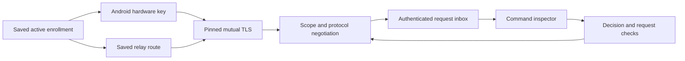

# Android command connection owner

`CommandConnection` owns one active, trusted Mac enrollment and its in-memory request inbox. The setup owner must close it before replacing or removing that enrollment. It cannot promote a prepared enrollment or change a peer pin.

The native factory combines the saved Access credential, HTTPS WebSocket carrier, Android transport identity, inner TLS client, negotiated channel, and request receiver. It uses inner ALPN `remozio/1`. A production Mac listener must require that same identifier. The experiment identifier remains separate.

The connection advertises only command schema 1 on approval wire version 1. It does not advertise UI capture or audit capabilities. The saved Mac, account, phone, and enrollment epoch must match the peer offer. The maximum payload covers the configured request and status bounds plus the approval envelope. The inner handshake has a 1 MiB resource bound.

## Connection lifetime

The foreground or push-wake host calls `run` for one connection attempt. Concurrent attempts are rejected. Cancellation, EOF, or failure releases the socket and identity handle. The inbox survives disconnection so reconnect cannot reset a request's timer or terminal state. Closing the owner cancels connection setup and invalidates every retained request handle.

Connection state reports only connecting, connected, disconnected, or closed. It makes no claim about Mac presence or request completion. This owner does not retry connections or decisions automatically. A host can explicitly run another connection attempt.

## Outgoing decisions

The inspector receives an approval context from the owner. Before a write, the owner checks that the request handle belongs to its inbox. It then rechecks the pending status, remaining authorization bound, exact decision body, phone identity, enrolled key, action, purpose, and signature. Execute uses the biometric key; decline uses the independent decision key. Writes serialize on the negotiated channel.

A retained decision can be sent again explicitly after reconnect. The exact bytes remain unchanged. Successful local transport processing is not proof of Mac acceptance. The Mac must still enforce current enrollment, expiry, replay protection, and the first accepted decision. A terminal update can race with a write; the Mac remains authoritative.

## Validation and remaining wiring

Synthetic JVM tests exercise exact decision delivery, signature rejection, request ownership, expiry, reconnect preservation, write serialization, and cancellation during setup. They use disposable software keys, not Android hardware or real approvals.

The application launcher does not yet instantiate this owner. Stored-enrollment selection, foreground and push-wake scheduling, current-enrollment invalidation, LAN selection, and the Mac production listener remain integration work. The factory currently requires a saved relay route. Pixel hardware TLS and real end-to-end behavior remain unproven.
