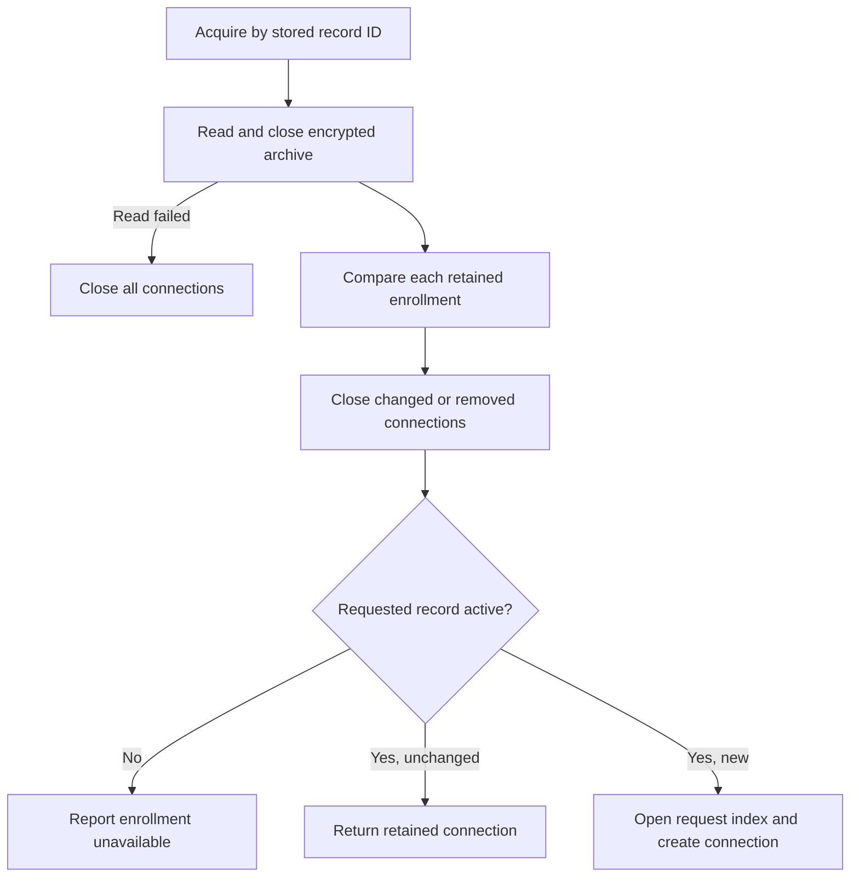

# Android command connection ownership

`StoredCommandConnections` owns one command connection per active enrollment. The application host must retain this registry across screen recreation. The launcher integration will supply the native factory and the shared enrollment mutex.

The comparison includes the Mac, account, phone, epoch, public keys, local key references, wake tag, relay route, credentials, and enrollment phase. A display rename alone does not replace a connection. The UI must read the current display name from the inventory.

An acquisition reads the entire archive under the same mutex used by enrollment writers. This detects changes to other Macs as well as the requested Mac. It never provisions an enrollment store. Factory and archive operations run on the I/O dispatcher.

Setup must invalidate the registry before committing enrollment changes. Call `invalidateLocked` while holding the shared enrollment mutex, or call `invalidate` when no enrollment transaction is active. This prevents old callbacks from authorizing against changed trust. A later acquisition also reconciles persisted changes. It does not continuously watch external archive modifications.

Ordinary network failures do not close the registry or reset request state. Callers may run a retained connection again. Callers must not close individual connections; the registry owns their lifetime. Acquiring a connection does not start a network operation or send a decision.

Tests cover shared ownership, multiple Macs, replacement order, archive failures, recovery, prepared and removed enrollments, and failed construction. Enrollment comparison tests include relay credential changes. Physical device behavior and launcher wiring remain pending.
