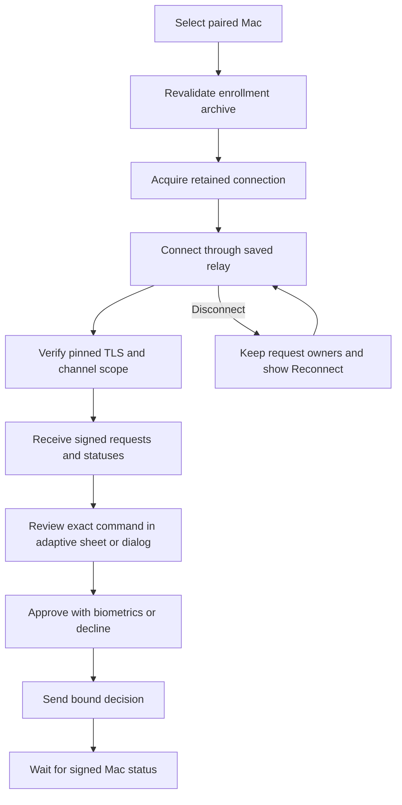

# Android live command screen

An active Mac card now opens its command inbox. The screen acquires the application-owned connection and runs it while the screen is started. Leaving the screen cancels network delivery. The registry retains the authenticated request owners for a later visit.

The connection label does not claim Mac presence. Offline requests retain their last observed status, including the existing age and authorization countdown. Reconnect never resends a decision automatically. A replacement connection waits for the previous run to release its wire.

The screen uses the existing Material 3 controls and adaptive command inspector. It shows full command details in the inspector. List rows identify individual requests and display signed status. Prepared enrollments cannot open a connection.

## Initial capture limits

The app allows 2,097,152 capture bytes and 262,144 CBOR items. Request bodies allow 65,536 more bytes, and signing envelopes allow another 65,536. Request and signing envelopes allow 4,096 CBOR items. Status messages allow 65,536 bytes and 4,096 items. Every decoder has a depth limit of 32. These are initial runtime defaults; settings controls remain to be connected.

A synthetic experiment on Apple Silicon with macOS 27.0.1 reported `kern.argmax` and `ARG_MAX` as 1,048,576. Unprivileged `/usr/bin/true` accepted a 1,044,480-byte argument or environment value, 65,536 short arguments, and 32,768 synthetic environment entries. Larger tested inputs returned `E2BIG`. This is evidence for that host, not a macOS 26 runtime result.

Tests parse the measured large argument and collection counts without truncation. They also reject an oversized capture and verify protocol overhead capacity. The defaults do not promise support for unbounded ancestry, rationale, or other capture metadata.

The application shares an 8 MiB canonical-capture budget and a 262,144 retained-element budget across all Mac connections. Each request also reserves metadata capacity. Parsed byte arrays add heap overhead beyond canonical bytes; the element budget bounds collection growth separately. One shared parsing monitor prevents concurrent request parsing from multiplying transient allocations. The capture decoder rejects oversized collection counts before constructing their elements. Its 262,144-item bound also limits temporary parsing; envelope decoders allow only 4,096 items.

A signed terminal status releases capture capacity. Retirement or enrollment closure also releases metadata capacity. Duplicate requests reuse their reservation. At capacity, the app retains existing requests and shows a distinct capacity message. It discards the new capture and continues receiving authenticated statuses. It does not accumulate a queue or a set of omitted request IDs. Statuses for unowned requests are authenticated and discarded after a capacity rejection; they cannot create owners or grant action authority. The message remains visible for that connection attempt, even if later delivery succeeds. Reconnect starts another attempt and clears the message; a repeated capacity rejection shows it again. This is not a claim that a complete request snapshot was received. It does not silently evict pending requests or resend decisions. These accounting bounds are not a measured Android heap-size guarantee.

## Remaining integration

Pairing setup must populate the archive before this screen can connect. It currently uses the enrolled relay; LAN preference and push wake delivery remain separate integration work. Capture-limit settings and distinct remote oversized-request reporting remain pending. Issue #132 still tracks capacity and storage recovery beyond the current generic connection error. Device end-to-end behavior remains unverified.

## Complete stream inspection

The Android command channel explicitly offers capture schemas 1, 2, and 3 with no additional features.
The existing sheet on compact windows and dialog on wider windows both use the same inspector.
Schemas 1 and 2 retain their existing input display; the app does not invent uncaptured output details.

Schema 3 shows standard input, standard output, and standard error in separate sections.
Each section shows its captured source, access mode, all enabled portable flags, observed path, identity, and binding.
Routing text distinguishes a private command terminal from the retained original source.
The inspector shows the separate caller terminal, its session and device, or an explicit absence description.
The captured routing mask remains available with the other bindings.
Paths remain escaped descriptive values. The existing exact-byte toggle includes all source paths.
Input content remains uncaptured. The layout does not change decision controls, biometric requirements, or terminal-status cleanup.

Three static debug previews use bytes copied from the shared schema-3 vectors: mixed terminal routing, redirected streams, and all portable flags.
They create no enrollment and offer no approval action.
Presentation tests compare all 39 valid shared vectors with their independent role, kind, access, flag, and mask expectations.
The tests also preserve the legacy display boundary and the explicit supported capability set.
The local native/Python gate and all six Kotlin/Android tasks pass.
API 37 emulator checks show the compact light sheet, the dark sheet at font scale 1.3, and the wide dark dialog at font scale 1.3.
The captured screenshots show mixed routing, original append output, separate terminal metadata, and all four portable flags.
These are synthetic previews. Physical Pixel, TalkBack, real biometric, and installed Root end-to-end checks remain deferred.
