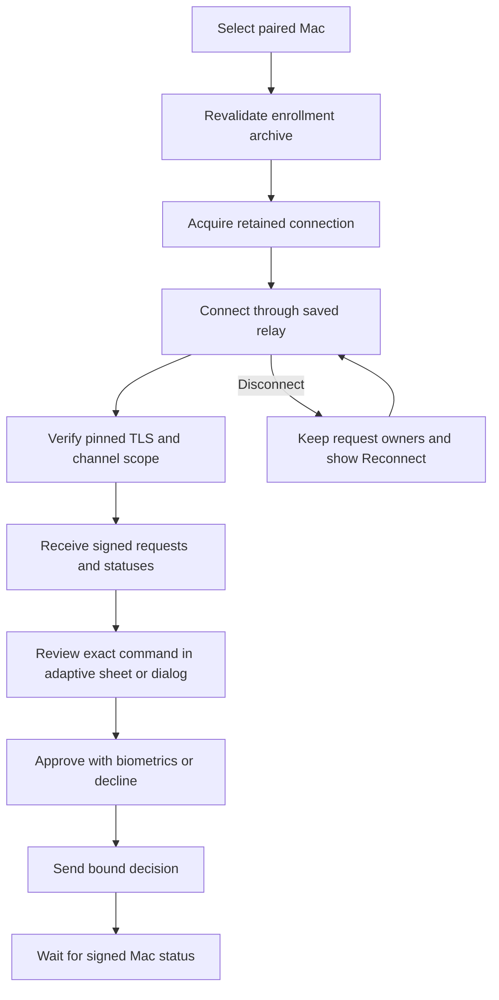

# Android live command screen

An active Mac card now opens its command inbox. The screen acquires the application-owned connection and runs it while the screen is started. Leaving the screen cancels network delivery. The registry retains the authenticated request owners for a later visit.

The connection label does not claim Mac presence. Offline requests retain their last observed status, including the existing age and authorization countdown. Reconnect never resends a decision automatically. A replacement connection waits for the previous run to release its wire.

The screen uses the existing Material 3 controls and adaptive command inspector. It shows full command details in the inspector. List rows identify individual requests and display signed status. Prepared enrollments cannot open a connection.

## Initial capture limits

The app allows 2,097,152 capture bytes and 1,048,576 CBOR items. Request bodies allow 65,536 more bytes, and signing envelopes allow another 65,536. Status messages allow 65,536 bytes and 4,096 items. Every decoder has a depth limit of 32. These are initial runtime defaults; settings controls remain to be connected.

A synthetic experiment on Apple Silicon with macOS 27.0.1 reported `kern.argmax` and `ARG_MAX` as 1,048,576. Unprivileged `/usr/bin/true` accepted a 1,044,480-byte argument or environment value, 65,536 short arguments, and 32,768 synthetic environment entries. Larger tested inputs returned `E2BIG`. This is evidence for that host, not a macOS 26 runtime result.

Tests parse the measured large argument and collection counts without truncation. They also reject an oversized capture and verify protocol overhead capacity. The defaults do not promise support for unbounded ancestry, rationale, or other capture metadata.

## Remaining integration

Pairing setup must populate the archive before this screen can connect. It currently uses the enrolled relay; LAN preference and push wake delivery remain separate integration work. Capture-limit settings and distinct remote oversized-request reporting remain pending. Issue #132 still tracks capacity and storage recovery beyond the current generic connection error. Device end-to-end behavior remains unverified.
