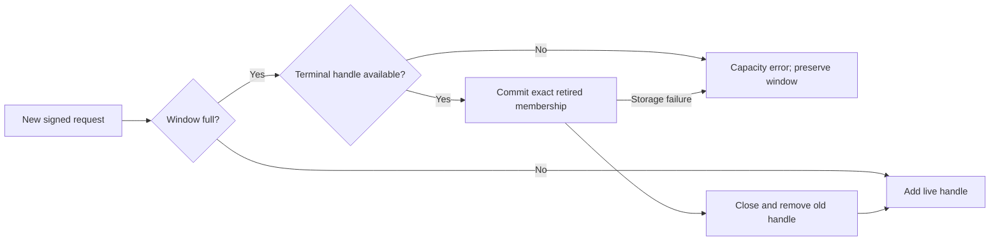

# Android request-window retention

The live inbox retains active requests and recent completed results. At capacity, a new authenticated request can replace the oldest retained terminal result. A nonterminal request is never removed to make room. A terminal unknown outcome stays unknown when its handle is retired.

Before removing a terminal handle, the inbox commits its request ID and digest to a retirement index. Failure preserves the existing window. A successfully retired ID cannot be admitted again. A different request digest under the same ID is a conflict. Repeated requests and statuses still require valid authority signatures and matching scope; they cannot recreate a live handle or reset its timer.

Recent terminal handles remain visible until capacity requires retirement. Retirement closes the old handle, so stale UI and decision callbacks cannot use it. It is not a new request outcome. Detailed historical results belong to the separately encrypted audit history.

## Android storage

The Android connection factory owns an exact SQLite index in app-private, no-backup storage. Its file name binds the enrollment record, Mac, account, epoch, and authority key. Each row contains a SHA-256 request-ID key and the 32-byte request digest. It stores no command, capture, credential, status, or audit record.

Queries retrieve one bounded digest. The index is not loaded into memory. Transactions use the delete journal and extra synchronization. An OS file lock excludes competing owners. A failed write quarantines that open index until it is closed and reopened. Schema initialization is transactional. A pristine version-0 database can finish initialization after an interruption. A version-0 database with any schema object, corruption, or an unsupported version fails without recreating the database.

The index grows with retired requests and has no automatic eviction. Its small opaque records are independent of audit-history retention. Filesystem exhaustion is a storage failure, not permission to discard active requests or suppress an error. Local app storage is trusted; this index is not a replacement for the Mac's durable consumption ledger. Restoring an entire old backup remains outside the agreed guarantee.

Call the native factory off the main thread. Closing its connection owner closes the retirement database. Trust replacement needs a new owner and index scope. Callers that omit a retirement index retain the existing strict window bound.

## Evidence and remaining checks

Synthetic receiver tests process 200 distinct requests through a 128-handle window. They test old pending and terminal repeats, invalid signatures, active-window exhaustion, retirement write failure, and index read failure. The retained active request's status remains unchanged.

JVM SQLite tests cover reopen persistence, duplicate and conflicting IDs, an uncertain commit result, malformed rows, and an unsupported schema. Android SQLite initialization and crash recovery still need physical-device validation. The launcher must expose capacity and storage failures as recoverable states. This change does not add launcher selection, background scheduling, or an audit-history view for retired results.
