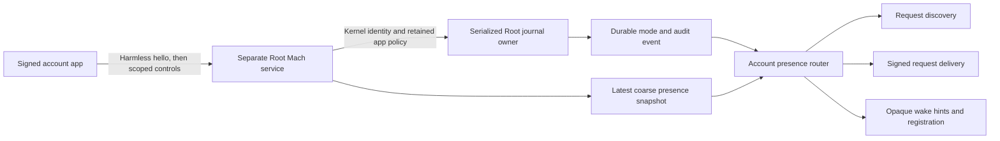

# Account presence runtime

This slice connects durable routing modes to request discovery, signed delivery and wake publication. It adds a separate app control interface and Mac menu/settings controls. It does not install or activate a service on the test host.

The app and transport have different interfaces and service identities. Phone and transport messages cannot set Present or Automatic. The existing signed phone Away control remains separate. Every app invocation must pass the kernel connection check and the current retained app policy. Root also validates its own code before accessing the journal.

Each mutation contains the configured Mac/account IDs, Root clock epoch, connection ID and the next operation sequence. A mode change also contains the last observed journal revision. Root commits its audit event and mode before replying. A revision conflict returns current state and requires a fresh user action. The client never retries a mode change automatically after a lost reply.

The app displays only confirmed Root state. Connection loss clears current state. Reconnection reloads Root-owned public metadata and reads the mode again. No UserDefaults value can claim a successful mode change. This app slice reads `/Library/Application Support/Remozio/presence-client-<uid>.cbor`; protected installation must create that metadata.

Observations contain coarse signals only: usable remote workspace, lock state, bounded display states and last qualifying input time. Missing values stay unknown. All supplied values share one sample moment. Root rejects stale/future samples and mixed epochs. An old connection cannot withdraw a newer connection's observation. Automatic fallback and its grace interval use the existing presence policy.

## Component evidence

- The source-backed delivery test uses a real request coordinator and verifies the returned signature. It checks manual modes, fresh/expired observations, a presence change during the signing callback, and access to an already delivered request.
- Endpoint tests use the real journal. They check authenticated admission seams, scope/connection/sequence isolation, code-policy changes, revision conflicts, expiry and observer withdrawal.
- Client tests check negotiation, reply freshness, cancellation, invalid receipts and lost replies. The combined client/endpoint test commits a mode change, discards its reply and confirms it after reconnect without another write.
- Mac Debug and Release build checks compile the controls and inspect bundle/signature/runtime metadata. They do not launch the GUI or prove Developer ID deployment.

The in-process fixtures replace kernel invocation validation and Root self-code validation with explicit seams. Their results do not prove those platform checks. Software fixture signing is not a production custody fallback.

## Remaining integration and physical gates

- Protected installation must provision the distinct app service, app/Root code pins, account UID and both configuration files. The existing authority executable still selects its trust-service runner; selecting the account presence owner remains unfinished.
- The GUI controls use the authenticated channel. A platform observer has not been connected to it. Automatic mode therefore reports detector unavailability until a verified observer supplies observations; it does not infer unlocked state from absent fields.
- Qualify lock transitions, zero brightness, sleep/wake, idle accounting and exclusion of Remozio's own activity. Test usable Chrome Remote Desktop and Screen Sharing sessions, including reading without input and disconnect transitions. Process or listener existence is not a usable remote desktop signal.
- Test native Mach service registration, installed service accounts, signed code floors, audit sessions, cross-connection calls, logout/restart and update recovery. See [the installed-account gate](https://github.com/rock3r/remozio/issues/286).
- Validate controls and offline presentation in the installed GUI. These physical/device checks wait for the user's interactive session.
