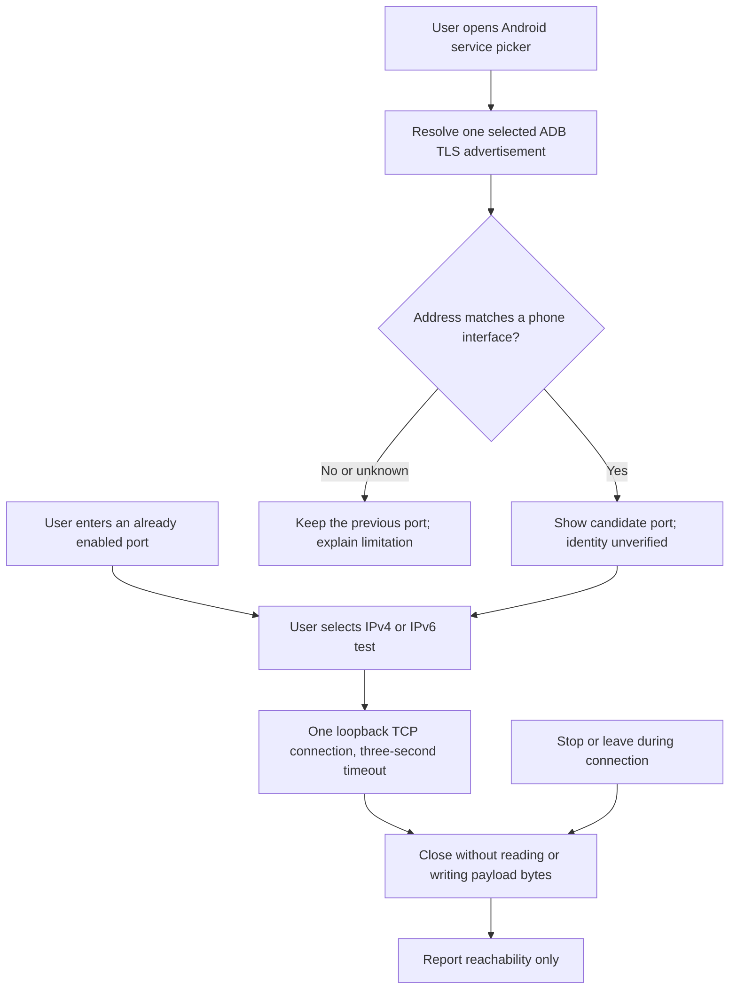

# Android local ADB endpoint experiment

The debug app has a **Local ADB endpoint experiment** entry. The release source set excludes the screen and its network probe. The [Pixel observations](evidence/2026-10-03-pixel-platform.md) record own-phone discovery and IPv4/IPv6 loopback reachability. Wi-Fi-off operation and bridge lifetime remain untested.

This prepares the first section-19 feasibility check: discovery and loopback reachability from an ordinary app targeting Android 17. It does not implement the deployment bridge.

## Boundaries

Discovery uses Android 17's system picker for `_adb-tls-connect._tcp`. It does not request broad LAN permission or scan addresses and ports. Android can retain the service permission from the user's selection. This is a platform permission, not ADB pairing or a Remozio enrollment.

A selected advertisement is compared with the phone's interface addresses. A matching non-loopback unicast address can populate the port field. Empty, oversized, foreign or unsupported results cannot populate it. The probe does not display or log service names, advertised addresses, TXT attributes or provider error messages. The system picker owns its selection UI. An advertisement can be forged; a match never proves that the port belongs to adbd.

The socket test accepts only a numeric port from 1 to 65535. Its destination is constructed from the literal address bytes for `127.0.0.1` or `::1`. It never connects to an advertised address, resolves a hostname, sends an ADB handshake, pairs a host, installs a package or enables debugging. A successful connection means TCP accepted the connection. It proves neither ADB identity nor authorization.

Each test has one attempt and a three-second connection timeout. Stop closes the socket before cancelling its coroutine. Leaving the screen during a connection also stops it. Late results cannot replace a newer operation. No result or port survives activity recreation through saved state.

The system picker may cover the activity, so discovery is not cancelled merely because the screen stops. It ends after selection, dismissal, explicit cancellation, destruction or a 90-second experiment timeout. Selection never starts a connection automatically.

The UI uses the existing Material 3 Expressive theme and standard controls. There is no custom animation. Results have a static text representation and a polite accessibility announcement. Large text, keyboard layout, predictive Back and animation-disabled behavior need the physical session.

## Pixel procedure

Use the debug APK on a Pixel with Android 17 or later during the agreed interactive session. Do not collect device serials, passwords, tokens or network addresses in committed evidence.

1. Open the experiment with wireless debugging disabled. Check the picker dismissal and timeout states. Neither may claim a local ADB endpoint.
2. Enable wireless debugging through Android Settings and note its current connection port. Open the system picker and select this phone if it appears. Record whether the returned address matches a local interface. Do not select another device as a substitute.
3. Test the current port on IPv4 and IPv6 separately. Record accepted, refused, timed out, denied or unavailable. The two families need not behave identically.
4. Stop during a connection attempt, leave the screen, and rotate it. A late callback must not display success for the abandoned operation. Return and explicitly start a new test.
5. Change the wireless debugging port by restarting that Android feature. Repeat discovery and the manual test. Do not reuse an old port as evidence of the new endpoint.
6. Turn Wi-Fi off and mobile data on. Repeat the old wireless port check and record the result without assuming it remains available.
7. If an authorized ADB path has already provisioned a legacy listener, enter its actual port and repeat the loopback checks with Wi-Fi off. This probe cannot start that listener. Legacy TCP ADB does not use the TLS discovery advertisement.
8. Repeat after an app update and device restart. Record the actual Android state; this screen performs no automatic recovery.

Record only device family, Android/API version, app target SDK, transport mode, Wi-Fi/mobile state, address family, selected-port match classification and result. Treat a timeout as ambiguous. Do not label it a permission denial without independent evidence.

## What remains unproven

- Own-phone discovery on other supported configurations; one Pixel exposed its service in the recorded experiment.
- Whether a picker grant for an advertised interface address affects loopback access. They are different destinations.
- ADB protocol identity, host authorization, listener exposure beyond loopback and legacy-listener lifetime.
- Foreground-service eligibility and survival during idle, Doze, lock, force-stop, update and network changes.
- Cloudflare Access, end-to-end encryption, bandwidth priority, installation outcomes, Stop and multi-Mac admission.

These later checks remain necessary before bridge implementation relies on the platform behavior. A successful TCP probe does not satisfy the complete bridge feasibility gate.

## Host validation

Unit tests validate numeric ports, address classification, literal loopback destinations, typed failures, socket cleanup and cancellation races. A disposable local test listener verifies that the probe closes without transmitting payload bytes. This synthetic listener is unrelated to ADB and contacts no phone.

Build and lint checks validate the Android 17 APIs and debug source-set wiring. They do not prove runtime permission behavior or discovery on hardware.

References: [Android local-network permission](https://developer.android.com/privacy-and-security/local-network-permission), [system NSD picker](https://developer.android.com/reference/android/net/nsd/NsdManager), and [ADB wireless debugging](https://developer.android.com/tools/adb).
