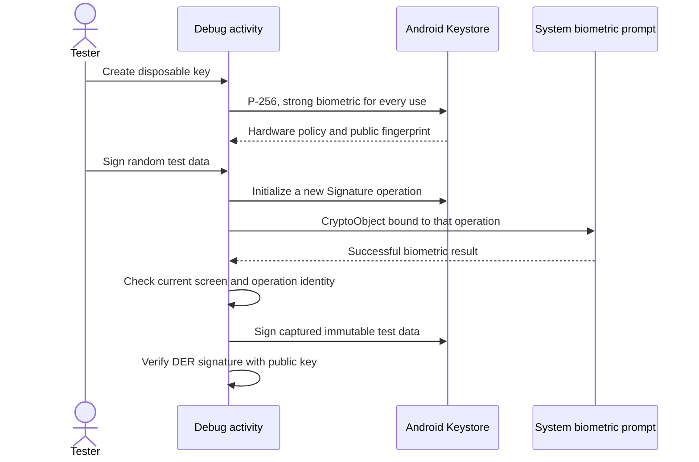

# Android biometric key experiment

The debug app has a **Biometric key experiment** button. The release app excludes the probe, its activity, and its permission.

The [recorded Pixel session](evidence/2026-10-03-pixel-platform.md) covers synthetic signing and selected lifecycle cases. Build results alone do not prove hardware policy enforcement.

## Scope and policy

The fixed alias is `remozio.debug.biometric-probe.v1`. Creation preserves an existing alias. Deletion removes only this alias. All key creation and deletion runs on one process-wide worker, including across activity recreation. A stopped screen discards its result. A native key operation may still finish; inspect the alias after returning.

Generation first requests StrongBox. Only `StrongBoxUnavailableException` permits a TEE attempt, and only if no alias exists. Inspection rejects software or unknown security levels. It checks non-exportability, hardware enforcement of authentication, per-use strong biometrics, and the unlocked-device requirement. An unexpected policy fails visibly. Its debug report includes only primitive policy flags and numeric values, never provider messages or key material. Inspection preserves the authentication and hardware requirements and leaves the existing key intact. It accepts both -1 and 0 as per-use authentication representations; positive authentication windows remain rejected. An invalid key is not silently replaced.

The probe requests `setInvalidatedByBiometricEnrollment(false)` to measure pairing retention. This is not a selected production invalidation policy. Reported enrollment invalidation does not prevent testing the independently checked signing policy. The result always labels enrollment retention unproven until the explicit lifecycle test succeeds. Local `KeyInfo` and a null private-key encoding do not constitute remote attestation or backup/clone resistance evidence.

Each biometric operation captures fresh random synthetic data. The success callback must match the current operation and its `Signature` object. Stopping or replacing the activity invalidates the operation and cancels the prompt. No real request, password, pairing, network, audit event, or decision is involved.

The provider produces a DER ECDSA signature, which the probe verifies locally. Protocol P1363 conversion and one-biometric credential release remain separate work. No shared authentication grace period or second biometric prompt is assumed.

## Later physical test checklist

Use a Pixel with Android 17 or later. Install the debug APK during the agreed interactive session.

1. Create the key. Record only the reported hardware level and public fingerprint. Check that a second Create keeps the fingerprint.
2. Sign twice. Each new operation must show its own strong biometric prompt. Each completed signature must verify.
3. Immediately select **Try a new signature without a prompt**. Authentication must be required. A success is a failed experiment.
4. Cancel the prompt. Repeat while leaving the app and while rotating the device. No stale callback may report a successful signature on return.
5. Restart the app and inspect the same fingerprint. Repeat after an APK update signed by the same debug signing key.
6. Change biometric enrollment through Android Settings. Inspect and sign again. Record retention or invalidation without assuming the requested policy guarantees retention.
7. Delete the probe key. Inspection and signing must fail until explicit creation. Create again and confirm a new fingerprint.

Do not change device credentials or biometrics automatically. Do not treat a provider error as a successful no-prompt denial: only a typed `UserNotAuthenticatedException` or Android `KeyStoreException.ERROR_USER_AUTHENTICATION_REQUIRED` in the bounded cause chain earns that result. Signature providers can wrap these failures. Other errors need diagnosis.

## Validation boundaries

Host unit tests cover operation invalidation and rejection of stale completion. Build and lint validate API use and source-set wiring. They cannot test secure hardware, biometric enrollment, prompt timing, process death, or APK-update continuity. The recorded Pixel session covers a subset of these cases; enrollment changes and the remaining lifecycle cases are still pending.

API references: [KeyGenParameterSpec.Builder](https://developer.android.com/reference/android/security/keystore/KeyGenParameterSpec.Builder), [KeyInfo](https://developer.android.com/reference/android/security/keystore/KeyInfo), and [BiometricPrompt](https://developer.android.com/reference/android/hardware/biometrics/BiometricPrompt).

## Android 17 observation

On 2026-10-03, a Pixel 11 Pro running Android 17/API 37 reported a StrongBox key with hardware-enforced biometric authentication, no private-key encoding and an unlocked-device requirement. It reported authentication validity 0 and enrollment invalidation true. The old probe rejected these metadata values before any signing test; that error did not establish failed key generation.

Android's public `KeyInfo` reference documents -1 for per-use validity, while the current [Keystore2 reader](https://android.googlesource.com/platform/frameworks/base/+/refs/heads/main/keystore/java/android/security/keystore2/AndroidKeyStoreSecretKeyFactorySpi.java) initializes absent timeout metadata to 0. The [parameter writer](https://android.googlesource.com/platform/frameworks/base/+/refs/heads/main/keystore/java/android/security/keystore2/KeyStore2ParameterUtils.java) omits the timeout for per-use keys. The probe accepts either representation with all other signing constraints intact. Source inspection does not replace the required no-prompt rejection and fresh-biometric signing tests.

Enrollment invalidation is reported separately. Its observed value does not establish actual key behavior after biometric enrollment changes. The probe neither deletes the existing key nor selects a production recovery policy from that flag.

## Recorded Pixel session

The [2026-10-03 evidence](evidence/2026-10-03-pixel-platform.md) records verified synthetic signatures, unauthenticated rejection, cancellation, restart continuity and key identity after a debug APK update. Enrollment retention and production integration remain unproven.
