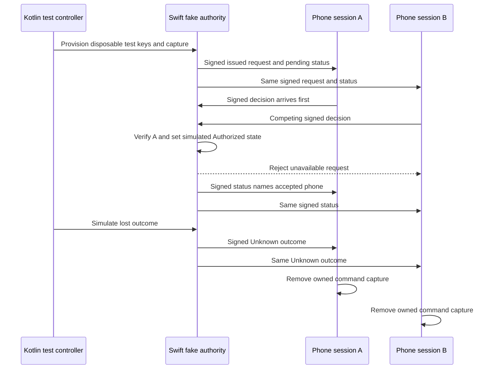

# Synthetic approval flow

This harness joins the native Swift authority verifier with the Kotlin request owner used by Android. It exchanges real canonical request, decision, and status bodies with P-256 signatures. It uses child-process pipes, synthetic identities, and an invented command capture. It never executes the captured command.



## Run

Use an Apple Silicon Mac, Xcode with a macOS 26 or later SDK, and JDK 21:

```sh
python3 scripts/build-approval-flow.py
./gradlew :phone-core:test :phone-core:approvalFlowTest
```

The native build is also part of `scripts/check.sh`. The Mac CI job runs the integration task after building it. The Kotlin CI job runs the portable phone tests on Linux. Android consumes the same `phone-core` module.

The build script normalizes the executable path to `.build/approval-flow/ApprovalFlowPeer`, independent of SwiftPM's build-directory layout. Its build log is `.build/approval-flow/swift-build.log`. The peer refuses root execution. The test controller bounds response waits and terminates its child after each case. No app, device, or network endpoint is contacted.

## Trust and simulation boundary

The test controller generates disposable Mac and phone keys in memory. It supplies the Mac private scalar through the private test-control pipe, and pins the corresponding public key independently of the peer's response. The Swift peer signs through CryptoKit; Kotlin signs through the host JDK. No key is written to a fixture or included in a release app.

This bootstrap is test provisioning, not a pairing protocol or a production trust channel. Control messages for revocation, clock changes, and outcome loss exist only in the harness. A key labelled Biometric in this fixture is an ordinary disposable test key. These checks do not prove Android Keystore protection, biometric consent, Secure Enclave custody, or application signatures.

The peer keeps one request in memory and serializes input from its pipe. After `DecisionVerifier` accepts a decision, the peer changes its simulated lifecycle phase. The harness queues both phone decisions before reading either response and repeats with each arrival order. It does not establish durable consumption, crash recovery, rollback protection, or a production dispatch permit. The separate journal experiment retains those open gates.

The final Unknown status comes from an explicit simulated outcome-loss event. It is not inferred from a timeout, and no command or UI action occurs.

## Cases

Six integration tests cover:

- Either phone wins when its valid decision arrives first; a competing decision and a replay cannot win again.
- Both phone sessions accept the same signed status, retain the winning phone, and clear captures on Unknown. Replayed pending status cannot restore details.
- Revoking one phone rejects its decision while leaving the other able to decide.
- The retained Mac deadline rejects an otherwise valid phone signature.
- Altered request bindings and a wrong signing purpose leave the request available for a later valid decision.
- A narrow decision key cannot authorize a command, and tampered Mac status cannot replace verified phone state.

Transport authentication, encrypted channels, fresh reconnect synchronization, persistent trust, durable atomic admission, real device keys, and target execution remain outside this experiment. The harness establishes interoperability of the current production codecs and verifiers, not completion of the full approval product.

The Kotlin peer signs with standard `SHA256withECDSA` DER output. The shared strict P-256 converter produces the 64-byte wire signature consumed by the Swift verifier. This exercises the format conversion needed by Android Keystore without claiming hardware-backed signing on the host JVM.
