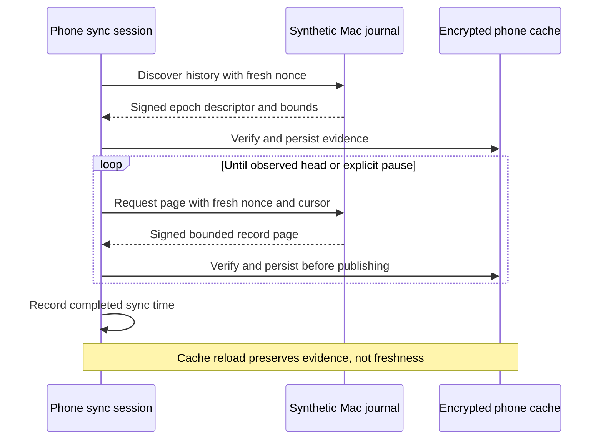

# Synthetic audit flow

This harness connects the Swift `AuditReplyBuilder` to the Kotlin `AuditSyncSession` used by the phone core. It exchanges canonical signed history replies and record pages through child-process pipes.



## Run

Use an Apple Silicon Mac, Xcode with a macOS 26 or later SDK, and JDK 21:

```sh
python3 scripts/build-approval-flow.py
./gradlew :phone-core:approvalFlowTest
```

The existing integration task runs six approval tests and four audit tests. The native check script builds both peers. Mac CI runs both suites; portable Linux tests exclude them. Missing peer executables fail the task.

The audit executable is `.build/approval-flow/AuditFlowPeer`. Its build log is `.build/approval-flow/swift-build.log`. The peer rejects root execution and bounds input before decoding it. The test controller bounds output and response waits, then terminates each child.

## Cases

- Sync two pages, pause at an explicit response budget, and resume. Reload encrypted evidence without restoring a claim of current freshness.
- Restore a shorter journal into a new linked epoch. Preserve older phone evidence and expose cursor-ahead and unavailable-history reports.
- Discover an epoch whose records were all pruned. Show the missing interval explicitly without inventing records.
- Reject replies for cancelled queries, reused nonces, altered signatures, and another authority key. A later valid sync still succeeds.

The request timeline retains Pending, Accepted, Attempted, and Unresolved events. An Unknown outcome remains Unknown after cache reload.

## Trust and simulation boundary

The Swift process generates a disposable P-256 key. The test controller receives its public key through the controlled child pipe and supplies it as trusted enrollment. This is test provisioning, not network enrollment. A production peer must never install trust from an unauthenticated greeting.

The journal is an invented in-memory source. Its restore, history-loss, and pruning controls simulate journal observations; they do not perform filesystem recovery. The cache uses a disposable JVM AES key and an in-memory ciphertext adapter. The Swift signer uses CryptoKit and the Kotlin verifier uses the host JDK.

No command, approval, device, app UI, or network endpoint is contacted. These checks prove interoperability and evidence handling. They do not prove durable Mac writes, rollback detection, encrypted transport, platform key custody, Android storage behavior, or real-device operation.
