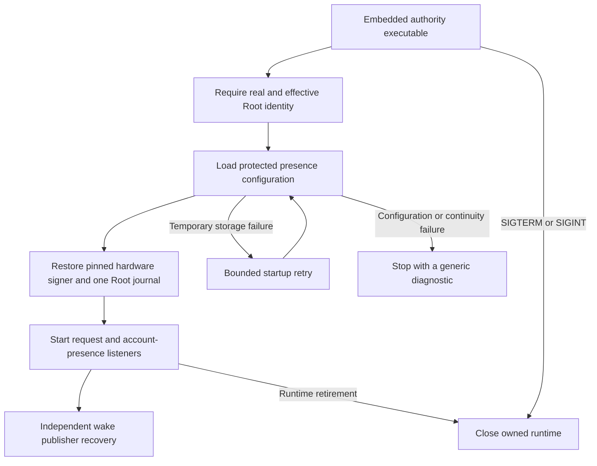

# Authority runtime entrypoint

The embedded authority accepts `--presence-configuration /absolute/protected/configuration.cbor`. This selects the presence and request runtime. The explicit `--configuration` mode retains the earlier trust-only runtime.

Both modes require real and effective Root identity before reading configuration. Selecting the request mode never falls back to the trust-only service.

## Startup and shutdown

Every startup attempt reloads protected metadata. Only temporary storage failures retry. Configuration, history recovery, and continuity repair failures remain distinct terminal states. An already retired runtime never reports successful startup.

The runner owns the asynchronous service and its worker. Shutdown cancels future attempts, waits for an active factory, and closes any service that factory returns. Concurrent close calls share one cleanup attempt. Failed cleanup stays owned for a later retry. Releasing the runner also cancels its worker and schedules cleanup.

The executable handles termination and interruption signals through owned dispatch sources. It waits for cleanup before returning success for cancellation. Shutdown failure returns a failure status. Diagnostics exclude private paths and configuration contents.

## Expiry ownership

Local request observations now retain their request kind after terminal transitions. This changes no signed status or protocol encoding.

Command expiry already closes the original command resources in the coordinator. The runtime accepts that cleanup path. An expired request from an unattached UI adapter fails maintenance instead of pretending that its original UI resources were released. Each future adapter must supply its own cleanup integration.

## Evidence and remaining gates

The focused runtime suite passed 11 tests on 2026-10-11. It covers bounded retries, permanent failures, startup cancellation, cleanup retry, concurrent shutdown, early retirement, release cleanup, and request-kind expiry handling.

The app check builds Debug and Release products and verifies their embedded signatures. It tests usage rejection and both modes' unprivileged rejection. These checks do not install or activate the authority.

This entrypoint does not attach the native command receive host, 1Password adapters, or Little Snitch adapters. Those producers must share the existing journal and clock. Protected provisioning, installed service signal behavior, hardware restoration, and physical device approval remain unproven. [Issue 286](https://github.com/rock3r/remozio/issues/286) retains those platform gates.
