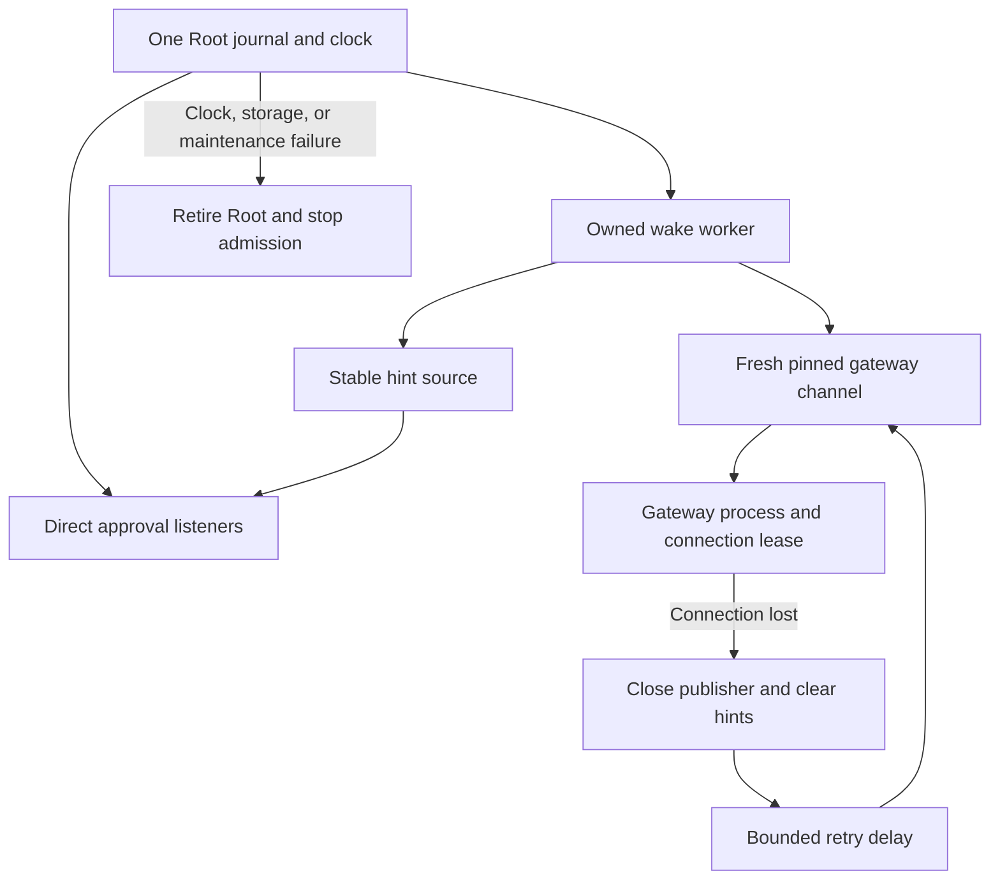

# Authority wake recovery

A missing or restarting local gateway must not close direct approvals. The authority now starts request listeners before it attempts wake publication.



## Recovery contract

Each attempt creates a new channel with the protected gateway account and code policy. It performs the existing authenticated handshake. It synchronizes a fresh lease and rechecks request state before exposing hints.

The native gateway accepts one Root connection. Losing that connection retires its process. Root therefore waits for a new gateway process. It does not reopen its own writer lease or create another authority clock.

Gateway connection, timeout, compatibility, and synchronization rejection failures retry with bounded exponential backoff. A lease that expires during asynchronous work also retries. Invalid authority time, scope, storage, or request-maintenance state retires Root. Retry never weakens peer authentication or request checks.

The worker exposes diagnostic wake status. It cannot grant an approval. The negotiated hint endpoint remains available during reconnect, with an empty hint list. It can also return an empty list during lease refresh.

## Retained work

A publisher owns one internal session token. The request owner checks that token before it accepts registration or withdrawal acknowledgments.

```mermaid
sequenceDiagram
  participant O as Root request owner
  participant P as Old publisher
  participant N as New publisher
  participant G as New gateway process
  P->>O: End old session; clear registration acknowledgments
  Note over O: Keep original grant IDs, deadlines, and withdrawals
  N->>O: Acquire a new session
  N->>G: Authenticate and synchronize fresh lease
  N->>G: Re-register original current grants
  G-->>N: Acknowledge
  N->>O: Recheck session, request, enrollment, routing, and clock
  P-->>O: Late old acknowledgment
  O-->>P: Reject
```

A new session preserves pending grant identities and original deadlines. It clears previous gateway acknowledgments. A cancelled or expired request cannot regain a grant. A retained withdrawal survives terminal capture removal and channel replacement.

The hint source checks its generation after each journal read. Clearing an old feed cannot remove its replacement. Closed publishers and replaced reads cannot expose old hints.

## Shutdown

Shutdown closes the hint source and presence input, cancels the worker, and waits for publisher cleanup. It then closes request listeners and the journal. Concurrent callers share one cleanup attempt.

A failed request cleanup remains owned. A later close retries it. A successful close is idempotent. The worker cannot reconnect after shutdown.

## Evidence and remaining gates

The focused gate passed 34 tests on 2026-10-11. It covers startup outage, reconnect, retained IDs and deadlines, terminal withdrawals, offline expiry, late acknowledgments, concurrent shutdown, cleanup retry, and cancellation during backoff. It also separates request retirement from gateway recovery.

The full local gate passed 1,609 core tests and the Debug and Release app builds. All six required Kotlin and Android tasks passed.

These fixtures use synthetic gateway drivers and private test journals. They do not prove installed service restart, launchd ordering, real provider delivery, hardware signer restoration, or device behavior.

The Root executable still selects its trust-only runner. Executable selection, transport-worker recovery, and protected installation remain separate integration work. [Issue 286](https://github.com/rock3r/remozio/issues/286) retains the installed XPC and physical validation gates.
