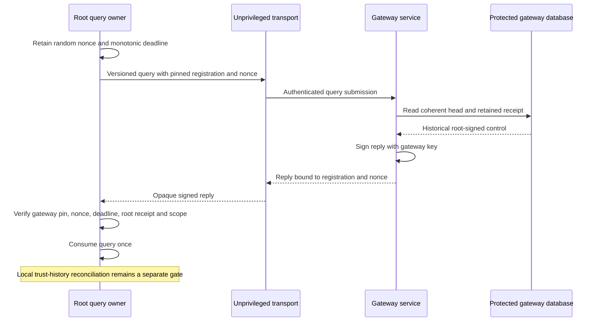

# Authenticated gateway head replies

The gateway can now sign its stored head and retained root receipt for a fresh root-side query.
The root verifies two signatures: the gateway reply and the retained root control.
This provides evidence for reconciliation. It does not change counters, enroll phones, restore mappings, or authorize delivery.

## Wire contract

The service uses deterministic CBOR. Unknown fields, versions, and message kinds are rejected.
This is a new Mac-to-gateway API; it does not extend an existing Android message.

| Field | Query | Reply |
| --- | --- | --- |
| 0 | Schema version `1` | Schema version `1` |
| 1 | Message kind `0` | Message kind `1` |
| 2 | Encoded pinned registration | Same registration bytes |
| 3 | Random 32-byte query nonce | Same nonce |
| 4 | Absent | Applied revision, unsigned 64-bit |
| 5 | Absent | Receipt kind: `0` empty, `1` candidate, `2` activation, `3` revocation |
| 6 | Absent | Canonical root control bytes; empty only at revision zero |
| 7 | Absent | Root control signature; empty only at revision zero |

The registration binds the owner, Mac, account, gateway, lifecycle epoch, and root public key.
The reply signature uses P-256 ECDSA in its 64-byte raw representation.
Its signed input is the UTF-8 bytes `Remozio/GatewayHeadReply/v1`, one zero byte, then the entire canonical reply.
This purpose is separate from approval and gateway control signatures.

Query bodies are limited to 1,024 bytes. Reply bodies are limited to 70,000 bytes, including a root receipt of at most 65,536 bytes.
The gateway sends no registration token or provider credential.
Retained receipts still contain operational metadata. Serve them only to the authenticated registered caller over a protected channel.

## Root owner lifecycle

`GatewayHeadQueryOwner` receives its registration and gateway public key from protected setup.
Neither an incoming query nor a reply can install those pins.
The owner retains at most eight queries by default; the supported range is one through 64.
The default deadline is 30 seconds, with a supported range of one through 60,000 milliseconds.
Expired slots are reclaimed when a new query starts.

A valid reply consumes its nonce once. Invalid signatures or receipt contents do not consume a valid pending query.
A clock regression or changed monotonic clock epoch stops the owner and clears its queries.
Service restart creates a new owner with no outstanding queries.
The host must invalidate the old owner when registration, gateway pin, lifecycle, or local trust changes.
All calls must share the host's serialized trust executor.

Receipt issue and expiry times remain historical evidence. An expired control can establish what the gateway retained; it cannot authorize replaying that control.
Freshness means the reply answers one live query. It does not prove the gateway store survived rollback or that no newer control exists.

## Host integration gates

- Provision and retain the gateway signing identity and root-side pin through the administrator-authorized setup path. Key custody remains a separate platform gate.
- Authenticate the registered caller before invoking `headReply`. The current method is a local service API, not an HTTP endpoint.
- Serialize the database read and signing operation with gateway control application. The signer must sign only this typed response path.
- Check local trust history before using `VerifiedGatewayHead`. A valid gateway signature cannot establish an enrollment or override a local revocation.
- A missing signed revocation or unknown trust-changing control must restrict the affected authority under the plan's recovery rules.
- A higher revision alone cannot advance the root counter. Counter reconciliation, acknowledgment persistence, and outbox renewal are not implemented here.
- Empty-head evidence is not proof that local history should be cleared. Neither component lowers its durable head through this API.

## Validation

Nine added tests use the real protected gateway database with disposable software signing keys.
They cover every receipt kind, both signatures, domain separation, tampering, wrong scope, query replay, concurrent queries, deadlines, capacity, clock changes, and reopen behavior.
The tests also verify that wrong-scope queries and a closed database never invoke the signer.
No network endpoint, real credential, push provider, device, or privileged service runs during these checks.
