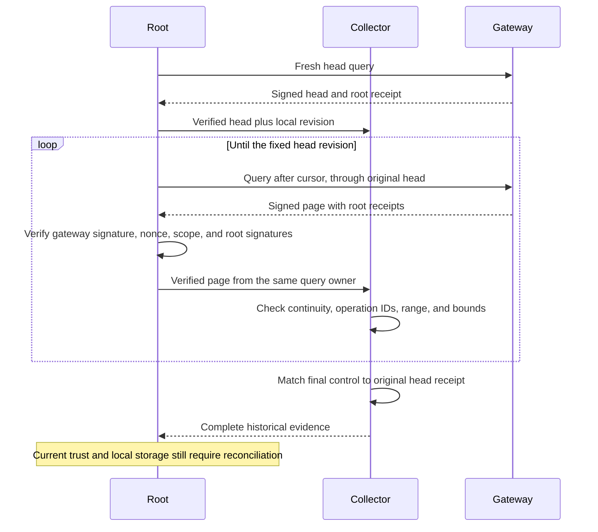

# Gateway history collection

A valid history page can omit a revision. Counter recovery therefore needs a complete sequence anchored to an authenticated gateway head.

`GatewayHistoryCollector` accepts pages from the query owner that verified its head. Another owner cannot supply pages, even with identical pins.
The upper revision stays fixed if the gateway receives newer controls during collection.
The next query starts after the last accepted revision.
Every revision must occur exactly once, with a distinct operation ID.
The terminal control must match the head's kind, operation, and canonical payload. Signature bytes can differ after valid signing.

The collector limits the record count and total payload and signature bytes. Defaults allow 100,000 records and 64 MiB of those bytes.
Object and collection overhead is additional but bounded by the record limit.
Page verification retains its existing bounds of 16 records and 1,100,000 encoded bytes.
An invalid page stops collection and releases retained records. Completion returns evidence once and also stops collection.
The host can explicitly invalidate a collector.

The host serializes calls and discards collection when registration, pins, or service ownership change.
Accepted evidence is historical. It has no lasting freshness guarantee and does not permit command execution, enrollment, or token publication.
Before recovery, the root must recheck its current registration, enrollment history, and local revision within its protected transaction.
Recovered revocations and unknown enrollment state still need the recovery policy.

## Validation

Synthetic tests use a real gateway database, independent gateway and root signing keys, signed replies, and live query nonces.
They cover multiple pages including a revocation, gaps, owner changes, wrong ranges, repeated pages, premature completion, and empty pages.
They also cover a validly signed conflicting head, signature re-signing, exact byte limits, count limits, explicit invalidation, clock ordering, and unsigned revisions.

This change does not write recovered root history, repair counters, replay controls, or add a transport endpoint.
[Root history recovery](../../macos/core/gateway-history-recovery.md) now provides transactional delivery-only adoption and retires stale candidates.
The host must integrate it with continuity checks, trust recovery, and current desired-token renewal.
No live credentials, remote services, device installation, or hardware approval was used.
