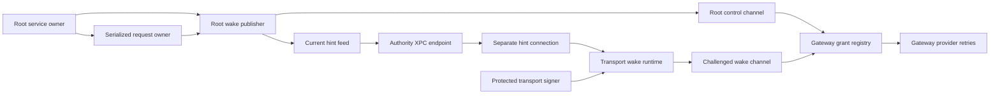

# Retained wake runtime

The request owner now feeds an owned Root publisher and a separate transport wake runtime. Protected startup metadata binds both runtimes to their installed accounts, keys, and gateway scope.



## Request lifetime

The Root publisher registers grants through IPC version 3. Registration alone cannot start provider work. The transport signs a fresh gateway challenge with its provisioned key.

The publisher preserves each original grant ID and request deadline. Rejected registration remains pending. Withdrawals remain retained after a terminal request is forgotten.

An acknowledgment does not establish current request state. Root rechecks the request, enrollment, presence, clock, and gateway lease after the asynchronous reply.

```mermaid
sequenceDiagram
  participant R as Request owner
  participant P as Root publisher
  participant G as Gateway
  participant T as Transport
  R->>P: Retained pending delivery
  P->>G: Synchronize lease and register original grant
  G-->>P: Registration acknowledgment
  P->>R: Recheck current request and trust
  T->>P: Fetch opaque current grant IDs
  T->>G: Sign fresh gateway challenge
  G->>G: Begin provider work
  R->>P: Request becomes terminal
  P->>G: Withdraw original grant
  T->>P: Refresh hints; terminal grant disappears
```

The hint feed exposes the gateway scope and opaque grant IDs. It includes no recipient, command, request capture, deadline, provider credential, or token.

The hint client owns a separate XPC connection. It negotiates base version 1 and wake extension version 1 before fetching hints. Unsupported versions retire only that connection.

Gateway acceptance transfers provider retries to the gateway. Rejected submissions retry with fresh challenges. An accepted grant is not resubmitted while it remains in the current hint batch.

## Startup and ownership

`AuthorityWakeStartupConfiguration` pins the request configuration, Root public key, gateway identity, code policy, lease, and polling interval. Root loads it from protected metadata.

`AuthorityWakeService.open` requires the Root account and a live presence callback. It restores the hardware signer and protected stores before starting any listener. One clock serves request preparation and lease publication.

The service owns the publisher task. Shutdown cancels publication and retires its gateway connection before closing request storage. A failed publisher retires this service incarnation.

The transport executable accepts `--wake-configuration PATH`. The wrapper contains protected direct transport metadata and an existing wake signer configuration. It contains no private key bytes.

Invalid metadata or an account mismatch prevents startup. Failure to restore the optional wake runtime leaves direct approvals available. It never creates a replacement key or changes custody.

The existing `--configuration PATH` mode remains supported. Wake worker failure does not close the direct TLS service.

## Component evidence

The final focused local gate passed 21 tests on 2026-10-11:

- Ten publisher tests cover retries, cancellation, revocation, expiry, presence, lease loss, storage failure, endpoint composition, and owned shutdown.
- Seven hint tests cover canonical scope validation, compatibility, invocation ordering, typed signing, and transport retries.
- Three startup tests cover protected scope, account checks, schema validation, and timing bounds.
- One composed test uses the actual gateway dispatcher, coordinator, endpoints, and grant registry.

The composed test checks that registration alone sends nothing. A challenged transport submission starts synthetic provider work. Cancellation and forgetting then withdraw the grant and remove its hint.

Run these tests with:

```sh
swift test --package-path macos/core --filter 'GatewayDeliveryCoordinatorTests.testRetainedRootPublication|WakeStartupConfigurationTests|AuthorityWakePublisherTests|AuthorityWakeHintTests'
```

Four additional request-owner tests cover independent frame retrieval, retained withdrawals, expiry, presence, and capacity backpressure. Existing channel tests cover ordinary request delivery separately.

## Remaining integration and platform gates

The Root executable still uses its existing trust service mode. The new Root factory requires real presence input; installation and executable selection remain separate integration work.

These fixtures do not prove installed Mach service behavior, kernel audit-token validation, live provider delivery, or Secure Enclave restoration under installed service accounts.

The full native gate passed on 2026-10-11, including Debug and Release app builds. All six required Kotlin and Android tasks passed. The [unprivileged XPC experiment](evidence/2026-10-11-retained-wake-xpc.json) passed all 19 existing synthetic cases on macOS 27.0.1. It verified temporary service removal. Its unsupported wake stubs advertise version zero.

[Issue 286](https://github.com/rock3r/remozio/issues/286) tracks the required installed XPC checks. Device and privileged interactive tests remain deferred until the user's Mac session.
