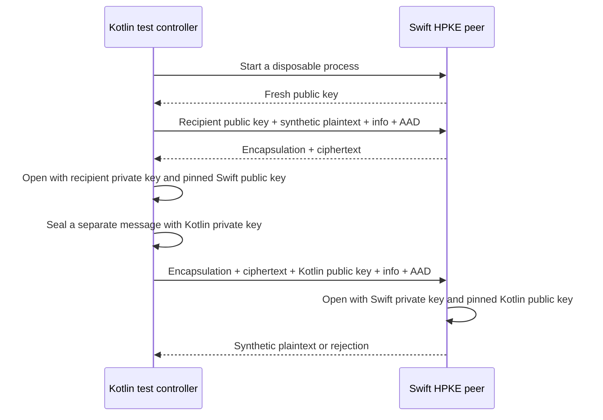

# HPKE interoperability experiment

This experiment tests authenticated encryption between CryptoKit on macOS and Bouncy Castle on the JVM.
It does not select a production transport or ship a crypto dependency in either app.

## Candidate primitive

| Property | Experiment value |
| --- | --- |
| Construction | RFC 9180 HPKE, authenticated mode |
| KEM | DHKEM(P-256, HKDF-SHA256), `0x0010` |
| KDF | HKDF-SHA256, `0x0001` |
| AEAD | AES-256-GCM, `0x0002` |
| Swift implementation | Platform CryptoKit |
| Kotlin implementation | Bouncy Castle `bcprov-jdk18on:1.86`, test dependency only |
| Keys | Independent, fresh software keys in each process |
| Public key encoding | Uncompressed P-256 SEC1, 65 bytes |
| Context | Fresh HPKE context for each message |

The controller exchanges public keys through private pipes. It never transfers private keys.
Each receiver uses the public sender key supplied by the controller.
That models an existing pin; it does not implement pairing or validate an enrollment.

The JSON pipe protocol is a test interface. Do not expose it through a socket or include the executable in the app.
The peer rejects root execution and release builds. No key enters Keychain, Secure Enclave, or Android Keystore.

## Checks

Run `./scripts/check.sh` to build the peer, then `:phone-core:approvalFlowTest` through the repository Gradle workflow.
The same task runs on macOS CI. Linux unit tests exclude the native peer tests.

| Check | Expected result |
| --- | --- |
| Swift seals, Kotlin opens | Original bytes recovered |
| Kotlin seals, Swift opens | Original bytes recovered |
| Wrong sender or recipient key | Authentication fails in both implementations |
| Changed `info`, AAD, or ciphertext; truncated ciphertext | Authentication fails in both implementations |
| Base-mode message presented as authenticated mode | Swift rejects it |
| Empty, truncated, or invalid encapsulated point | Swift rejects it |
| Empty payload and 65,536-byte payload | Both directions preserve all bytes |
| Identical input with a fresh sender context | Encapsulation and ciphertext differ |
| Replay with a fresh recipient context | Decryption succeeds again |

The last result is intentional. HPKE does not provide application replay protection.
The authority still needs current enrollment checks, request binding, deadlines, and durable single-use consumption.
The test context names a synthetic Mac, account, phone, enrollment epoch, and direction.
These strings are fixtures, not a proposed production encoding or negotiated protocol version.

## Limits and next gates

- This is JVM interoperability evidence, not Android device evidence. It does not exercise Android Keystore or biometrics.
- The Bouncy Castle calls use software key objects. A supported path for non-exportable Android keys remains unproven.
- CryptoKit exposes HPKE support for Secure Enclave P-256 agreement keys. This experiment does not exercise that API or prove pre-login access.
- Pairing, revocation, certificate validation, hardware custody, key rotation, and code identity checks remain separate requirements.
- The test pins one suite. It does not implement negotiation, downgrade protection, framing, a streaming channel, or reconnect recovery.
- Static recipient keys do not establish a forward-secrecy policy for captured messages. A production channel needs an explicit key lifecycle.
- No relay, Cloudflare Access, TLS endpoint, phone, push service, UI prompt, or privileged service runs here.
- A passing experiment does not authorize using exported software keys in production.

## References

- [RFC 9180](https://www.rfc-editor.org/rfc/rfc9180.html)
- [CryptoKit HPKE](https://developer.apple.com/documentation/cryptokit/hpke)
- [Secure Enclave P-256 agreement key](https://developer.apple.com/documentation/cryptokit/secureenclave/p256/keyagreement/privatekey)
- [Bouncy Castle HPKE API](https://downloads.bouncycastle.org/java/docs/bcprov-jdk18on-javadoc/org/bouncycastle/crypto/hpke/HPKE.html)
- [Published artifact versions](https://repo.maven.apache.org/maven2/org/bouncycastle/bcprov-jdk18on/maven-metadata.xml)
