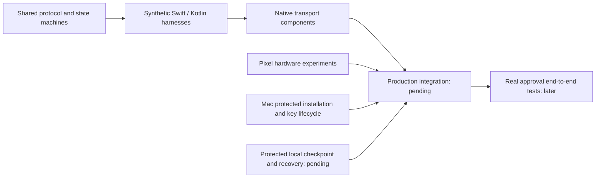

# Interactive experiment handoff

Remozio is not ready for a production approval or a complete end-to-end test. This session tests platform assumptions with disposable fixtures. It does not enable the unfinished approval stack.

## Where we are



Arrows show dependencies, not completed connections. Passing a component test does not establish the next stage.

| Surface | Available now | Still missing |
| --- | --- | --- |
| Mac app | Window, menu, Settings, encrypted setup preview | Setup application, protected services, pairing and live approval routing |
| Android app | Saved Mac list, cached audit navigation, notification setup, update controls, debug previews and probes | Enrollment flow, live inventory, request actions and audit synchronization |
| Transport | Native byte channels, pinned TLS, negotiation and synthetic relay checks | Production listeners, enrolled hardware peers and configured Cloudflare path |
| Authority | Verified decisions and durable journal components | Protected host, local checkpoint recovery and real executor |
| Push | Sender, delivery and phone notification components | App integration, configured credentials and physical delivery evidence |
| Prompt adapters | Design contracts | Authorized UI fixtures, presence observations and live adapters |
| ADB | Debug discovery and loopback probe | Hardware feasibility, foreground lifetime and the bridge itself |

The [Mac app guide](../../macos/app/README.md), [Android guide](../../android/README.md) and [experiment index](README.md) describe each component's limits.

## Before the session

- Use an Apple Silicon Mac and a Pixel with Android 17 or later. Record the actual OS versions; macOS 27 results do not prove macOS 26 compatibility.
- Keep the same debug signing identity for Android update-continuity tests. A debug APK is not a production release candidate.
- Run the repository gate before choosing artifacts. The [build guide](../../android/README.md) names the SDK and APK path. The [Mac guide](../../macos/app/README.md) names its build outputs.
- Agree on each device-setting change before making it. Biometric enrollment changes, debugging configuration and service registration are explicit test steps.
- Use synthetic commands and disposable keys. Never submit a real 1Password, Little Snitch or sudo approval to exercise a fixture.

Do not start with root service installation. The packaging fixture has no registration operation, and its manifests are not production service definitions.

## First session: prepared checks

On 2026-10-03 the user selected Pixel checks first and Mac service, lock/logout/restart, and remote-desktop tests last. The table groups the prepared procedures; it does not override that order.

Run each detailed procedure linked below. Record a failed or unavailable case separately from an expected rejection.

| Order | Check | What to establish | Stop condition |
| --- | --- | --- | --- |
| 1 | App surfaces | Mac window/menu/Settings; Android large text, TalkBack, sheets, dialogs and notification setup | Inaccessible controls or misleading action/status text |
| 2 | [Biometric probe](android-biometric-key.md) | Hardware policy, a fresh prompt per signature, cancellation and key continuity | A fresh signature succeeds without required authentication, or stale completion reports success |
| 3 | [ADB endpoint probe](android-adb-endpoint.md) | Own-phone discovery, IPv4/IPv6 reachability, Wi-Fi-off behavior and cancellation | Unexpected destination, traffic beyond a connection attempt, or stale completion |
| 4 | [XPC experiment](macos-xpc.md) | Six synthetic cases on the tested OS; temporary agent cleanup | Payload dispatch despite the handshake control, or cleanup failure |
| 5 | [Presence signals](macos-presence.md) | One-shot idle/display observations and their limits in the target GUI session | A candidate signal is treated as proof of human or remote presence |
| 6 | [Enclave signing](macos-key-custody.md) and [TLS](macos-enclave-tls.md) | Disposable hardware signatures and pinned loopback TLS on the tested OS | Unexpected authentication UI, software fallback or a wrong pin accepted |

The XPC test registers a temporary **per-user** LaunchAgent. Follow its cleanup procedure if interrupted. It does not register the root authority.

The ADB probe cannot enable a legacy listener. Test that path only after the user has explicitly provisioned one through an authorized ADB connection. Record listener exposure separately; loopback reachability does not prove that other interfaces are closed.

Biometric enrollment changes and device reboots can follow the basic checks. Preserve the existing probe key for continuity checks. Do not recreate it to turn a failed continuity result into a pass.

## Later sessions: fixtures or integration still needed

These are not runnable product tests yet. Prepare the relevant implementation and procedure before changing the machine.

| Work | Required evidence before relying on it |
| --- | --- |
| Protected Mac services | Developer ID checks, protected paths, registration/removal, reboot to login window, lock/logout, update replacement and pre-login key access |
| Authority continuity | Protected local checkpoint, interrupted transitions, partial-state replacement, stale floors and offline recovery |
| UI adapters and presence | Sanitized authorized dialog captures; local input, CRD, Screen Sharing, dark display, manual Away and offline states |
| Cloudflare and FCM | Per-Mac configuration, scoped credentials, real delivery, reconnect, offline reconciliation and independent Mac operation |
| Android enrollment | Hardware transport/decision keys, biometric key policy, removal, re-enrollment and retained pairing across updates |
| ADB bridge | Peer authentication, listener exposure, foreground-service eligibility, idle/network/update recovery, explicit Stop and per-pair isolation |
| Release updates | Real signing identities, retained keys, interrupted activation/install outcomes and safe recovery |

The user excluded whole-Mac backup rollback from the guarantee on 2026-10-03. A matching journal and checkpoint backup still restores without detection, as the [journal experiment](macos-authority-journal.md) demonstrates. An independent witness is no longer a blocker for that threat; protected storage and ordinary crash/replay recovery remain required.

Do not substitute an online startup check, recurring authorization, forced re-pairing or physical recovery without consulting the user. Those changes alter the agreed UX. The current enclave probes also use after-first-unlock access; they do not establish pre-login availability.

The user accepted pathname execution with a final identity/content recheck and its remaining race. The [command execution experiment](macos-execution-binding.md) records the evidence. Production command execution remains unimplemented. See the [accepted limits](../design-decisions.md) for both amendments.

## Evidence record

Keep one small raw record per case under the ignored `experiment-results/` directory. After review and redaction, copy the sanitized result to `docs/experiments/evidence/` with a date and case name. Commit that reviewed copy; do not force-add the ignored raw record.

```text
Case:
Commit and build variant:
Device family; OS/API version:
Starting state:
User action:
Expected observation:
Actual observation:
Result: passed / failed / unavailable / not run
Cleanup completed:
Limitations and next step:
```

Record public fingerprints only when needed for continuity. Exclude passwords, private keys, tokens, device serials, network addresses, real command contents and ADB payloads. Screenshots of real prompts need separate inspection and redaction.

A timeout is an unknown result unless a separate observation establishes the expected rejection. A disconnected Mac has unknown current presence. An expired estimate does not prove that its target prompt expired.

## Integration exit criteria

After the platform gates pass, integrate one vertical path at a time. Start with enrollment and authenticated request delivery, then explicit declines, then biometric decisions and guarded dispatch. Preserve the existing requirement that the first valid decision wins across phones.

Each path needs failure cases: lost connection, stale request, expiry, competing decisions, revoked enrollment and restart. Keep Unknown outcomes distinct from success, denial and confirmed expiry; never retry an uncertain external action automatically.

Real approvals, credential insertion, durable Little Snitch rules and deployment through the ADB bridge remain later end-to-end tests. This handoff does not mark the design implemented or those tests passed.
