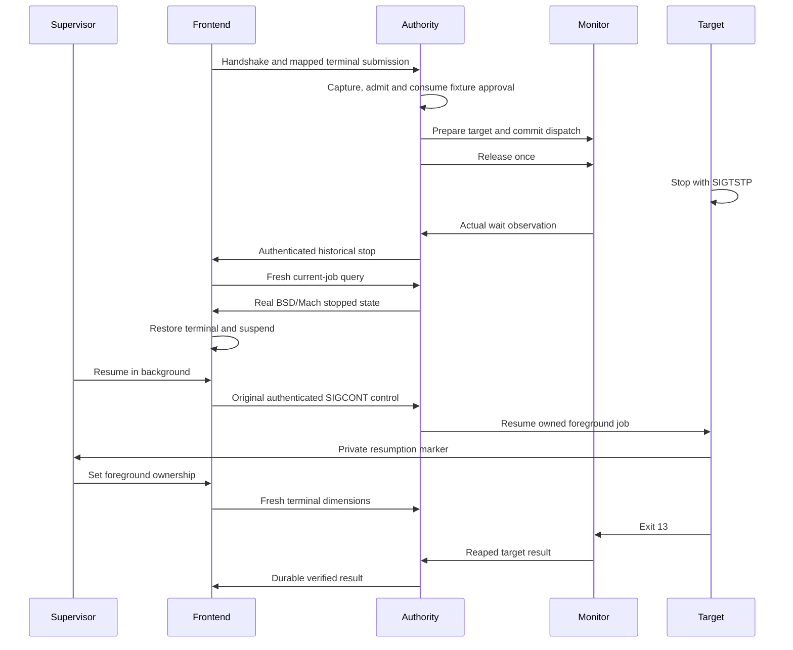

# Live command frontend experiment

Run `python3 scripts/run-macos-live-frontend.py` on an Apple Silicon Mac without elevation.
The repository gate runs this experiment on macOS.
Evidence appears in `.build/live-command-frontend/evidence.json`.

The authority, supervisor, frontend, monitor and target are separate processes.
The authority uses `CommandReceiveHost`, the journal and `CommandExecution`.
The frontend uses the authenticated execution session and the product main loop.
The monitor and launcher include product sources through explicit fixture wrappers.
Each caller terminal belongs to a private session created by the runner.

The runner repeats each case three times and requires matching observations.

| Case | Actual behavior | Required observation |
| --- | --- | --- |
| Original job | The target stops itself. The frontend suspends after a fresh query. | Restored caller attributes, background target resumption, new dimensions and one admission. |
| Overtaken stop | A real continuation resumes the target before the frontend receives the historical stop. | A fresh query reports running. The supervisor observes no frontend suspension. |
| Nested shell | Typed Ctrl-Z stops a nested shell job. Typed `fg` resumes it. | A query reports unknown during nested ownership and running after Bash regains the terminal. Bash and the frontend never stop. |

All cases require actual owner reaping and the journal's revision-two verified outcome.
Exit 13 produces a verified failure phase. It is the fixture's expected command result.
The supervisor checks terminal attributes after the frontend exits.
Cancellation asks the supervisor to retire its own frontend.
The authority stays alive while the product owner cancels and reaps its monitor and target.

The overtaken-stop case delays an already authenticated frontend observation.
It does not replace the authority's current-job callback.
Nested input enters through the private caller terminal and passes through the real frontend relay.
The nested queries are explicit fixture probes on the original execution session.
These probes do not add application behavior.

Credential operations are fixture substitutes restricted to the current user.
The enrollment uses disposable software keys. It proves no Android biometric property.
The fixture policy uses the actual executable hash with synthetic role metadata.
The authority right passes through an owned child's special port. No bootstrap service is registered.
These seams prove no protected installation, production signing, cross-user elevation or service discovery.

The local runtime is macOS 27.0.1. The compilation target is macOS 26.
A compilation target does not prove behavior on that runtime.
CI must run the same cases on macOS 26 before merge.
This experiment uses no user terminal and installs no services.
Its deadlines bound fixture runs. They add no product command runtime limit.
Physical device tests remain pending.
