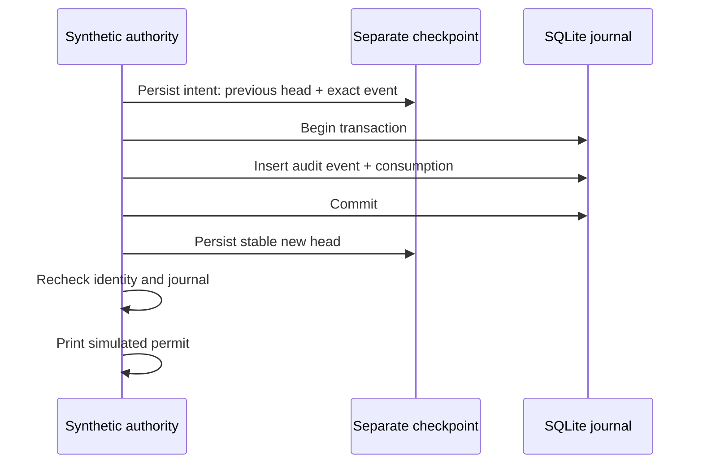

# Authority journal crash experiment

This experiment measures a native Swift/SQLite consumption journal in a disposable directory. It stores invented request and phone IDs, closed outcome tags, sequence numbers, and hashes. It never stores a command or prompt capture and never dispatches an external action.

Run it as a normal user on an Apple Silicon Mac:

```sh
python3 scripts/run-macos-journal-experiment.py
```

The runner builds the executable, creates temporary stores, terminates child processes at named boundaries, checks recovery, and removes its fixtures. Each child has a timeout. The executable refuses root execution. Its `simulated-permit` output is only an observation marker.

## Commit order



The event hash covers its sequence, previous digest, request ID, phone ID, and outcome. Startup replays the event chain and compares the reconstructed consumption map with the stored rows. A missing or inconsistent row fails the experiment's admission check.

SQLite uses rollback-journal mode, `synchronous=EXTRA`, and `fullfsync=ON`. The executable reads back those settings. Checkpoint replacement writes a new file, calls `F_FULLFSYNC`, renames it, then syncs the directory. SQLite atomicity covers the database transaction; it does not include the independent checkpoint or an external effect. See [SQLite atomic commit](https://www.sqlite.org/atomiccommit.html), [SQLite pragmas](https://www.sqlite.org/pragma.html#pragma_fullfsync), and [Apple's sync documentation](https://developer.apple.com/library/archive/documentation/System/Conceptual/ManPages_iPhoneOS/man2/fsync.2.html).

## Recovery results

| Persisted state after interruption | Recovery in this experiment |
| --- | --- |
| No intent, or intent with the previous database head | No consumption; discard the incomplete consumption intent |
| Intent with the exact committed consumption head | Preserve consumption and append No dispatch |
| Stable consumption checkpoint | Preserve consumption and append Unknown |
| Interrupted recovery outcome transaction | Complete the internal outcome record; never issue another permit |
| Unrelated head, missing checkpoint, or inconsistent rows | Stop with an error; no simulated permit |

The original intent remains present until recovery records its next intent. This preserves No dispatch evidence if recovery itself crashes. Recovery is idempotent across the tested boundaries. A crash after the stable consumption checkpoint is conservative: the process may have reached dispatch, so the outcome is Unknown.

Pending request payloads are not persisted or reconstructed. The CLI accepts a new synthetic request ID for its single admission attempt. It is not a network protocol or a restart-resubmission implementation. A request consumed before a crash cannot win again, including from another synthetic phone.

## Writer exclusion and replacement

Every command holds a nonblocking exclusive `flock` for its lifetime. A competing process gets Busy. The experiment checks the held directory, lock, and database identities at commit boundaries. It also validates the journal again before intent and before the simulated permit.

The tests replace the lock file, replace the database file, and change database content while a writer is paused. Each tested replacement closes admission before the simulated permit. The lock is advisory: [Apple documents it as coordination between cooperating processes](https://developer.apple.com/library/archive/documentation/System/Conceptual/ManPages_iPhoneOS/man2/flock.2.html).

These checks do not protect a directory from an adversary who can replace it between checks. Production requires protected root placement, stable lock ownership across installation and maintenance, and consistent participation by every writer. This experiment proves none of those installation properties.

## Measured evidence

[Local evidence](evidence/2026-10-01-authority-journal.json) records 23 observations on macOS 27.0, arm64, with system SQLite 3.54.0 and a macOS 26 deployment target:

- Seven consumption crash boundaries, including interruption inside the SQLite transaction.
- Six crashes during No dispatch recovery.
- Competing writers and replay after consumption.
- Three live file/content replacement cases.
- Five missing, stale, or corrupt row/checkpoint cases.
- One complete snapshot restoration that the local scheme cannot detect.

The runner also checks that repeated recovery produces the same report. CI repeats the experiment on its macOS 26 runner; local evidence alone is not a macOS 26 runtime result.

## Production gates remain

A matching database and checkpoint backup restores consistently and is **not detected**. A local hash chain cannot establish that a newer state once existed. The user excluded whole-Mac backup rollback from the guarantee on 2026-10-03; an independent witness is no longer required for that threat. The [accepted limits](../design-decisions.md#whole-mac-backup-rollback) retain protected storage, ordinary replay prevention, crash recovery and mismatch handling. This experiment still does not enable production admission.

Process termination does not simulate physical power loss, failed drive flushes, torn checkpoint files, disk exhaustion, or every I/O error. Those need additional fault injection and platform evidence. The test has one synthetic admission per invocation, scans the full journal, and provides no retention or capacity policy.

The experiment stops on a mismatch. Production must distinguish recoverable history loss, genuine authority mismatch, and transient unavailability as the design requires. This executable does not implement those user-facing recovery paths, the persistent recovery marker, trust continuity, epoch management, authenticated decisions, or target revalidation. It is not linked into the app or authority service.
