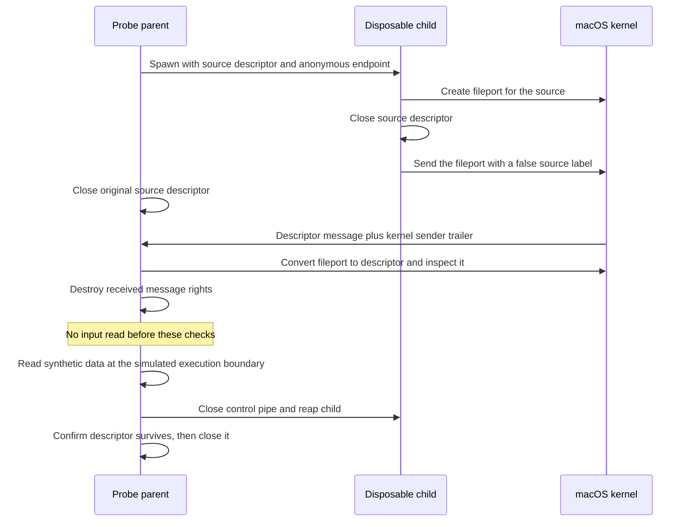

# Command input transfer experiment

The design requires an actual passed input stream. A caller-provided label cannot establish its identity or preserve its pending bytes.
This experiment measures public macOS fileport APIs with disposable descriptors and an anonymous Mach endpoint.

## Reproduce

On an Apple Silicon Mac with Xcode:

```sh
python3 scripts/run-macos-command-fileport-experiment.py
```

The normal native gate also runs it. The CI job uses macOS 26.
The runner compiles one C fixture with a macOS 26 deployment target and applies an ad-hoc signature.
It creates a private temporary directory and a separate child for each case.

The parent gives each child a source descriptor and the anonymous endpoint through spawn.
The child creates a fileport, closes its source descriptor, and sends a single Mach port descriptor.
The parent closes its source descriptor before receipt. It compares the kernel trailer PID and UID to the spawned child.
A deliberately false regular-file label cannot determine the observed source type.



## Cases and evidence

The [local report](evidence/2026-10-06-command-fileport.json) binds these observations to the fixture source hash.
It records macOS 27.0.1, build 26A434, arm64, and SDK 27.0. It does not establish macOS 26 runtime behavior.

| Case | Required observations |
| --- | --- |
| Regular file | Same device, inode and mode; original offset remains 2 before reading; later read returns the remaining synthetic bytes |
| Directory | Same device, inode and mode; observed type remains a directory |
| Pipe | Same object identity; six bytes remain queued before reading; five bytes written after transfer also arrive |
| Unix stream socket | Same object identity; queued and later input both arrive |
| Disposable PTY | Observed terminal remains a terminal; later input arrives; master resize is visible on the imported slave |
| `/dev/null` | Same device identity; character device is not a terminal; read returns EOF |
| Write-only pipe end | Observed access mode is write-only; read fails with `EBADF` |
| Ordinary live Mach send right | Conversion fails with `EINVAL`; it is not mistaken for a fileport |
| Silent child | Receive times out; the control pipe closes and the child is reaped |

Every imported descriptor has `FD_CLOEXEC`. It remains valid after destroying the message rights and reaping its sender.
Explicit descriptor close then makes its number invalid in the fixture process.
No source bytes are read to inspect or transfer the descriptor. The later reads are synthetic execution-boundary checks.
This is not an approval or a command execution test.

## What this enables and what remains

Fileports provide a candidate for passing the actual stdin source and retaining it while approval is pending.
They preserve streaming input; no prebuffering is needed merely to transfer or classify a source.
The descriptor shares its underlying open file with other holders, including offset and status flags.
Production code must not silently change shared flags or infer that input content remains fixed after approval.

The source descriptor is still caller-controlled. Its identity is not consent or proof of human-authored input.
A directory transfer does not authorize a target path. An imported fileport does not authorize execution.
The kernel attributes identify this spawned fixture only. This probe does not apply protected release code policy.

The current [caller receiver](../macos-command-caller-receiver.md) intentionally rejects complex messages.
Its version 1 carrier is unchanged. A future authenticated descriptor channel must bind the source to the exact submission and caller incarnation.
It must define versions, descriptor counts, permitted descriptor types, reply ownership, cleanup, and resource budgets before production exposure.
Complex messages can import resources before application rejection. This probe does not establish a hostile-sender resource budget.

The socket case establishes transfer feasibility. Mapping every supported stream into the application capture schema remains integration work.
Do not silently reject ordinary workflows because the current schema lacks a source label.
The PTY case does not establish controlling-terminal sessions, process groups, signal forwarding, real command I/O, or GUI-session behavior.
No service installation, protected Root capture, sudo policy, production transport, phone, or device E2E is exercised.

## Cleanup

Each case destroys received message rights, closes descriptors and control pipes, and reaps its child.
A failed case first asks its owned child to exit through the control pipe. It kills and reaps a child that remains alive.
Receive and read waits are bounded. The runner has a 30-second outer deadline and kills its process group on timeout.
The private directory and synthetic file are removed even on failure.
The report contains host metadata, source hashes, and booleans. It contains no input contents, paths, PIDs, tokens, or terminal names.

The installed public `sys/fileport.h` declares both APIs.
Apple's [descriptor implementation](https://github.com/apple-oss-distributions/xnu/blob/main/bsd/kern/kern_descrip.c) retains the underlying open file and applies close-on-exec to imported descriptors.
