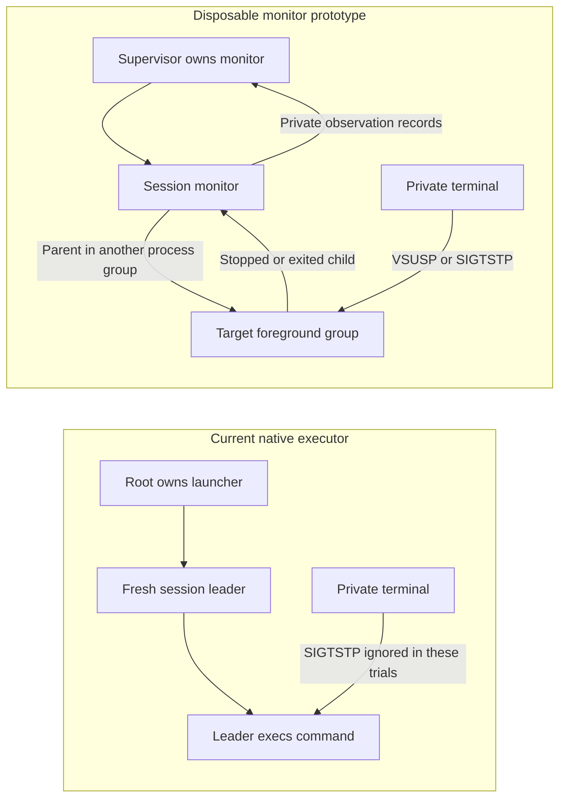

# Command job-control experiment

The current private-terminal leader ignored `SIGTSTP` in ten native trials. A separate session monitor preserved normal stop and resume behavior.

The [recorded evidence](evidence/2026-10-09-command-job-control.json) contains 50 trials. The runtime was macOS 27.0.1 on Apple Silicon.
The deployment target was macOS 26. Actual macOS 26 behavior remains untested.

## Current leader and candidate monitor



The native case links the current `CommandProcess.c`, `CommandPTY.c`, and launch decoder. It uses the existing synthetic launcher.
The stopped child remains owned and unreaped. `SIGSTOP` stops it; `SIGCONT` resumes it; the actual exit status is 7.
The native observation structure currently exposes neither stopped nor continued states.

The candidate keeps the session leader alive in a separate process group. The target remains its child and becomes the terminal's foreground group.
The monitor observes the child through `waitpid`, including stopped and continued states. The target closes private descriptors before exec.

## Measured cases

| Case | Trials | Result |
| --- | --- | --- |
| Current native leader | 10 | Default `SIGTSTP` does not stop it; explicit stop, resume, and actual exit remain observable |
| Monitor and direct suspend signal | 10 | Target stops; monitor keeps running; resumed target exits 7 |
| Monitor and terminal suspend character | 10 | The terminal sends `SIGTSTP`; target stops and resumes; exact output and exit 7 remain intact |
| Cancellation while stopped | 10 | Target exits through `SIGKILL`; monitor reports its actual wait status and exits cleanly |
| Missing executable | 10 | No exec event; private failure reports `ENOENT`; actual target exit is 127 |

Both the monitor and external supervisor register kernel exec and exit observations before release.
The external supervisor sees target exec only in successful execution cases. It sees target exit in all four monitor cases.
The monitor remains the target's exclusive wait owner. External kernel events do not grant target process ownership.

## Stop and resume sequence

```mermaid
sequenceDiagram
    participant S as Disposable supervisor
    participant M as Session monitor
    participant T as Target foreground group
    participant P as Private terminal
    M->>T: Fork target; hold exec gate
    M->>P: Select target foreground group
    M->>S: Report prepared target
    S->>T: Register kernel exec and exit events
    S->>M: Release fixture gate once
    M->>T: Release target exec
    T->>S: Kernel exec event
    S->>P: Write terminal suspend character
    P->>T: Deliver SIGTSTP
    T->>M: Actual stopped child status
    M->>S: Report stopped state
    S->>P: Deliver SIGCONT
    P->>T: Resume foreground group
    T->>M: Actual exit status 7
    M->>S: Report terminal status; exit
    S->>M: Reap owned monitor
```

## Reproduce

Run `python3 scripts/run-macos-job-control-experiment.py` without elevation on an Apple Silicon Mac.
The runner compiles disposable fixtures, creates private terminals, verifies 50 observations, and prints sanitized JSON.
`./scripts/check.sh` includes this runner on macOS. The sources remain under `experiments/command-job-control`; packaging does not embed them.

The runner rejects changed observations. It records source hashes and host versions. Its temporary paths and target arguments stay out of evidence.
Fixture loop deadlines bound experiments only. They define no product execution limit.

## Required integration

This result supports a monitor design. It does not establish production job control.

- Preserve the existing durable dispatch checkpoint and one release attempt. A stop or reconnect must never repeat execution.
- Verify and protect the installed monitor. Bind its private status channel to the original execution owner; target output cannot become control data.
- Register target kernel events before release. Preserve actual target exit status independently of the monitor's exit status.
- Give target cancellation to its exclusive wait owner. Never signal a target PID after reaping or ownership loss.
- Negotiate stopped and continued events in the frontend channel. Restore the caller terminal before suspension and capture fresh settings after foreground resume.
- Preserve separate redirected streams and pipe controls. A PTY must not silently merge redirected stderr or remove signal forwarding.
- Verify nested foreground jobs, monitor crashes, caller detachment, protected installation, and cross-user execution.

The installed service, production elevation, actual macOS 26 runtime, real shell, and physical terminal checks remain gates.
No user terminal, firewall rule, device setting, or installed service changed during these experiments.

The same 50-trial experiment also passed on an Apple Silicon CI host with macOS 26.6.2 and SDK 26.5.
The [completed Mac job](https://github.com/rock3r/remozio/actions/runs/37876164698/job/113650441702) records the actual runtime and source hashes.
That result applies to PR 246, commit `ed4dad31e89a9dc1951c5b10d5cf1224f9a570b4`. It does not prove privileged or physical behavior.
