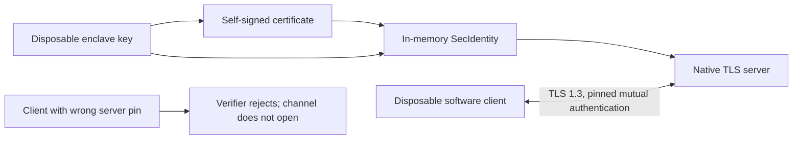

# Secure Enclave TLS experiment

A disposable Secure Enclave P-256 key completed a mutual TLS 1.3 exchange through Network.framework on this Mac. `SecIdentityCreate` paired its private-key reference with a synthetic certificate in memory. The probe verified the Secure Enclave token attribute and confirmed that private-key export was rejected.

[Recorded result](evidence/2026-10-03-enclave-tls.json): macOS 27.0.1, build 26A434, Apple Silicon. This is local hardware evidence. CI compiles for macOS 26 but does not run this hardware experiment.



## Controls and result

| Check | Recorded result |
| --- | --- |
| Enclave token attribute | Present on the server key |
| Private-key export | Rejected |
| Identity construction | Succeeded without a Keychain search or import |
| Positive exchange | Exact synthetic payload returned over mutually authenticated TLS 1.3 |
| Negotiated profile | Expected ALPN; no accepted early data; resumption and tickets disabled |
| Wrong server pin | Client certificate verifier reported rejection; the channel never opened |
| Wrong-pin channel outcome | Opening deadline expired after verifier rejection |
| Persistence | Neither key requested permanent storage; certificates and identities remained in memory |
| Authentication UI | Disabled through `LAContext.interactionNotAllowed` |

The negative control changes only the server pin to another generated public key. A timeout alone cannot pass it. The probe also requires a direct rejection from the client certificate verifier. If the channel opens, the control fails before sending application bytes. The initial uninstrumented negative run timed out and was not counted as rejection evidence.

Both peers use the native byte owner and public certificate APIs. The certificate helper is minimal synthetic DER, not a production certificate issuer. The client key is a software fixture; it does not stand in for Android Keystore evidence. No private key, opaque key representation, certificate, or signature is written to the report.

## Run explicitly

```sh
swift build --package-path experiments/key-custody --triple arm64-apple-macosx26.0 --disable-keychain --disable-netrc
probe_bin=$(swift build --package-path experiments/key-custody --show-bin-path --disable-keychain --disable-netrc)
"$probe_bin/EnclaveTLSProbe"
```

Run as an ordinary user in a debug build. Exit 0 requires every assertion; exit 77 means the experiment could not establish them. Exit 70 means report encoding failed. There is no software fallback for the server key. The listener binds only an ephemeral IPv4 loopback port and accepts one connection per attempt. Connections have five-second opening deadlines. A 15-second main-queue watchdog ends an unfinished run; the recorded invocation also used an external 25-second process timeout.

The normal gate builds the executable and runs `--timeout-control`. That control starts from a passed report and verifies that timeout finalization produces a blocked report and exit 77. It creates no keys or sockets. Hardware exchange remains opt-in. It does not install a service, modify an enrolled device, configure a relay, or use a production identity.

## Remaining gates

This result does not prove access before first unlock, during lock/logout, or after an update. The probe uses after-first-unlock accessibility and no protected root service. Developer ID restrictions, protected installation, production key persistence, certificate renewal, cross-process use, Android hardware keys, and the internet carrier still need separate evidence. The root authority's rollback witness remains unresolved. This experiment does not select a production accessibility policy or authorize any approval.

API references: [SecIdentityCreate](https://developer.apple.com/documentation/security/secidentitycreate(_:_:_:)), [Secure Enclave key token](https://developer.apple.com/documentation/security/ksecattrtokenidsecureenclave), and [random key creation](https://developer.apple.com/documentation/security/seckeycreaterandomkey(_:_:)).
