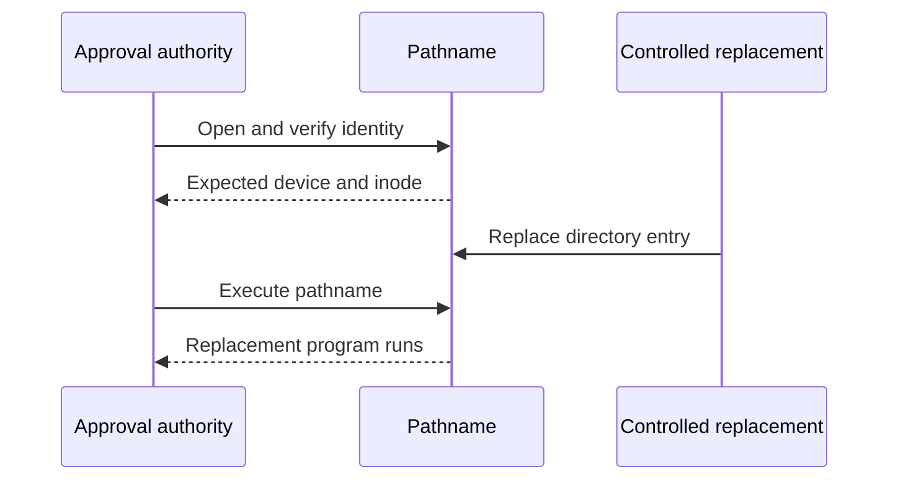

# Command execution binding experiment

The current probe does **not** establish atomic execution of the approved entry file. It demonstrates the pathname race and tests a descriptor-path alternative with disposable fixtures. No production execution path is enabled by this result.

## Reproduce

On an Apple Silicon Mac with Xcode:

```sh
python3 scripts/run-macos-execution-experiment.py
```

The script compiles two tiny programs in a temporary directory. Each prints a fixed marker and its executable path. It also creates a shell script with a fixed `printf`. Every child runs as the current user, with a minimal environment and a timeout. The temporary directory is removed on normal completion or exception.

It neither elevates privileges nor contacts an app, device, network, or approval service. The normal Mac check runs this synthetic experiment. Its output is evidence for that host, not a release certification.

## Measured behavior

The [retained local report](evidence/2026-10-01-execution-binding.json) used macOS 27.0 build 26A428, Xcode 27.0, SDK 27.0, and an arm64 macOS 26 deployment target. A deployment target is not a test on macOS 26.

The [retained CI report](evidence/2026-10-01-execution-binding-ci.json) separately repeats every observation on macOS 26.6.2 build 25G83, arm64, Xcode 26.6, and SDK 26.5. Its source job and tested commit are recorded in the report. The two hosts produced the same results below. This does not cover every macOS 26 release or launch configuration.

| Probe | Observed result | Meaning |
| --- | --- | --- |
| Execute original pathname | Original marker | The fixture works normally |
| Compare open descriptor and pathname identity | Same device and inode | The final identity check passed |
| Replace pathname, then execute it | Replacement marker | A successful check did not bind the later execution atomically |
| Execute `/dev/fd/<retained>` directly | `EACCES` for binary and script | This descriptor-path method did not work in the tested configuration |
| Read the retained script through explicit `/bin/sh` | Original script; `$0` names `/dev/fd/<retained>` | The descriptor is inherited and readable, but script-visible path semantics differ |
| Write the open script in place, then read it again | Changed script marker | Retaining an inode does not freeze its contents |
| Compile a call to `fexecve` through public `unistd.h` | Function undeclared | This SDK does not expose that declaration |



The replacement is deliberately scheduled after the check. This is a deterministic demonstration of the gap, not a probabilistic stress test or a claim about its usual duration. Adding a hash check before the same replacement would leave that gap. The experiment does not change an already loaded process.

The SDK probe only tests a public declaration. It does not prove that every possible platform mechanism is unavailable. The descriptor result does not establish behavior across other OS versions, filesystems, policies, or launch configurations. An unexpected compiler failure aborts the probe rather than being reported as an absent API.

## Accepted production contract

On 2026-10-03 the user accepted explicit pathname execution with a final executable identity/content and working-directory recheck. This preserves ordinary executable location and argv behavior while acknowledging the remaining replacement race and mutable dependencies.

Approval binds the invocation, not immutable program bytes. Do not silently copy programs into privileged storage, force a different interpreter, or restrict executable workflows. The [accepted limits](../design-decisions.md#command-execution-by-pathname) record the decision. Production execution remains unimplemented; the decision resolves its semantic contract only.

Before shipping, also resolve the separate sudoers or administered-policy gate, protected service placement, caller lifetime, deterministic environment, process I/O, durable consumption, and crash recovery. The phone must show exact arguments and the input-source disclosure. No result here substitutes for those checks.

References: the installed SDK's `unistd.h` and `spawn.h`, [Apple's execve manual](https://developer.apple.com/library/archive/documentation/System/Conceptual/ManPages_iPhoneOS/man2/execve.2.html), and [the execution adapter design](https://remozio-plan.seebrock3r.chatgpt.site/).
