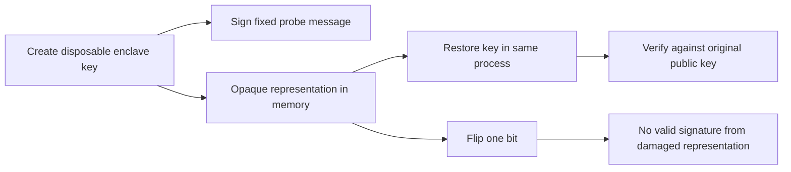

# Secure Enclave signing experiment

The probe created a disposable Secure Enclave P-256 key on this Mac. It signed a fixed message without authentication UI. A key restored from its opaque representation produced a valid signature under the original public key. A single-bit change to that representation did not produce a valid signature.

[Recorded result](evidence/2026-10-01-key-custody.json): macOS 27.0, build 26A428, Apple Silicon. This is local evidence, not a macOS 26 compatibility result.



## Run

```sh
swift build --package-path experiments/key-custody --triple arm64-apple-macosx26.0
probe_bin=$(swift build --package-path experiments/key-custody --triple arm64-apple-macosx26.0 --show-bin-path)
"$probe_bin/remozio-key-custody-probe"
```

Exit 0 means all probe assertions passed. Exit 77 means the probe could not establish them. The JSON identifies the last stage and a numeric error when available. Exit 70 means report serialization failed. There is no software-key fallback.

The probe sets `LAContext.interactionNotAllowed` before key operations. It uses `after-first-unlock-this-device-only` with `privateKeyUsage`. It does not request biometric enrollment, change permissions, install services, or store key representations. Reports contain booleans and error domain/code pairs, never signatures, key material, or error descriptions.

The tamper check accepts either an operation error or a signature that fails verification. It tests one mutation only. It does not establish why the operation failed, or prove resistance to every malformed representation.

CI builds the executable but does not run the hardware probe. The normal local gate also builds it without invoking it.

## What remains unproven

| Requirement | Evidence still needed |
| --- | --- |
| Availability before GUI login | Reboot and service tests with the selected production key policy |
| Access during lock/logout | Interactive lifecycle tests |
| Access limited to authorized code | Developer ID, protected placement, and independent process tests |
| Another Mac cannot restore a copied representation | Authorized two-Mac experiment |
| Durable key storage survives updates | Keychain storage and service replacement experiments |
| Ordinary restart and partial-state recovery | Protected local checkpoint and crash/recovery integration; [whole-Mac backup rollback is excluded](../design-decisions.md#whole-mac-backup-rollback) |

Apple documents that [after-first-unlock accessibility](https://developer.apple.com/documentation/security/ksecattraccessibleafterfirstunlockthisdeviceonly) requires one unlock after restart. This candidate must not be assumed to satisfy the root authority's pre-login requirement. The experiment does not select the production accessibility policy.

The [Secure Enclave API](https://developer.apple.com/documentation/cryptokit/secureenclave/p256/signing/privatekey) exposes an opaque representation for restoration. Successful restoration is useful evidence for key persistence. It does not supply a monotonic counter or detect restoration of an older journal and matching key blob. A signature over a backup cannot establish that the backup is the latest state.

The later [Secure Enclave TLS experiment](macos-enclave-tls.md) establishes a local Network.framework handshake using a disposable enclave key. It does not close the lifecycle and protected-installation gates above.
