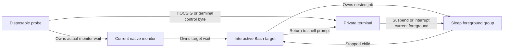

# Nested shell job-control experiment

The current native monitor supports nested Bash jobs in a disposable private terminal.
The [recorded evidence](evidence/2026-10-09-command-nested-shell.json) contains 30 successful trials on macOS 27.0.1.
The build targets arm64 macOS 26. This local result does not establish macOS 26 runtime behavior.

## What runs

The fixture compiles the current monitor, native parent, process owner, PTY implementation and launch decoder.
The only credential substitute is the monitor's UID guard. The kernel credentials remain those of the unprivileged test user.
A parent fixture observes each record after the original codec accepts it. It changes no record or acceptance result.
The synthetic launcher changes no credentials. No fixture enters the app bundle or installs a service.

Bash starts with `--noprofile --norc`, a disposable HOME and an explicit environment.
The probe reads and writes only its private terminal. It never changes the user's terminal.

## Measured sequence

| Step | Required observation |
| --- | --- |
| Prepare | The native parent registers the original target before one release |
| Start | The actual Bash target becomes ready |
| Nested job | `/bin/sleep` becomes the foreground group in the monitor's session |
| Suspend | The nested job stops; Bash returns to its foreground prompt |
| Ownership | The monitor remains alive; no accepted record reports the Bash target as stopped |
| Resume | `fg` restores the original nested foreground group |
| Interrupt | The private terminal interrupts that job; Bash observes status 130 |
| Finish | Bash exits with status 7; independent exec/exit evidence and actual waits agree |

Fifteen trials use `TIOCSIG` for suspend and interrupt.
Fifteen trials write the current terminal's `VSUSP` and `VINTR` bytes.
The probe waits until the nested sleep job is observable before sending either control.
That fixture check adds no product delay or command restriction.

The probe counts every accepted Bash stop record, including a stop followed by a continue within one poll.
Each real trial requires a zero count. A synthetic regression requires one stop while the retained snapshot shows continued state.
These counts describe reported records. The monitor can coalesce observations before it emits a record.
They do not prove the absence of every transient kernel state.

A nested job's suspension does not mean that the Bash target stopped.
Bash handles its own child and prompt. The frontend must preserve that distinction when job-state events are implemented.

## Reproduce

Run `python3 scripts/run-macos-nested-shell-experiment.py` without elevation on an Apple Silicon Mac.
`./scripts/check.sh` runs the same experiment on macOS, including CI.

The runner rejects changed or incomplete observations. It records host versions and source hashes.
It rejects a source change during measurement. Evidence contains no private paths, target arguments or terminal transcript.
The probe bounds fixture work and cancels through its owned monitor on failure or interruption.
A cleanup failure fails the experiment. Fixture deadlines set no product execution limit.

## Remaining gates

This experiment proves private-terminal behavior for the tested runtime and sources.
It does not prove the following:

- Protected service installation, production elevation, or cross-user execution.
- Authenticated frontend job-state events, real CLI suspension, or restoration of a user terminal.
- External debugger behavior, monitor crashes, crash recovery, or mixed redirected streams.
- Physical Mac/phone approval flow or macOS 26 runtime behavior from this local result.

[Issue 250](https://github.com/rock3r/remozio/issues/250) tracks debugger and ownership questions.
The [earlier leader and monitor experiment](macos-command-job-control.md) retains its separate observations and limits.
