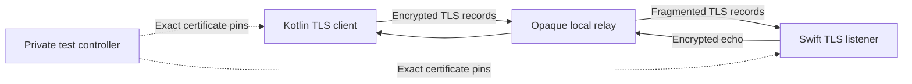

# TLS channel experiment

This experiment tests a streaming encryption candidate between macOS Network.framework and JVM JSSE. It uses loopback sockets and disposable identities. It does not select or install the production transport.

The relay copies bytes in both directions without a certificate or private key. The TLS session ends only at the Kotlin and Swift peers. The positive test sends empty and large synthetic frames through fragmented writes. It checks the negotiated TLS version and application protocol, recovers the exact bytes, and inspects relay capture for a distinctive plaintext marker.

## Candidate and controls

| Property | Experiment choice |
| --- | --- |
| Encryption | Platform TLS 1.3 only |
| Peer authentication | Mutual authentication with exact disposable leaf certificate pins |
| Certificate keys | Fresh software P-256 keys generated by JDK keytool |
| Application protocol | `remozio-experiment/1` through ALPN |
| Swift identity import | PKCS#12 with `kSecImportToMemoryOnly`; no persistent Keychain import |
| Session resumption | Disabled on the server; early data rejected before frame processing |
| Frame bound | Four-byte length, then at most 65,536 bytes |
| Listener | Ephemeral IPv4 loopback port, eight concurrent connections, ten-second connection lifetime |
| Relay | Loopback only, bounded capture, deliberately fragmented forwarding |

The controller supplies the pins through private process setup. This models an existing trusted enrollment; it is not pairing. The test directory permits only its owner to access it. Generated PKCS#12 files use a public synthetic password and are removed with the fixture. That password is not a production secret or security boundary.

The Swift peer rejects release builds and root execution. It echoes one synthetic frame and closes the connection. Closing the controller pipe terminates the peer, including after a controller crash. Do not package it in the application or expose its harness through a tunnel.

## Verification

Run `./scripts/check.sh` to build the native peer, then the repository's six-task Gradle gate. `:phone-core:approvalFlowTest` runs these tests on macOS. Linux portable tests exclude the native peer class.

The test cases cover:

- Mutual TLS 1.3 and exact payload recovery through the opaque relay.
- Wrong server pin rejection before application data.
- Wrong or absent client identity rejection.
- TLS 1.2 downgrade and unrelated ALPN rejection.
- Modified relay traffic rejection without an application reply.
- Oversized frame rejection before allocating its body.
- Native listener shutdown when the controller pipe closes.

A negative test must accompany the positive exchange. A failed connection alone does not establish correct peer authentication.

The [recorded run](evidence/2026-10-03-tls-channel.json) passed all seven tests on macOS 27.0.1, Apple Silicon, with JDK 21. The deployment target remains macOS 26; this is not a macOS 26 runtime result.

## What this does not prove

This relay is a local byte forwarder. It does not implement Cloudflare Tunnel, Access, HTTP, or WebSocket framing. A production internet path needs an outer carrier that preserves the inner TLS stream. Cloudflare terminating ordinary HTTPS would not satisfy this requirement on its own.

The tests use JVM JSSE and exported software keys. They do not prove Android Keystore integration, Pixel TLS behavior, Secure Enclave identity support, pre-login access, or production protected storage. Memory-only import is an API choice here, not proof of production key custody.

Exact leaf pinning is the fixture's trust policy. Certificate lifetime, renewal, enrollment epoch binding, compatibility negotiation, revocation, and code identity remain production requirements. Successful TLS authentication cannot replace the root service's current enrollment checks, signed request validation, or durable decision consumption.

TLS protects this stream. It does not reconcile request state across reconnects or prevent an authorized peer from repeating an application message. No command, credential, UI prompt, decision, or real device appears in the exchange. The 65,536-byte experiment frame bound is not the product's capture limit.

Further evidence must cover Android's hardware-backed client key, the outer relay carrier, protected service identities, and reconnect behavior before this candidate can become the production channel.

References: [Apple security options](https://developer.apple.com/documentation/network/security-options), [PKCS#12 import](https://developer.apple.com/documentation/security/secpkcs12import(_:_:_:)), and [JSSE guide](https://docs.oracle.com/en/java/javase/21/security/java-secure-socket-extension-jsse-reference-guide.html).

The later [WebSocket carrier experiment](websocket-carrier.md) tests an independent outer HTTPS layer. This page records the original byte-forwarder experiment.
