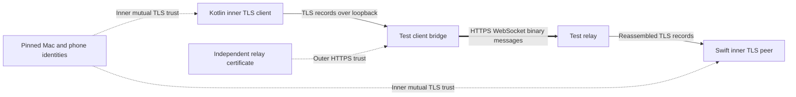

# WebSocket carrier experiment

This extends the [TLS channel experiment](tls-channel.md) with an independent HTTPS WebSocket carrier. All listeners bind to IPv4 loopback. No Cloudflare account, phone, provider credential, or production service is involved.

The client bridge splits the inner TLS stream into binary WebSocket messages. The relay reassembles that stream for the native Swift listener. The reverse path uses a different message size. WebSocket message boundaries therefore need not align with TLS records or application frames.

The relay terminates the outer HTTPS session and can inspect or alter every binary message. Those messages still contain only inner TLS records. Its private key and certificate are independent of the Mac and phone fixtures. The inner peers retain their existing mutual certificate pins and TLS 1.3 requirement.

## Checks

Four additional `TLSInteropTest` cases cover this boundary:

| Case | Required observation |
| --- | --- |
| Independent outer HTTPS and inner TLS | Exact large payload recovered; plaintext marker absent from relay message capture |
| Valid relay certificate, wrong inner Mac pin | Inner handshake fails despite successful outer authentication |
| Untrusted relay certificate | Outer connection fails before any inner bytes reach the relay |
| Relay modifies an inner message | Inner TLS rejects it without an application reply |

The harness uses OkHttp and MockWebServer 5.5.0 as test dependencies only. No new network library ships in either application. Endpoint and certificate values come from the fixture, never from incoming WebSocket messages. Text messages are rejected.

The bridge bounds queued output, captured bytes, and socket read time. Cleanup cancels WebSockets, closes local sockets, and joins worker threads. The native peer retains its controller-pipe lifetime and connection bounds from the earlier experiment.

Build the native peers with `./scripts/check.sh`, then run the six-task Gradle gate. The new cases run in `:phone-core:approvalFlowTest` on macOS. Linux portable tests continue to exclude this native class.

The [recorded run](evidence/2026-10-03-websocket-carrier.json) passed all four additional cases on macOS 27.0.1, Apple Silicon, and JDK 21. All eleven TLS tests passed together.

## Remaining integration gates

This validates a local HTTPS/WebSocket carrier, not Cloudflare Tunnel or Access. Deployment routing, provider authentication, failure responses, reconnect, and network transitions remain untested.

The client bridge adapts a JVM `SSLSocket` through another loopback socket. It is a test adapter, not the Android architecture. An Android-compatible stream adapter or TLS engine must preserve these boundaries and use the retained platform identity without exporting its private key. Hardware-key behavior still needs the Pixel session.

The relay is a test server with a fixed native upstream. It is not a production proxy or an arbitrary TCP tunnel. The production Mac endpoint still needs protected service identity, caller authentication, resource limits, and current enrollment checks. Neither successful TLS layer authorizes an approval or replaces signed request validation.

The experiment does not change the product's capture limits, setup UX, or transport selection. It supplies evidence that the two authentication layers can remain separate while carrying a native TLS stream through WebSocket binary messages.

References: [OkHttp WebSockets](https://square.github.io/okhttp/5.x/okhttp/okhttp3/-ok-http-client/new-web-socket.html), [MockWebServer](https://github.com/lysine-dev/okhttp/tree/parent-5.5.0/mockwebserver), and [published artifact versions](https://repo.maven.apache.org/maven2/com/squareup/okhttp3/mockwebserver3/maven-metadata.xml).
