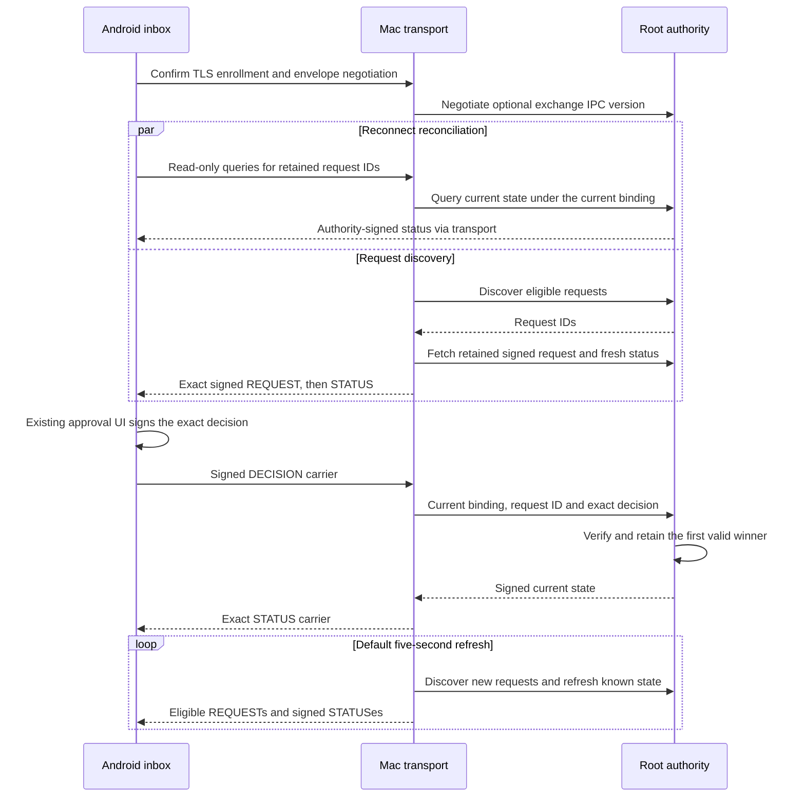

# Persistent approval channel

An enrolled phone keeps one authenticated channel open during foreground request review. The default Mac handler now connects request delivery and decision/status exchange.

## Messages and compatibility

All payloads use the existing enrollment-bound TLS channel and version-one session envelope. REQUEST, DECISION, and STATUS retain their existing signed version-one carriers. The transport checks decision routing claims. Only the root authenticates and consumes a decision. The phone authenticates each root signature and retained digest/challenge.

`RequestStatusQuery` is a separate read-only control message. Its canonical CBOR has exactly three keys: zero is version one, one is the text `request-state`, and two is a 16-byte request ID. It is at most 64 bytes. Both implementations reject unknown versions, extra fields, wrong types, and noncanonical bytes. A query grants no action or arbitrary signing authority.

The Mac negotiates exchange support through the root IPC before starting the loop. Explicit zero or unknown extension versions retain the earlier fetch-and-close handler. An unavailable selector can retire the connection. Pairing remains intact. Older fetch-only Macs cannot reconcile statuses or accept decisions on that handler. Their returned requests still require a signed status before the phone can act.

An unknown query or a forgotten root request yields no status. Silence, EOF, or an empty discovery result never means denied, expired, approved, or completed. These failures cannot replace an owner's verified state.

## Ownership and resource bounds

One consumer serializes all root operations and channel writes. One persistent reader handles incoming messages. Refresh never cancels a pending receive. The queue retains at most eight bounded incoming frames and one blocked reader; TCP applies backpressure. Refresh events occupy one bit. Incoming decisions and queries take priority over each next request in a discovery batch.

The negotiated receive path rejects a frame header above the decision carrier bound before allocating its body. Decisions are at most 4096 bytes. The loop tracks at most 4096 live request IDs. Terminal statuses leave the periodic watch set. A reconnect query can still retrieve retained terminal state.

The default refresh interval is five seconds. The default deadline for each network write is 30 seconds. Both have constructor settings. Root IPC retains its separate operation deadlines and bounded wait queue. EOF, cancellation, stale sessions, malformed messages, and failed writes close the channel. Custom transport handlers retain control.

The loop resends eligible retained requests during refresh. A write is not proof that the phone retained an owner. Resending lets an inbox retry after capacity becomes available. Android authenticates duplicates before reusing the owner; it preserves the original timing and status. Current presence still controls new request delivery. It cannot suppress status queries or outcomes for known requests.

## Android reconnect

The native Android receiver snapshots retained request IDs at connection start, including terminal owners. It sends only read-only queries for them. New captures received afterward create no extra reconnect queries. Responses use the existing authenticated status path and cannot create an owner.

Reconnect queries and existing UI decisions share one writer. Reads run concurrently with queries, which avoids a response/write deadlock. EOF retains owners. Cancellation or a lost decision reply never resubmits a decision. A later signed status reconciles the result. Foreground connection ownership and the existing reconnect control remain unchanged.

## Evidence and remaining integration

Swift tests use a negotiated in-memory byte stream and synthetic authority IPC. They cover exact signed request/status delivery, decision routing, terminal queries outside discovery, periodic discovery, duplicate retry, expiry/other-phone results, query backpressure, scope rejection, size bounds, timeout, cancellation, and stale sessions.

Kotlin tests cover the shared canonical query, retained pending/terminal reconciliation, startup snapshots, one shared writer, cancelled decisions, failed queries, and owner retention. Existing native carrier and TLS relay suites remain in the required gate.

These tests do not prove Android biometric hardware, native socket delivery through this loop, production root signer installation, FCM scheduling, protected app installation, terminal recovery after a root restart, or command execution. Those integration and device checks remain required.
