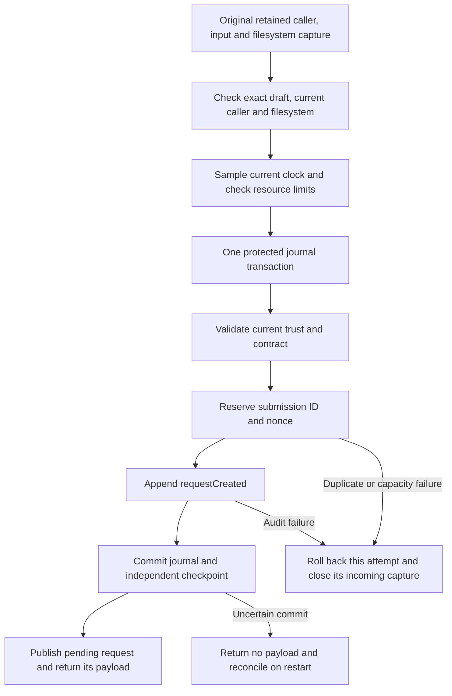
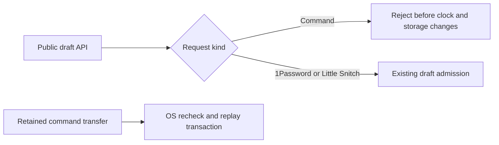

# Command admission replay transaction

`admitCommand` reserves the original submission ID and nonce when it creates the approval request. It uses the configured Mac/account scope and SHA-256 of the retained canonical capture. Callers cannot supply a substitute digest to this admission path.

## Ownership and replay

A duplicate ID or nonce rejects the incoming capture. It does not close the earlier command, consume its input, replace its pending request, or append another creation event. The existing owner serializes this operation with trust changes and request work.

Cancellation, decline, expiry, completion, and ordinary restart retain the reservation. The stored evidence grants no execution or retry permission. A caller cannot repeat an uncertain attempt just because it did not receive an acknowledgment.

Input bytes remain unread during admission. The request still owns the original caller, input object, and working directory. Existing cleanup closes them after rejection or retirement.

## Commit failure

A body failure rolls back both the reservation and creation event. The request owner publishes neither a pending entry nor an issued payload. After verified rollback, a fresh retained capture can use those still-unreserved values.

A checkpoint failure returns no issued payload and retires the writer. Restart reconciliation determines whether both writes committed. A committed candidate preserves both the creation event and replay reservation; a rolled-back attempt preserves neither. An uncertain result does not authorize automatic resubmission.

## Provisioning and remaining gates

The protected installer must complete the [explicit replay-store migration](macos-command-submission-replay.md) before command admission. Admission never creates a code policy or migrates the store lazily. An uninstalled store rejects the command before request publication.

The public generic draft API rejects commands before it changes the clock or storage. Commands must use `admitCommand`, which transfers the retained OS objects. Non-command adapter drafts keep their existing admission and action policy.

Synthetic lifecycle tests and the approval-flow experiment use an internal fixture method. It does not authenticate a caller or retain command OS objects. It is unavailable to ordinary module clients and grants no execution permission.

Production activation still requires protected target policy, current code checks, resource limits, authenticated no-admission replies, permit consumption, and process I/O. The endpoint remains disabled. These tests do not prove protected Root installation or device E2E.

## Evidence

Seven new tests exercise standalone and checkpointed request ownership, including serialized `AuthorityJournal` ownership. They cover original capture metadata, independent ID/nonce reuse, unread input, capacity, explicit installation, audit rollback, cancellation/decline, ordinary restart, and checkpoint prepare/finalize failures. Existing capture-rejection, expiry, close, and completion tests also check the replay record.

Two additional tests verify early public command rejection with standalone and checkpointed owners. They also verify unchanged public admission for 1Password access, 1Password unlock, and Little Snitch.
