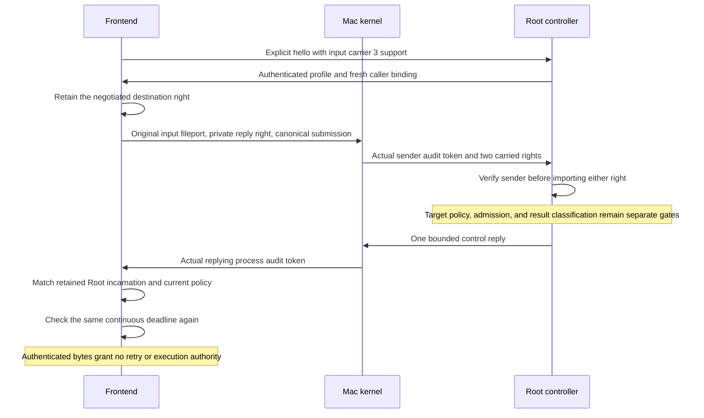

# Authenticated command reply channel

The command frontend can transfer its original input fileport and a private reply right in one authenticated Mach message. A separate control carrier returns bounded bytes from the retained Root incarnation.

The raw `submit` API returns bytes without admission semantics. The explicit [typed result contract](macos-command-admission-results.md) adds submission-bound validation under local wire version 2. These raw bytes are not an admission result. The channel establishes sender and transport identity. The request controller must still bind a typed result to the original submission and prove its admission state.

## Carrier contracts

| Carrier | Message ID | Version | Rights | Payload bound |
| --- | --- | --- | --- | --- |
| Existing input | `0x524d0402` | 2 | One input fileport | Configured command limit |
| Input with reply | `0x524d0405` | 3 | Input fileport, then private reply send right | Configured command limit |
| Admission control reply | `0x524d0406` | 1 | None | 4 KiB |

Input carriers have a complex header, descriptor count, typed send descriptors, big-endian version and byte count, payload, and zero alignment padding. The reply has the same version/count prefix but no descriptors. Unknown layout, version, kind, or padding rejects the packet. Input is never truncated or read during receipt.

`CommandHandshakeCapabilities.admissionReplies` explicitly selects input carrier 3. The default `current` profile and serial host retain carrier 2 until a complete admission controller is wired. Neither profile negotiates automatic retry semantics. A retained handshake rejects a received input carrier that differs from its selection.

The client retains its own reference to the negotiated destination. Submission accepts no replacement port argument. Closing the handshake releases that reference and prevents submission. A private reply port is created for each submission and released on every return path.

## Ownership

Both rights come from the same authenticated message. The receiver verifies the queued sender before importing them and matches the receipt to that preview. It validates the complete descriptor layout before converting the input fileport.

Before transfer, the received submission can send one opaque control reply. Copies share the input ownership claim. After capture claims it, those copies cannot send or dispose the reply. The retained capture owns the reply until the serialized request controller sends it or closes the capture.

A repeated transfer does not close an earlier owner's input or reply. A rejected first capture closes both. Recoverable send failure destroys pseudo-received copied rights and preserves borrowed originals. Shared input offsets and flags remain unchanged.

## Client checks

The public client requires the configured release Root policy and UID zero. It rechecks the retained authority before exposing invocation bytes or an input object. After receipt, it rechecks current policy and compares the complete audit binding with the original handshake authority. Another valid process under that policy cannot substitute for the retained incarnation.

One sleep-inclusive clock budget covers sending, waiting, authentication, and final return. Short queue-preview waits allow cancellation checks without resetting that budget. A response arriving at the final deadline is not returned. This control deadline does not shorten an admitted request's approval lifetime.

A lost reply remains uncertain. The client never resubmits automatically. If the client closes its private port before receipt, the queued reply descriptor may become a dead name; that packet is rejected with normal cleanup. If Root received the request earlier, losing the reply does not prove that admission failed.

## Evidence and remaining integration

Real Mach tests cover explicit negotiation, unread input, malformed rights, wrong senders, different process incarnations, control bounds, capture ownership, cancellation, lost replies, final deadline checks, and full-queue cleanup. Compiler probes accept valid admission-input transfer and reject replying through the transferred receipt or an alias.

The [sanitized experiment evidence](experiments/evidence/2026-10-08-command-admission-reply.md) records the tested platform and limits.

Production still needs typed submission-bound admitted/no-admission/uncertain results, verified rollback classification, negotiated retry classes, and one bounded fresh-resubmission controller. Replay duplicates or uncertain commits cannot be labeled as proof that the original submission created no request. The serial host must integrate that controller before advertising carrier 3. Protected installation, elevation policy, dispatch, and process I/O remain required. No production listener or approval is activated by this change.
