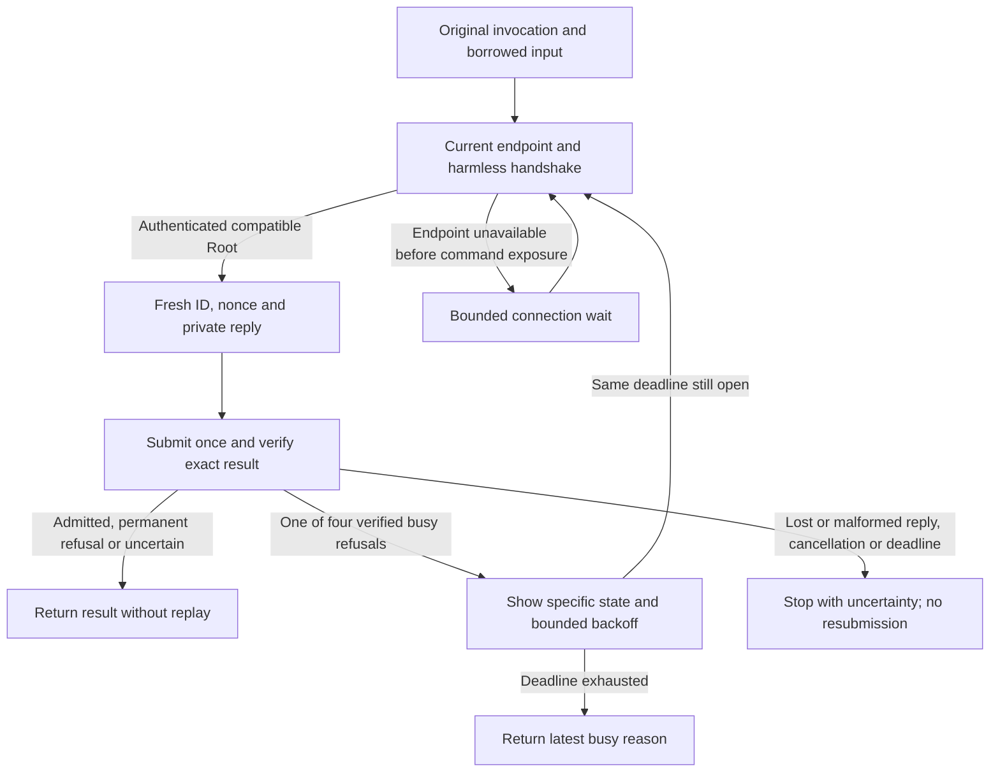

# Typed command admission results

The frontend can explicitly negotiate local wire version 2, submission schema 1, and input carrier 3. This contract defines typed results on the authenticated private reply channel. Wire version 1 remains unchanged and grants no typed result meaning.

The public `submitWithResult` method authenticates the actual replying Root process against the retained handshake incarnation. It then checks the exact submission and canonical result before the same continuous deadline ends. Product callers cannot construct `VerifiedCommandAdmissionResult` themselves.

```mermaid
sequenceDiagram
    participant F as Frontend
    participant R as Serialized Root owner
    participant J as Protected journal
    F->>R: Negotiated submission, original input, private reply right
    R->>R: Own input and detach private reply
    R->>J: Read current protected policy and checkpoint
    R->>R: Recheck actual caller and resolve current host state
    alt Known refusal before capture
        R->>J: Check scope, checkpoint, and ID-or-nonce absence
        R->>F: Not admitted only if proof succeeds; otherwise uncertain
    else Capture proceeds
        R->>R: Assemble immutable capture
        alt Capture and admission succeed
            R->>J: Reserve submission and create request atomically
            J->>R: Durable completion
            R->>F: Admitted request ID, digest, challenge
            Note over R: Reply loss preserves the admitted request
        else Known capture refusal or verified admission rollback
            R->>J: Check scope, checkpoint, and ID-or-nonce absence
            R->>F: Not admitted only if proof succeeds; otherwise uncertain
        else Duplicate, callback failure, or unclassified failure
            R->>F: Uncertain result
        end
    end
    F->>F: Match scope, binding, original bytes, and deadline
    Note over F: No automatic resubmission after uncertainty or reply loss
```

## Exact contract

The canonical CBOR envelope has exactly six keys:

| Key | Value |
| --- | --- |
| 0 | Result format 1 |
| 1 | Complete negotiated profile, including Mac/account scope |
| 2 | Original submission ID, nonce, and caller binding |
| 3 | SHA-256 of the original canonical submission bytes |
| 4 | Outcome: admitted 1, no admission 2, uncertain 3 |
| 5 | Exact outcome body |

The result is limited to 4 KiB, depth 6, and 96 items. Unknown fields, versions, kinds, reasons, and classes fail. Noncanonical encoding fails. A reply for different arguments fails even if a caller reused the same identifiers.

An admitted body contains a 16-byte request ID, 32-byte request digest, and 32-byte challenge. This acknowledges request creation. It grants no decision or execution permit.

A no-admission body contains a rejection reason and its exact retry class. Such a result must prove that this submission created no request and dispatched no action. Parsing a reason does not establish that state. The serialized host must construct this assertion only after a known pre-admission refusal or verified rollback.

| Reason | Required retry class |
| --- | --- |
| Update installing 1 | Update installing 1 |
| Authority starting 2 | Authority starting 2 |
| Update waiting 3 | Update waiting 3 |
| Storage unavailable 4 | Storage unavailable 4 |
| Invalid request 10, policy rejected 11, capacity exceeded 12, unsupported 13, requester exited 14 | Never 0 |

Contradictory pairs fail. An uncertain body contains one known uncertainty reason: admission rejected 1, duplicate submission 2, or storage failure 3. It never permits a new attempt. A timeout or lost reply also remains uncertain.

## Admission owner integration

The capture retains its authenticated negotiated profile and the digest of the original submission. The coordinator checks its trusted Mac/account scope before request creation.

After the first request transfer, the coordinator detaches the private reply right into its local attempt owner. Capture cleanup can then close the input, caller, and filesystem without losing that reply. Every return closes the detached right. A repeated transfer cannot detach an earlier owner’s right.

After the existing atomic reservation and request creation succeeds, the coordinator sends the admitted identity. Failure to send that reply does not enter rejection cleanup, roll back the request, or close its retained input. The request follows its normal lifetime and dispatch gates.

The coordinator classifies only its own validation and admission failures. Invalid drafts, capacity limits, and unsupported contracts permit a permanent refusal. Storage write failures permit the storage-unavailable class only after an intact absence read. Callback errors remain uncertain, even when they use a recognized error type.

Before sending any refusal, the owner checks retained commands and reads protected trust, the audit head, and historical reservations. The reservation query covers the original ID **or** nonce. A different ID with a reused nonce still prevents a refusal. Reservations never expire or get deleted.

Checkpointed storage must validate the independent committed boundary. A rejected transaction can remain usable only after verified rollback. Retired storage, failed reads, ambiguous commits, and failed checkpoint preparation or finalization remain uncertain. A successful journal commit with failed checkpoint finalization cannot permit automatic resubmission.

Duplicates remain uncertain. A claimed receipt alias cannot close or reply through the earlier owner.

## Ownership before capture

`prepareAdmission` authenticates the current handshake, full kernel sender binding, profile, and original canonical submission. The attempt owns input and reply before filesystem capture starts. Public transfers use Swift `sending`; object and alias reuse fail compiler probes.

The journal serializes the complete attempt. It checks the actual Root identity, current frontend policy, Mac/account scope, and protected storage again. An unprepared request owner reports authority starting only after an absence proof. Trusted host resolution can report a policy refusal or one of the four busy states before capture.

The host resolver supplies current target credentials, environment, and capture limits. Incoming claims cannot choose an elevation policy. Throwing from the resolver, draft, or cancellation callback always remains uncertain. A callback cannot mimic a filesystem error to authorize a retry.

Capture failure closes the original caller, input, and filesystem. The detached reply remains available to the journal owner. Only request-related path or file-kind failures permit a permanent refusal after a fresh absence proof. Resource, I/O, permission, unknown system errors, and changed captures remain uncertain. Storage or identity validation failure remains uncertain.

Successful capture transfers the reply to the existing request coordinator. Successful admission preserves its input even if acknowledgment delivery fails. Every refused attempt closes its original objects and private reply.

`pollAdmission` connects the serial receive queue, session registry, attempt, and journal owner. Its result callback observes local request failures. Those exceptions are not retry proofs. A handled refusal leaves a healthy queue available for another request. An unreadable host policy requests stop before more traffic is handled.

## Compatibility and remaining integration

Version selection chooses the highest supported common wire/carrier pair. Wire 2 requires carrier 3. The explicit [I/O channel profile](macos-command-io-channels.md) requires wire 3/carrier 4 and retains these exact admission meanings. Mixed-version peers can still select wire 1 with a common legacy carrier. An older raw reply cannot acquire new meanings through its payload.

The default registry and serial host continue to advertise wire 1 and input carrier 2. An integrated host can explicitly select `admissionResults` and use `pollAdmission`. This opt-in does not install a service or activate command execution.

Disposable fixtures exercise actual Mach receipt through the host, registry, and serialized journal. Tests cover pre-capture refusals, startup, missing executables, callback spoofing, historical ID/nonce collisions, and lost acknowledgments. The production entry rejects an unprivileged host before policy callbacks.

## Bounded caller integration

`CommandCallerReadiness.submit` uses the real handshake and admission client. Its immutable submission template preserves raw arguments, environment additions, working directory, target, rationale and I/O options. It discards the template's old identifiers.

Each permitted submission negotiates wire 2/carrier 3, creates random identifiers and uses a fresh private reply endpoint. The endpoint provider looks up the current registered service again. Authentication still requires the configured release Root policy and actual kernel sender before invocation bytes or input are exposed.



One continuous caller deadline covers lookup, negotiation, encoding, submission, validation, backoff and reason changes. Handshake receive previews keep cancellation checks active. Readiness, backoff and control durations are explicit caller settings. No wait changes an admitted request's approval lifetime.

An unavailable endpoint or metadata-only timeout can wait before command exposure. This is separate from retrying a submitted command. Signature failure, wrong scope, incompatible protocol and callback cancellation stop immediately.

Only an authenticated, exactly bound busy result permits another submission. Every new capture needs a new decision. After a send, timeout, cancellation, malformed reply and unknown outcome stop without replay. An earlier busy proof cannot classify a later in-flight timeout as a definite refusal.

Deadline exhaustion before submission carries the latest verified busy reason, or no reason while initial connection is unavailable. The later CLI must map these distinct states to nonzero statuses and show available status controls. The caller preserves the borrowed descriptor's bytes and flags. It never closes the original input or falls back through sudo.

Real Mach tests cover all four busy states, fresh identities, unchanged raw invocation data, unread pipe input, endpoint replacement, reason changes, continuous deadline jumps, cancellation, permanent refusals, uncertainty and reply loss. These fixtures do not run an elevated command.

The installed service endpoint provider, settings UI, CLI status mapping and command execution remain separate integration work.

Tests establish codec validation, exact binding, real Mach negotiation and receipt, final deadline checks, and acknowledgments from the serialized journal owner. Refusal tests cover both identifiers, retired resources, protected-read failures, rollback, capacity, unsupported contracts, and both checkpoint failure phases. Lost-delivery tests cover both checkpointed and ordinary fixture storage. Compiler probes reject public verified-result construction.

These tests run under a normal user with explicit test identities on macOS 27.0.1 and a macOS 26 deployment target. They do not prove protected Root deployment, macOS 26 runtime behavior, elevation policy, execution, or device end-to-end approval.

The I/O caller uses `CommandCallerReadiness.submitIO` and retains the admitted terminal session.
Its readiness deadline ends at admission, while each later terminal poll has its own finite control budget.
