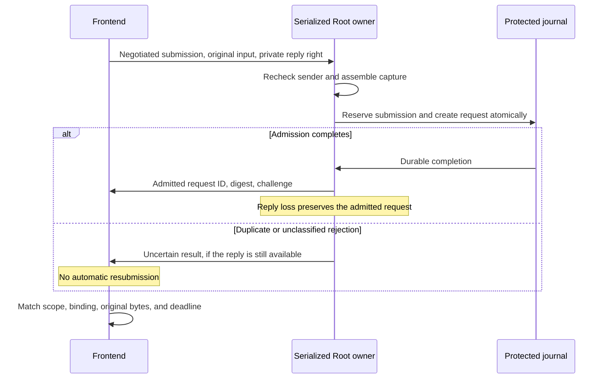

# Typed command admission results

The frontend can explicitly negotiate local wire version 2, submission schema 1, and input carrier 3. This contract defines typed results on the authenticated private reply channel. Wire version 1 remains unchanged and grants no typed result meaning.

The public `submitWithResult` method authenticates the actual replying Root process against the retained handshake incarnation. It then checks the exact submission and canonical result before the same continuous deadline ends. Product callers cannot construct `VerifiedCommandAdmissionResult` themselves.

## Exact contract

The canonical CBOR envelope has exactly six keys:

| Key | Value |
| --- | --- |
| 0 | Result format 1 |
| 1 | Complete negotiated profile, including Mac/account scope |
| 2 | Original submission ID, nonce, and caller binding |
| 3 | SHA-256 of the original canonical submission bytes |
| 4 | Outcome: admitted 1, no admission 2, uncertain 3 |
| 5 | Exact outcome body |

The result is limited to 4 KiB, depth 6, and 96 items. Unknown fields, versions, kinds, reasons, and classes fail. Noncanonical encoding fails. A reply for different arguments fails even if a caller reused the same identifiers.

An admitted body contains a 16-byte request ID, 32-byte request digest, and 32-byte challenge. This acknowledges request creation. It grants no decision or execution permit.

A no-admission body contains a rejection reason and its exact retry class. Such a result must prove that this submission created no request and dispatched no action. Parsing a reason does not establish that state. The serialized host must construct this assertion only after a known pre-admission refusal or verified rollback.

| Reason | Required retry class |
| --- | --- |
| Update installing 1 | Update installing 1 |
| Authority starting 2 | Authority starting 2 |
| Update waiting 3 | Update waiting 3 |
| Storage unavailable 4 | Storage unavailable 4 |
| Invalid request 10, policy rejected 11, capacity exceeded 12, unsupported 13, requester exited 14 | Never 0 |

Contradictory pairs fail. An uncertain body contains one known uncertainty reason: admission rejected 1, duplicate submission 2, or storage failure 3. It never permits a new attempt. A timeout or lost reply also remains uncertain.

## Admission owner integration

The capture retains its authenticated negotiated profile and the digest of the original submission. The coordinator checks its trusted Mac/account scope before request creation.

After the existing atomic reservation and request creation succeeds, the coordinator sends the admitted identity. Failure to send that reply does not enter rejection cleanup, roll back the request, or close its retained input. The request follows its normal lifetime and dispatch gates.

The coordinator currently sends uncertainty for a duplicate reservation or other unclassified rejection, when its reply remains usable. A duplicate does not prove that the earlier request was never admitted. A claimed alias cannot close or reply through the earlier owner.

No no-admission assertion is generated by this change. Verified rejection classification remains required. Some early capture or authority failures close the reply before an assertion can be made; the client observes uncertainty.

## Compatibility and remaining integration

Version selection chooses the highest supported common wire/carrier pair. Wire 2 requires carrier 3. Mixed-version peers can still select wire 1 with a common legacy carrier. An older raw reply cannot acquire new meanings through its payload.

The default registry and serial host continue to advertise wire 1 and input carrier 2. They must integrate complete admission-result handling before enabling wire 2. The explicit handshake and result APIs are exercised by disposable fixtures, without registering a production listener.

The bounded fresh-submission controller remains required. It must preserve unconsumed input, create fresh identifiers and capture for each permitted attempt, and use one sleep-inclusive caller deadline across all waits and reason changes. Lost replies, duplicate reservations, or uncertain commits cannot trigger automatic replay. No fallback through sudo is allowed.

Tests establish codec validation, exact binding, real Mach negotiation and receipt, final deadline checks, and acknowledgments from the serialized journal owner. Lost-delivery tests cover both checkpointed and ordinary fixture storage. Compiler probes reject public verified-result construction.

These tests run under a normal user with explicit test identities on macOS 27.0.1 and a macOS 26 deployment target. They do not prove protected Root deployment, macOS 26 runtime behavior, elevation policy, execution, or device end-to-end approval.
