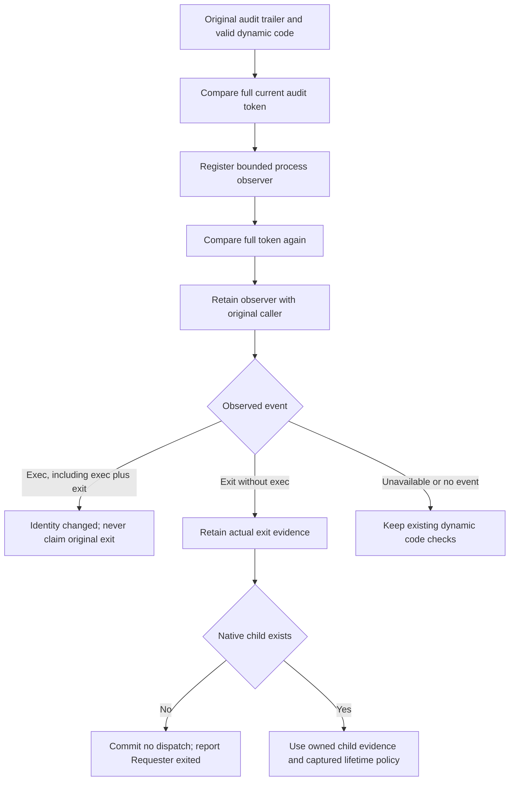

# Command caller lifetime

The native observer watches the original authenticated caller. It never signals or reaps that process.
The serialized command owner uses confirmed exit evidence to distinguish Requester exited before execution from other preparation failures.

## Binding and ownership

Observer construction compares the full audit token before and after kernel registration.
A changed token cannot attach an observer to a later process incarnation.
The event source must match the retained PID and process filter.
Exec takes precedence when the kernel combines exec and exit flags. That classification remains sticky after exit.
A changed pidVersion alone never proves physical exit.

Each poll is nonblocking. Interruptions leave the observation unchanged; native observation errors make it unavailable.
The private descriptor closes on retirement and has close-on-exec protection.
Closing the observer does not terminate, wait for, or otherwise control the caller.

The observer is optional. Failure to construct or poll it does not add a denial to a caller that passes existing policy checks.
The retained dynamic code, credentials and executable path still require validation.
Only the private caller record can set exit evidence. A callback error or supplied PID cannot set it.
Evidence survives closing the original resources, but grants no execution or replay authority.

## Execution boundary

An execution owner with no native child and confirmed caller exit returns the existing requester-exited-before-start terminal tag.
The journal commits the no-dispatch transition before attempting that original terminal reply.
If a terminal commit fails, the existing Unknown recovery path applies. It cannot later revise Unknown or repeat execution.

After a helper starts, its real preparation, release and execution observations determine the outcome.
An exit race does not create an atomic guarantee. A prepared helper can be cancelled before release without executing the approved program.
A released command uses the captured terminate or continue choice. Neither choice adds an execution duration limit.

## Evidence and remaining gates

The retained-caller tests use real signed peer processes, actual Mach audit trailers and original transferred stream resources.
They distinguish direct exit from exec followed by exit, reject an old full token after exec, and preserve the original capture.
A separate native fixture loses its own event descriptor. It returns Unavailable, never exit evidence.
Policy failure and observer closure leave the peer able to exec and exit normally.

The dispatch tests cover ordinary and checkpointed journals, pre-spawn exit, a helper-start race, both started-command lifetime choices and replay refusal.
A callback that throws the same validation error as an exited caller still cannot establish requester exit.

These checks run unprivileged on macOS 27.0.1 with a macOS 26 ARM64 compiler target.
Actual macOS 26 runtime behavior and Root observation across user boundaries remain unproven platform gates.
No service was installed, no credentials changed, and no physical device or terminal test ran.
The product frontend, phone presentation and protected service activation still need integration.
Private PTY forwarding, resize, signal controls and the selected elevation policy remain required before activation.
