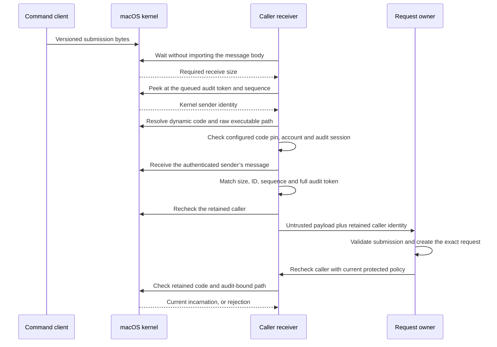

# Command caller receiver

`MachCommandCallerReceiver` receives submission bytes and binds them to their actual sender.
It does not approve a request or grant execution authority.

## Identity flow

Only a kernel trailer supplies the audit token. Payload identity fields cannot replace it.
The production constructor accepts the existing `XPCPeerPolicy`: Developer ID trust, component identifier, approved CodeDirectory hashes, account, and optional audit session.
The policy must come from protected configuration. A caller must not supply it.

The receiver retains the dynamic `SecCode` reference and the original audit token.
It uses `proc_pidpath_audittoken` to preserve the executable path as raw bytes.
The DTO records observed real and effective UIDs, PID, PID version, and signing information.
The optional POSIX session ID comes from `getsid`, between audit-bound identity checks.
The audit session ID is separate. The receiver does not infer a TTY.

At dispatch, the owner must supply the current protected policy. The record has no cached-policy fallback.
Any failed recheck retires the record. A later check cannot recapture another process.
Explicit close also retires it. Access must be serialized by its owner.

## Carrier version 1

The owner lends a receive right and retains responsibility for its lifetime.
The receiver must be its sole consumer. The owner serializes every preview, discard and receive.
No endpoint or service is installed by this library.
The owner supplies a positive maximum payload size and a positive receive timeout.
It must select these values within its protected memory and request budgets.

| Field | Encoding |
| --- | --- |
| Mach message ID | `0x524d0401` |
| Header | Native public `mach_msg_header_t` |
| Carrier version | Big-endian UInt32, value 1 |
| Payload byte count | Big-endian UInt32, nonzero |
| Payload | Opaque bytes, up to the configured maximum |
| Padding | Zero bytes to the next four-byte boundary |
| Audit trailer | Kernel-provided format 0 audit trailer |

Unknown versions, incorrect lengths, nonzero padding, unexpected IDs, reply ports, vouchers, and complex messages are rejected.
Oversized packets are discarded without truncation. The next receive can process another packet.
Received message rights are destroyed after either acceptance or rejection.
The C shim also destroys partially received resources on a body error.
Receive interruptions return an error instead of silently restarting the full timeout.

The carrier version does not replace application protocol negotiation or schema validation.
Version 2 adds one input fileport through an explicit method. Reply channels and streaming execution I/O remain separate integration work.
The receiver authenticates the sender before allocating its message arena or importing message resources.
It waits with a 32-byte buffer, `MACH_RCV_LARGE`, and a requested audit trailer.
Even a bare header needs more space with that trailer, so the message remains queued.
`mach_port_peek` then supplies the kernel audit token, sequence, and ID without importing its body.

The bounded receive result supplies the user-space message size.
The peek API reports the queued kernel representation size, which can differ.
The peek API's returned byte count establishes the audit data length; its stored trailer header can still report eight bytes.
The receiver compares the final message size, ID, sequence, and full audit token before returning any payload.
It also rechecks the retained caller after receiving the message.

For a rejected sender or invalid size or ID, a tiny receive without `MACH_RCV_LARGE` discards the queued message.
The kernel destroys its body rather than importing transferred memory or descriptor rights into the receiver.
A failed discard surfaces its Mach error, including interruption; the caller must recover before treating that queue head as consumed.
Receive waits share a monotonic timeout budget. System identity checks are not preemptible, so this is not a hard operation deadline.

An authenticated sender can still transfer resources before carrier version 1 rejects a complex packet.
Kernel queue pressure and resources held during send are also outside this receiver's budget.
Descriptor admission, trusted-sender resource limits, and complete denial-of-service protection remain separate work.

## Input carrier version 2

The owner explicitly calls `receiveInput` on a channel that supports this carrier.
The existing `receive` method continues to accept only version 1. Neither method silently downgrades the other carrier.

| Field | Encoding |
| --- | --- |
| Mach message ID | `0x524d0402` |
| Header | Native public `mach_msg_header_t`, complex flag set |
| Body | Native `mach_msg_body_t`, exactly one descriptor |
| Input | Native `mach_msg_port_descriptor_t`, a received send right to a fileport |
| Carrier version | Big-endian UInt32, value 2 |
| Payload byte count | Big-endian UInt32, nonzero |
| Payload | Opaque submission bytes, within the configured maximum |
| Padding | Zero bytes to the next four-byte boundary |
| Audit trailer | Kernel-provided format 0 audit trailer |

The receiver applies the same sender preview, protected policy, timeout budget, and final identity checks.
It validates the descriptor count and type before interpreting carrier metadata.
Reply ports, vouchers, extra descriptors, transferred memory, unknown versions, and malformed payloads are rejected.
Message destruction releases received rights on every success or rejection path.
An ordinary Mach send right fails fileport conversion; it cannot supply input.

`RetainedCommandInputDescriptor` owns the imported descriptor independently of the received fileport right.
It sets the descriptor-local close-on-exec flag. It does not alter shared open-file status flags or read source bytes.
The request owner serializes borrowing and closes both the input descriptor and caller record when the request retires.
A borrowed descriptor must not escape its callback, be closed by the borrower, or be passed to another thread.
Closing the owner is idempotent. A closed owner cannot lend its former descriptor number.

The same authenticated Mach message associates the input object with its submission bytes and observed sender incarnation.
Those bytes still need schema validation and admission. An input descriptor is not consent or execution authority.
The descriptor shares its open-file offset and status flags with other holders. Source content remains caller-controlled.

This library installs no endpoint and exposes no product sender that transfers input to an unverified service.
The future client must authenticate the Root endpoint and bind the negotiated channel before transferring its input.
An admission owner must bind the submission ID, nonce, stream binding, request lifetime, and current protected policy.
It must bind the source observation to that request and enforce resource budgets. This carrier does not add protocol negotiation, replies, or command I/O.
Authenticated senders can still import resources before invalid descriptor types are rejected; that budget limitation remains.

## Observing the retained input

`input.capture(streamBinding:)` describes the imported object without reading source bytes.
The authority supplies a 16-byte binding and retains its association with this descriptor and request.
A binding copied from caller claims does not prove that association.

The method checks read access with `F_GETFL`, then queries `fstat`, `isatty`, and `F_GETPATH`.
Write-only and event-only descriptors fail with `notReadable`.
An invalid binding fails before querying the object. A closed owner cannot produce another observation.

| Kernel observation | Capture kind | Minimum schema |
| --- | --- | --- |
| Character device matches the current `/dev/null` device number | Null | 1 |
| Regular file | File | 1 |
| FIFO | Caller-controlled pipe | 1 |
| Character device with a positive terminal query | Caller-controlled terminal | 1 |
| Socket | Caller-controlled socket | 2 |
| Directory | Directory | 2 |
| Other character or block device | Caller-controlled device | 2 |
| Another reported file type | Other caller-controlled source | 2 |

Null input retains no descriptive path, identity, or stream binding in the capture.
Other sources retain the supplied binding and the observed device and inode values.
Those numbers are observations, not a globally unique stream key.
The live descriptor association remains authoritative.

A successful absolute `F_GETPATH` result is retained as raw bytes.
An unavailable path remains null. Pipes and sockets do not need a path to remain supported.
No path is reopened to obtain input. Replacing a named file does not replace the imported object.

An imported pseudo-terminal slave can prove that it is a terminal through `isatty`.
The local probe's `TIOCPTYGNAME` query returned `ENOTTY` on that slave.
The adapter therefore uses the generic terminal label, without guessing from path spelling.
The PTY tag remains available for a source whose construction proves that stronger description.

The producer must select a supported capture schema before encoding an issued request.
`CommandInputKind.minimumSchemaVersion` gives the required version for each source kind.
Schema 1 cannot receive a socket, directory, device, or other-source label.
The producer must not substitute another kind to bypass that requirement.

Observation does not freeze content, open-file offsets, flags, or terminal settings shared with other holders.
The producer and executor must keep the descriptor associated with the original request.
A captured access mode is not a promise of later read success.
This method does not approve input bytes, allocate an execution permit, or execute a command.

## Validation and limits

The focused tests send real Mach messages. They check payload preservation, malformed packet rejection, queue recovery, and timeouts.
They reject wrong accounts, audit sessions, and code hashes. The public release policy rejects the test host.
A disposable signed child executes again with the same PID and a different PID version.
Rechecks reject its old incarnation and its exited incarnation.
Complex packet tests include a transferred send right and 64 KiB of synthetic out-of-line memory.
Repeated previews retain the queue head without increasing its send-right references.
A normal receive imports the right and memory as a positive control, and message destruction releases the right.
A wrong account is rejected before complex-body parsing, and explicit discard preserves the next queued packet.
Bare-header and empty-queue cases check the tiny receive path and timeout.

The fixtures use internal ad-hoc policies. Product callers cannot select that fixture path.
Ad-hoc signing appears as ad-hoc metadata, not verified publisher trust.
The [audit-token experiment](experiments/macos-command-caller.md) also has retained macOS 26 CI evidence.

Process identity is not request consent or channel continuity.
The future admission owner must bind the submission, request nonce, lifetime, and transport channel.
It must enforce the current component role and security floor from protected release metadata.
This library does not check caller ancestry or sudoers policy, install Root, read stdin content, or execute commands.
It does not prove PID reuse behavior or physical-device end-to-end behavior.

The shim uses public installed Mach and Security declarations.
Apple's [receive implementation](https://github.com/apple-oss-distributions/xnu/blob/main/osfmk/ipc/mach_msg.c) describes partial body-error copyout.
Apple's [Mach library implementation](https://github.com/apple-oss-distributions/xnu/blob/main/libsyscall/mach/mach_msg.c) describes interruption retries and received-resource destruction.

Apple’s [queue preview implementation](https://github.com/apple-oss-distributions/xnu/blob/main/osfmk/ipc/mach_port.c) returns audit data without receiving the body.
Its [message queue implementation](https://github.com/apple-oss-distributions/xnu/blob/main/osfmk/ipc/ipc_mqueue.c) distinguishes queued kernel sizes from receive sizes.

Input-carrier tests preserve regular-file identity and offset, queued and later pipe bytes, shared flags, and close-on-exec.
They close the sender’s original descriptor and fileport before receipt, reject ordinary ports and transferred memory, and check version isolation and cleanup.
These use disposable local resources and synthetic input. They do not exercise a phone, protected Root installation, or physical-device end-to-end behavior.

Source-observation tests use real imported fileports for pipes, files, sockets, directories, `/dev/null`, `/dev/zero`, and a disposable terminal.
They preserve queued bytes, file offsets, and shared flags, reject write-only input, and keep the original object after path replacement.
They check binding lengths, schema requirements, and closed-owner behavior.
They do not prove atomic observations, immutable content, or read success for every possible device.
