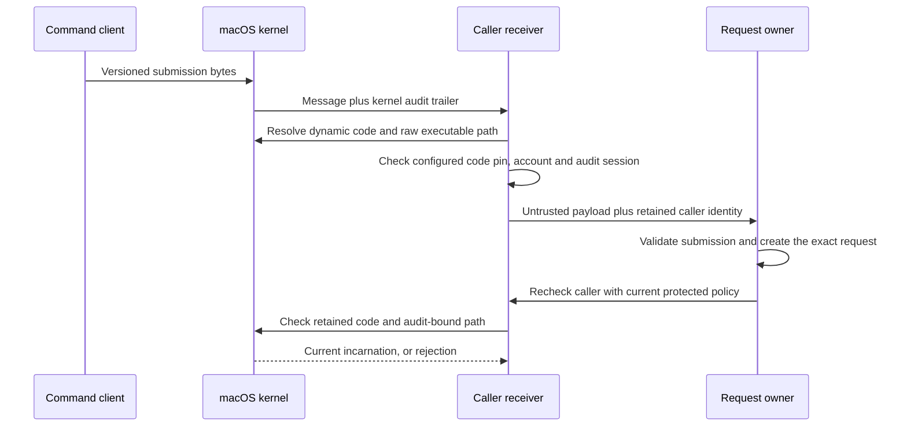

# Command caller receiver

`MachCommandCallerReceiver` receives submission bytes and binds them to their actual sender.
It does not approve a request or grant execution authority.

## Identity flow

Only a kernel trailer supplies the audit token. Payload identity fields cannot replace it.
The production constructor accepts the existing `XPCPeerPolicy`: Developer ID trust, component identifier, approved CodeDirectory hashes, account, and optional audit session.
The policy must come from protected configuration. A caller must not supply it.

The receiver retains the dynamic `SecCode` reference and the original audit token.
It uses `proc_pidpath_audittoken` to preserve the executable path as raw bytes.
The DTO records observed real and effective UIDs, PID, PID version, and signing information.
The optional POSIX session ID comes from `getsid`, between audit-bound identity checks.
The audit session ID is separate. The receiver does not infer a TTY.

At dispatch, the owner must supply the current protected policy. The record has no cached-policy fallback.
Any failed recheck retires the record. A later check cannot recapture another process.
Explicit close also retires it. Access must be serialized by its owner.

## Carrier version 1

The owner lends a receive right and retains responsibility for its lifetime.
No endpoint or service is installed by this library.
The owner supplies a positive maximum payload size and a positive receive timeout.
It must select these values within its protected memory and request budgets.

| Field | Encoding |
| --- | --- |
| Mach message ID | `0x524d0401` |
| Header | Native public `mach_msg_header_t` |
| Carrier version | Big-endian UInt32, value 1 |
| Payload byte count | Big-endian UInt32, nonzero |
| Payload | Opaque bytes, up to the configured maximum |
| Padding | Zero bytes to the next four-byte boundary |
| Audit trailer | Kernel-provided format 0 audit trailer |

Unknown versions, incorrect lengths, nonzero padding, unexpected IDs, reply ports, vouchers, and complex messages are rejected.
Oversized packets are discarded without truncation. The next receive can process another packet.
Received message rights are destroyed after either acceptance or rejection.
The C shim also destroys partially received resources on a body error.
Receive interruptions return an error instead of silently restarting the full timeout.

The carrier version does not replace application protocol negotiation or schema validation.
Descriptor transport, reply channels, and streaming I/O require their own designed extension.
Complex messages can import resources before application rejection. This component alone does not establish a complete hostile-sender resource budget.

## Validation and limits

The focused tests send real Mach messages. They check payload preservation, malformed packet rejection, queue recovery, and timeouts.
They reject wrong accounts, audit sessions, and code hashes. The public release policy rejects the test host.
A disposable signed child executes again with the same PID and a different PID version.
Rechecks reject its old incarnation and its exited incarnation.
A complex packet test checks that rejection releases an imported send right.

The fixtures use internal ad-hoc policies. Product callers cannot select that fixture path.
Ad-hoc signing appears as ad-hoc metadata, not verified publisher trust.
The [audit-token experiment](experiments/macos-command-caller.md) also has retained macOS 26 CI evidence.

Process identity is not request consent or channel continuity.
The future admission owner must bind the submission, request nonce, lifetime, and transport channel.
It must enforce the current component role and security floor from protected release metadata.
This library does not check caller ancestry or sudoers policy, install Root, capture stdin, or execute commands.
It does not prove PID reuse behavior or physical-device end-to-end behavior.

The shim uses public installed Mach and Security declarations.
Apple's [receive implementation](https://github.com/apple-oss-distributions/xnu/blob/main/osfmk/ipc/mach_msg.c) describes partial body-error copyout.
Apple's [Mach library implementation](https://github.com/apple-oss-distributions/xnu/blob/main/libsyscall/mach/mach_msg.c) describes interruption retries and received-resource destruction.
