# Retained command capture assembly

`RetainedCommandCapture` combines the payload and input from one authenticated Mach submission with OS observations.
It produces the exact canonical `CommandCapture` bytes used by an issued approval request.
The owner retains the original caller, input descriptor, executable, and working-directory observations for later rechecks.

```mermaid
flowchart LR
    M[Verified Mach sender and fileport] --> S[Parse original submission bytes]
    S --> B[Match authenticated channel binding]
    B --> P[Apply resolved target and minimal environment]
    P --> O[Observe files, input, caller, ancestry]
    O --> C[Encode exact command capture]
    C --> R[Recheck original caller and files]
    R --> H[Retain objects for admission and dispatch]
    H -. host integration .-> A[Issued request and signed approval]
    A -. consumed permit .-> D[Current policy and final recheck]
```

## Trust inputs

The receiver constructs `ReceivedMachCommandInputSubmission`; callers cannot fabricate its verified sender record.
The assembler parses that record's original payload. It does not take a separately supplied argv or caller label.
It requires the channel binding from authenticated host state and a 16-byte stream binding created by the authority.
A binding copied from the untrusted submission is not an authenticated channel.

The host supplies target credentials resolved through current protected elevation policy and OS state.
The target UID must match the requested UID. The host also supplies the complete explicit minimal environment.
This class is not an elevation-policy resolver and does not infer permission from administrator membership.
The sudoers compatibility decision and production resolver remain required integration work.

| Field | Source |
| --- | --- |
| Argv, requested paths, I/O mode, disconnect option, rationale, submission identifiers | Original frontend payload |
| Actual requester and signing observations | Retained audit-bound Mach sender |
| Executable identity/hash and working-directory identity | Retained filesystem capture |
| Input kind, available descriptive path and identity | Actual imported fileport descriptor |
| Ordered bounded ancestry | Kernel process observations from the retained caller |
| Target UID/GID/groups/name and minimal environment | Trusted host policy and OS resolution |

The filesystem adapter observes the requested paths. It preserves path and argv semantics, including scripts and symlinks.
The command producer does not add an implicit shell or copy the program to another location.
The remaining pathname-execution race is the accepted design limit.

## Environment and schema selection

The assembler validates the minimal environment and rejects duplicate names or entries marked as caller additions.
Explicit additions replace a minimal value with the same name and carry requested provenance.
It sorts the complete effective environment by unsigned raw name bytes. It never reads the service's ambient environment.
The host must select PATH, HOME, and locale behavior through the eventual policy/settings integration.
This class adds no hidden environment restriction or product default.

The host explicitly selects the negotiated phone capture schema.
Actual socket, directory, device, and other-source inputs require schema 2. Schema 1 cannot substitute a different source kind.
The `CommandCapture` producer encodes every field and passes the result through the existing strict parser.
Shared schema 1 and 2 vectors re-encode to their exact original canonical bytes.

## Ownership and dispatch

Construction takes ownership of the received caller and input on both success and failure.
The host must not reuse or copy that received submission into another request owner.
A failed parse, binding/context check, observation, size limit, or cancellation closes the transferred resources.
The host serializes all access and closes the owner on request retirement.

Before dispatch, the host consumes the durable permit and validates current elevation policy.
It then calls `recheck(currentPolicy:)` with the current protected caller policy.
A failed caller, filesystem, input-lifetime, or cancellation check closes the whole owner.
A closed owner cannot lend either its old input or working-directory descriptor.
The exact original objects can be borrowed through bounded callbacks for later process I/O and directory setup.
Borrowers must not close, retain, or pass those descriptors to another thread.

Input capture and recheck do not read stdin. Streaming content remains caller-controlled.
Input paths are descriptive observations. Dispatch retains the original object rather than reopening its descriptive path.
Capturing metadata does not freeze content, offsets, flags, terminal settings, dependencies, or process ancestry.

## Evidence and remaining integration

Real Mach/fileport tests assemble a complete command from its original payload and preserve queued pipe bytes.
They check environment override provenance, raw argv, actual requester identity, directory identity, and issued-request byte preservation.
They reject malformed payloads, wrong bindings, wrong target UIDs, unsupported schemas, invalid minimal environments, and resource overflow.
Cancellation, executable replacement, and a changed caller policy retire all transferred resources.
Socket tests require schema 2 without a downgrade.

This library creates no admission record, signs no request by itself, installs no Root endpoint, and executes no command.
Mutual frontend/Root negotiation, target-policy resolution, admission/replay handling, permit dispatch, and process I/O remain integration work.
Protected deployment and physical-device end-to-end tests remain unperformed.
