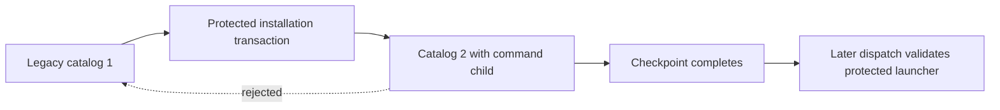

# Installed command child policy

The protected code policy now records the command child as role 11.
Its entry retains the team, signing identifier, code-directory hash, installed generation and minimum generation.
This metadata grants no permission to execute a command.

## Catalog formats

| Catalog format | Accepted roles | Use |
| --- | --- | --- |
| 1 | Original roles 1–10 | Read existing installations without changing their canonical bytes |
| 2 | Original roles and command child 11 | Write new policies and record the command child |

Unknown formats and roles fail closed. Format 1 cannot carry role 11.
New policy construction uses format 2. Decoding preserves the original format for canonical validation.
A successor cannot lower its catalog format, remove an existing role, change its identity or lower either generation floor.
Inactive roles retain their identity and floors.

## Stored policy compatibility

The catalog format is separate from the stored snapshot format.
Snapshot format 2 wraps a tagged catalog and the retained revision token for each role.
It can contain catalog 1 or catalog 2. Existing bare catalog 1 rows remain readable.
Bare catalog 2 is not a legacy snapshot and is rejected.

An upgrade changes the global policy revision and the checkpointed authority digest.
Unchanged entries retain their existing role tokens. The new command child receives its own token.
The audit ledger and its head remain unchanged by this installation metadata update.
A rejected downgrade leaves the installed policy and checkpoint intact.

Older binaries that only support catalog 1 reject catalog 2. They must not reinterpret it or reset the protected store.
The installer and update flow must respect this support boundary when choosing a runnable authority binary.

## Dispatch integration

The future Root dispatch controller must read the current active child entry from protected journal state.
It must validate the retained protected launcher path with `SignedExecutableValidation` and the entry's identity and floors.
It must repeat relevant installation checks before releasing the original prepared child.
A copied policy entry, receipt or caller-supplied path cannot authorize release.

The command process mechanics are described in [the native process owner](macos-command-process.md).
Protected installation, selected elevation policy and durable dispatch wiring remain required before product execution.
No service or executor is activated by this catalog change.

## Validation

Tests retain exact legacy bytes, reject role 11 under format 1 and reject unknown formats.
They check the stored wrapper separately from its catalog and reject bare catalog 2.
A journal test upgrades the legacy catalog, preserves old role tokens and floors, and creates the child token.
It reopens the store, reconciles the completed checkpoint and rejects a format downgrade without changing persisted state.

Local validation on 2026-10-08 passed all nine focused tests.
The full native gate passed with 1127 core tests and 97 protocol tests on Apple Silicon, with the macOS 26 deployment target.
The required Kotlin/Android gate passed in 26.660 seconds, including 532 tests, APK assembly and lint.
These checks do not establish a protected installation or a connected product executor.
