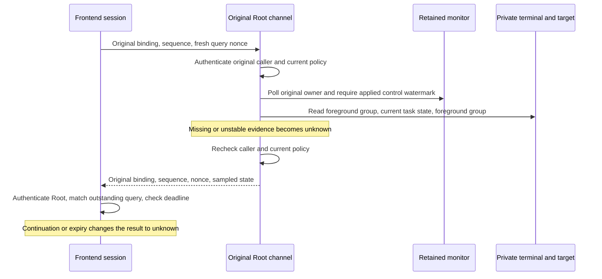
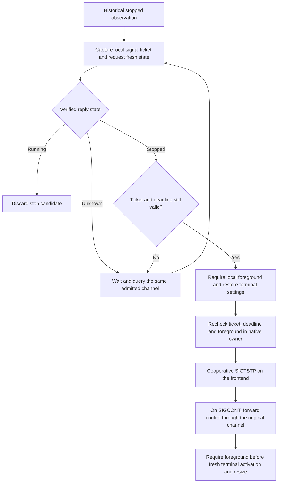

# Fresh command job queries

The command channel now supports a fresh query on explicit local wires 10 and 11.
Wire 10 uses mapped PTY routing. Wire 11 keeps separate stdio and private controls.
Both use submission schema 1 and input carrier 5. Capture schema 3 remains a separate contract.
Historical wires 1 through 9 retain their meanings and reject the new frames.
The existing mapped caller entry point defaults to wires 8 and 9.
The packaged CLI explicitly requests wires 10 and 11. It does not fall back after an incompatible offer.

## Exchange

The query uses the original admitted channel. It carries no PID, executable, approval, or replacement authority.
Each reply includes the existing request digest, challenge, submission digest, caller binding, and negotiated profile through the stream binding.
Each direction keeps its consecutive channel sequence. A fresh query contains a random 32-byte nonce.
Only one query can be outstanding. A send with zero progress retains its unsent nonce.
A reply with a wrong nonce, replay, or regressed stopped revision retires the original session.
It never permits another command submission.

| Direction | Frame tag | Payload |
| --- | --- | --- |
| Frontend to Root | 16 | Exactly 32 nonce bytes |
| Root to frontend | 6 | Exact state map containing the same nonce |

| Reply state | Map fields |
| --- | --- |
| Unknown | 0: nonce; 1: state tag 0 |
| Running | 0: nonce; 1: state tag 1 |
| Stopped | 0: nonce; 1: state tag 2; 2: positive signal below NSIG; 3: positive native job revision |

Unknown fields, malformed nonce lengths, wrong directions, and historical profiles fail validation.
A reply after output EOF does not reopen output or remove its acknowledgment requirement.

## Root checks

Root handles the query after the bounded control batch. Earlier pipe controls must have an application acknowledgment from the original monitor.
The [private monitor protocol](macos-command-monitor-protocol.md) describes this separate version-2 watermark.
The native query checks the original target's birth, monitor parent, current BSD state, and read-only task suspension count.
Tracing or a changed process group makes the response unknown.

For PTY routing, Root reads the foreground group on its own private master before and after the target query.
Both readings must match the retained original target group. An absent group or nested foreground group remains unknown.
This does not establish ownership of a nested job or signal that job.
Pipes keep their direct descriptors and do not acquire a private terminal.

The channel authenticates the original caller and checks current protected policy before and after obtaining state.
If the reply queue is full, Root retains the nonce and recomputes the state on the next attempt.
It must not retain an unsent stopped confirmation across that delay.

## Frontend checks

The session authenticates Root before decoding. It checks the complete stream binding, channel sequence, and outstanding nonce.
Accepted input, signals, resize, or cancellation invalidate a pending query. A continued job observation also invalidates it.
Local continuation can invalidate the query before its control reaches Root.

The caller sets a positive freshness budget from 1 through 60,000 milliseconds. The API default is 250 milliseconds.
The budget starts before authentication and queuing. Continuous time bounds reply freshness.
An expired reply becomes unknown. It does not cancel the command or close its channel.
A later query uses another nonce on that same admission.

`VerifiedCommandCurrentJobObservation` exposes read-only state and original bindings. Its constructor is private to the verified receiver path.
It describes the sample point. Another process can change target state after that point.
The CLI reconciles local continuation and terminal ownership immediately before cooperative suspension.
The transport result alone is not a suspend instruction.

## CLI stop and resume

Any recorded local signal changes the ticket. Consuming pending signal bits does not reset that ticket.
The ticket saturates rather than wraps. It contains no remote authorization.
The native operation checks the continuous-clock deadline before and after queuing its own masked stop.
An intervening continuation or expired sample cancels that pending stop through local SIGCONT.
The loop uses the existing authenticated continuation control. It sends no second target stop for a confirmed stopped job.
Background resume leaves terminal settings restored. Foreground resume copies the current dimensions before relaying more traffic.
Ordinary orphaned-group behavior remains intact. No path substitutes SIGSTOP or takes terminal foreground.

## Evidence and remaining gates

Real anonymous Mach tests exercise both profiles, exact nonce binding, one outstanding query, wrong nonce, replay, and revision regression.
They also fill the four-message reply queue, change the sampled state, and verify recomputation after draining it.
Continuation and deadline tests verify unknown results. The expiry test issues another query on the original admitted channel.
These transport tests supply synthetic sampled states. They do not prove an installed Root service or real command execution.

Separate disposable native monitor tests verify applied signal ordering, current task state, actual private foreground ownership, and final reaping.
They use an unprivileged wrapper and install no service. The local runtime is macOS 27.0.1 with an arm64 macOS 26 build target.
Actual macOS 26 runtime, signed target task-name access, and installed privileged service checks remain unproven.

The actual CLI now selects the new profiles and schedules queries from historical stop candidates.
A Debug-only anonymous-Mach fixture supplies a nonce-bound synthetic stopped sample to the actual serialized CLI loop.
Its disposable supervisor observes an actual SIGTSTP, restored settings, background SIGCONT, fresh foreground resize, and final child reaping.
This proves the frontend composition, not a real target stop or installed Root service.
Separate native tests cancel a stop after continuation, after expiry, and after expiry while the stop is already queued.
The expiry-after-queue test advances a fixture clock. It retains actual signal delivery and wait checks.
Nested foreground job behavior remains an experiment gate. Missing state must remain unknown without an invented terminal fallback.
Physical terminal and phone end-to-end checks wait for the user's interactive session.
