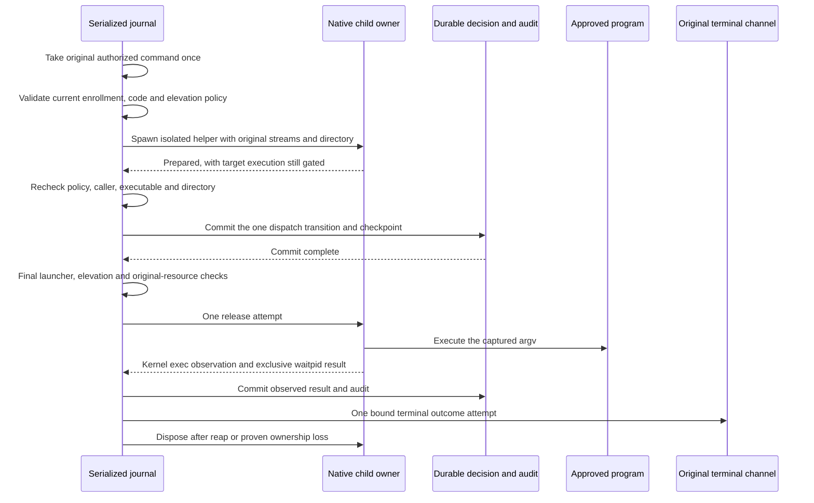

# Durable command dispatch

The journal retains each command's original resources and native process owner under one lock.
The pending request table does not own active children. Closing storage cancels unreleased helpers and leaves released work under native supervision.

## Current trust

The controller retains the winner's enrollment epoch and biometric public key from the consumption transaction.
A current enrollment read must match the active row's phone ID and exact epoch, regardless of retained history order.
Revocation, replacement keys, new enrollment epochs and gateway restrictions prevent release.
Current contract and feature support remain required.

Production construction requires actual Root identity and current authority self-validation.
The launcher must occupy a protected path and match the active command-child code entry.
Check its Developer ID requirement, exact code hash, installed generation and retained floor before preparation and release.
The current frontend policy must still match the retained caller.

The trusted elevation callback must enforce the selected administrator policy. It cannot reenter the journal or execute external actions.
The controller assumes no default policy based on administrator membership.

## Failure boundaries

A failed preparation or final check cancels the helper without releasing the approved program.
A failed dispatch commit never releases it. A failed result commit produces one Unknown on the original terminal channel.
If the coordinator remains usable, retain the original execution owner and retry only the durable Unknown transition.
Runtime and launcher failures before spawning use the same outcome owner. That owner has no runtime validation and cannot spawn.
A later commit cannot revise the caller's Unknown result or repeat execution.
If storage retires, native cleanup still completes; startup recovery must reconcile the unresolved durable outcome.
Known exit and signal values come only from the retained native process owner after kernel execution evidence and reaping.
Incoming receipts, PIDs or supplied observations cannot establish these results.
Generic lifecycle transitions still do not construct a native exit result.

The cleanup timer retains the journal until every native owner is disposed.
It runs independently of request-expiry maintenance and does not need available storage.
An observation error still permits nonblocking reaping of the owned child. It does not force cancellation of released work.
It stops when there are no children. Closure prevents unreleased work; it does not kill released work for history recovery.
The captured terminate/continue option controls caller loss after release. No duration limit is imposed on a running program.

Preparation duration, file mask, active-command capacity and polling interval are bounded host settings.
A polling interval change takes effect when the existing native owners drain.

## Evidence and activation gates

The integration tests use the original Mach submissions and actual unprivileged native fixture processes.
They exercise success, failure, signals, replay rejection, callback reentry, final policy rejection, enrollment changes and storage loss.
Re-enrollment tests preserve retired history in either epoch order.
Result recovery tests hold real SQLite contention or clock failure, then verify one durable Unknown without another execution or reply.
They also close storage while that commit is pending and verify that native cleanup completes.
Pre-spawn runtime and launcher failures retain the same outcome path through commit recovery.
A separate boundary test verifies that a failure owner without runtime validation cannot spawn or release.
The fixture launcher performs no credential change and is never embedded or installed.

This change connects the pipe execution path. It does not install or expose a command service.
Private PTY allocation, continuous stream forwarding, resize and authenticated signal controls remain required before product activation.
The selected elevation-policy integration, protected service installation and physical terminal checks remain gates.

An isolated native regression probe closes its own event descriptor after release.
The previous reap condition reached the three-second failure boundary with exit 8.
The corrected condition reaped the same sleep command without cancellation and returned exit 0.
It retained no kernel exec or exit observation. That fallback therefore cannot establish a known program result.

The complete local gate passed with 1,148 core tests, 97 Swift protocol tests and 532 Kotlin/Android tests.
The debug APK build and Android lint passed.
Caller lifetime observation and pre-spawn classification are described in [Caller lifetime](macos-command-caller-lifetime.md).
