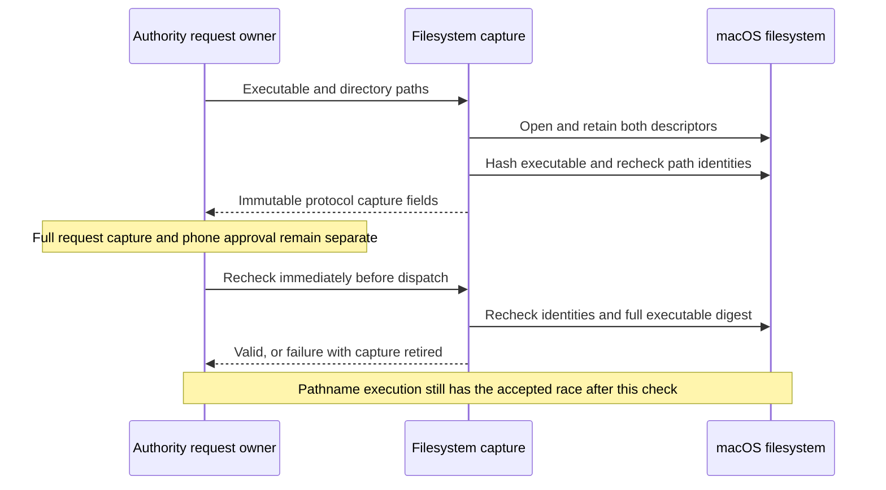

# Mac command filesystem capture

The Mac core now captures an executable's identity and SHA-256 digest, plus the working directory's identity. It preserves each original path as bytes.

## Capture and recheck

`CommandFilesystemCapture` follows normal symlinks and accepts user-owned executables. It does not apply the installer's protected launch-path rules to commands.

The executable must be a regular file with an execute permission bit. The directory must be a directory. The eventual executor must still apply authorization and OS execution checks.

The component reads the complete executable in 64 KiB chunks. It uses the size observed before reading. It rejects short reads and metadata changes during hashing. Growth cannot extend the read indefinitely.

The owner can supply cancellation or deadline checks. These run between reads; a blocking filesystem call remains subject to the filesystem's behavior. There is no silent content truncation or arbitrary executable-size limit.

Retained descriptors bind the captured objects while approval is pending. Recheck compares the original path with those objects, then checks the full digest again. Changes to directory contents alone do not change directory identity.

Any recheck failure closes both descriptors and retires the capture. The owner must close it on request expiry, rejection, cancellation, or completion. Access must remain serialized.

## Security boundary

This component observes files in its calling process. Only an authenticated authority admission path can make those facts trusted request evidence. The protocol value constructors do not confer authority.

The [accepted execution contract](design-decisions.md) permits replacement after the final check. Scripts, interpreters, dependencies, and executable permissions can also change afterward. This check does not make program bytes immutable.

The component does not execute a command. Root admission, requester lifetime, sudoers policy, deterministic environment, decision consumption, process I/O, and recovery remain separate integration work.

## Verification

Tests use temporary files under the current account. They cover complete hashing, symlinks, raw path bytes, replacement, in-place changes, directory replacement, cancellation, and changes during hashing.

No root service is installed. These tests do not establish privileged execution or device end-to-end behavior.
