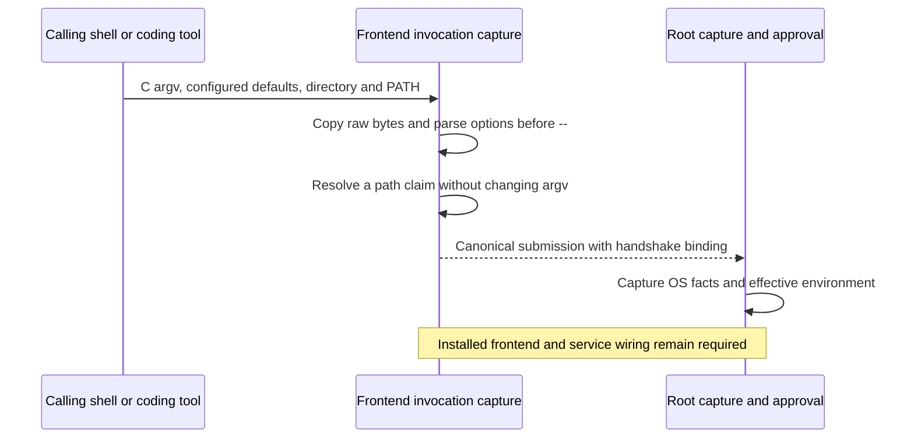

# Command frontend invocation

`CommandFrontendInvocation` builds the untrusted claims for the command frontend.
It copies C argv bytes and creates a canonical `CommandSubmission` for the existing authenticated transport.
It does not authenticate the caller, approve a command, or execute a target.



## Argument boundary

The parser accepts both command names:

```sh
remozio run [options] -- executable [arguments...]
remozio sudo [options] -- executable [arguments...]
```

The required `--` ends frontend options. Every later argument belongs to the target.
Empty arguments, control characters and non-UTF-8 bytes remain unchanged.
No extra shell evaluates these bytes.
Shell operators outside the invocation remain in the calling shell.
For example, the calling shell opens the output file in `remozio sudo -- cmd > file`.
An explicit `remozio sudo -- /bin/sh -c 'cmd > file'` instead includes the redirection in the requested script.

| Option | Requested claim |
| --- | --- |
| `--pty` | Interactive PTY mode |
| `--pipes` | Separate stdin, stdout and stderr |
| `--uid DECIMAL` | Requested target UID; the default is zero |
| `--env NAME=VALUE` | Explicit environment addition; an empty value is valid |
| `--on-disconnect terminate` | Attached command lifetime |
| `--on-disconnect continue` | Explicit continuation after disconnect |
| `--reason TEXT` | Unverified caller rationale |

Repeated options use their last value. Repeated environment names also use their last value.
Environment names are sorted by bytes for canonical encoding.
Environment values preserve raw bytes and any additional equals signs.
Only the rationale needs valid UTF-8 because its protocol field is text.
The parser gets default I/O and disconnect behavior from configuration.
It does not guess PTY mode from stdin or inherit the process environment.
Root still selects the effective target and validates every requested environment addition before approval.

## Path claims and bounds

The frontend can copy its current directory with `getcwd` without Unicode conversion.
Absolute executable paths stay unchanged. Relative paths retain dot components and symlink names.
A bare executable name uses an explicitly supplied PATH.
Relative and empty PATH entries use the captured directory.
Lookup skips directories, files without execute bits and unusable path lengths.
It does not rewrite the original argv zero or claim that a selected file is immutable.

The Root capture retains filesystem identities and descriptors separately.
It must perform the final checks required by the accepted pathname execution contract.
The frontend path lookup grants no authority and cannot replace those checks.

C argv copying and parsing use configurable byte and item ceilings.
Terminating bytes count toward the copy budget, including for empty arguments.
Submission encoding applies the existing CBOR limits again.
No input stream is read, buffered, closed or changed by this code.

## Evidence and remaining work

Seventeen focused tests pass on macOS 27.0.1 with an arm64 macOS 26 deployment target.
They cover actual C pointers, raw-byte protocol round trips, option boundaries, configured defaults and filesystem lookup.
A real executable path also passes the existing filesystem capture and recheck.
The host filesystem rejected creation of a non-UTF-8 fixture filename.
A separate test verifies that a raw absolute path claim remains unchanged for Root validation.

This is invocation code, not an installed CLI executable.
[Pipe controls](macos-command-pipe-controls.md) now preserve separate stdio with negotiated signals and cancellation.
The packaged frontend, service discovery, settings loading and job-state events remain required.
The CLI must also restore terminal settings and bind all controls to the original authenticated execution session.
Protected service activation, elevation-policy selection and physical end-to-end tests remain gates.
These tests do not prove macOS 26 runtime behavior.
