# Command frontend relay

The relay connects the original authenticated execution session to the independently retained calling terminal.
It cannot approve, release, resubmit or repeat a command.
The packaged CLI must serialize its calls and own the local signal loop.

## Routing and bounded progress

`RetainedCommandExecutionSession.executionIOMode` comes from the authenticated profile.
The PTY initializer requires a terminal lease opened before command submission.
The pipes initializer reads and writes no local stream.
Root continues to route redirected stdin, stdout and stderr through their original descriptors.
The relay never chooses its terminal from `isatty(stdin)`.

| Operation | Contract |
| --- | --- |
| Before opened | No raw activation or input read |
| Input | Read at most 4096 bytes within the remaining 32768-byte credit window |
| Full control queue | Retain the whole unsent input chunk |
| Output | Retain one chunk and its unwritten suffix; do not receive another output chunk while blocked |
| Blocked output | Continue bounded input, EOF and resize delivery through the original channel |
| Output acknowledgment | Send only after output ends and every local output byte is written |
| Local EOF | Retain the EOF control until a known-zero send succeeds |
| Resize | Retain the latest dimensions until the original control channel accepts them |
| Progress | Return to the caller without adding a receive wait |
| Idle poll | Use a finite caller-selected wait; never impose a command runtime limit |
| Channel failure | Retire the original channel; never resubmit |

Raw terminal reads require a returning, non-restarting, unblocked `SIGTTIN` handler.
Raw activation, restoration and writes require the corresponding `SIGTTOU` route.
The core owner installs no process signal handlers.
`EINTR` yields to the CLI signal loop instead of restarting the terminal operation.
An exact `MACH_RCV_INTERRUPTED` from stream receive also yields without retiring the admitted channel.
The receive consumed no message. A new poll authenticates the original authority again.
Other transport or authentication failures still retire the channel.
The CLI must reconcile pending local signals before that new poll.
Foreground checks never take foreground.
The kernel's background-write enforcement still depends on the terminal's existing `TOSTOP` setting.

## Suspension and cleanup

```mermaid
stateDiagram-v2
    [*] --> AwaitingOpened
    AwaitingOpened --> Active: Authenticated opened and foreground
    Active --> CleanupPending: Foreground loss or interrupted terminal operation
    CleanupPending --> Active: Restore, then fresh foreground activation
    Active --> Suspended: Explicit restore succeeds before cooperative stop
    Suspended --> Active: Explicit resume and fresh activation
    Active --> TerminalCleanup: Verified terminal result
    TerminalCleanup --> TerminalCleanup: Restoration fails; keep owner and result
    TerminalCleanup --> [*]: Restore and close succeed
```

A historical job observation is metadata. It never directly suspends the frontend.
The CLI must reconcile current local signals and foreground state before a stop.
`prepareForSuspension` disables IO before attempting restoration.
Every native restoration attempt also disables IO until fresh activation succeeds.

Failures preserve the original error and the terminal's restoration obligation.
`close` can retry terminal cleanup without reopening or repeating the command.
A verified terminal result remains available while cleanup waits for foreground.
The terminal owner requires a restoration-failure callback.
If destruction cannot restore settings, it reports that failure before abandoning its descriptor.
This does not promise restoration after process loss or `SIGKILL`.

## Evidence and remaining gates

Sixteen new focused tests pass locally on macOS 27.0.1, build 26A434, on arm64.
The two native fixtures compile with an arm64 macOS 26 deployment target.
One fixture forces actual terminal output backpressure and checks every byte of 1 MiB.
It also checks binary input, copied dimensions, original flags and restored settings.
The other forces a stale foreground check before a real kernel read.
It observes `SIGTTIN` and `EINTR`, preserves queued input, and completes restoration after foreground returns.
Unsafe input signal routes are rejected before consumption.

A real Mach integration test uses the original authenticated execution session.
It checks exact binary input and EOF delivery while local output remains blocked.
It then checks partial output, drain acknowledgment and a historical stopped-job observation.
A second real Mach test sends `SIGWINCH` to its own receiving test thread.
It observes interruption, then completes the same authenticated request without resubmission.
The kernel probe also checks preview and receive interruption with queued-message preservation.
The tests' authority uses the fixture's unprivileged identity. It does not install or elevate a Root service.

The packaged CLI, signal dispatch and event-wait integration remain to be connected.
The headless PTY output destination remains a user UX decision.
These tests do not prove installed service behavior, physical terminal recovery or phone approval.
Actual macOS 26 runtime evidence must be recorded separately from deployment-target compilation.
