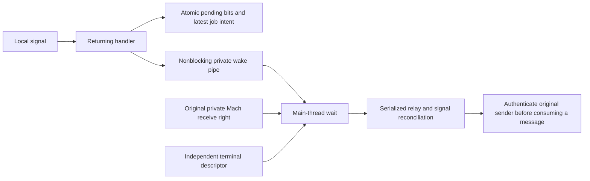
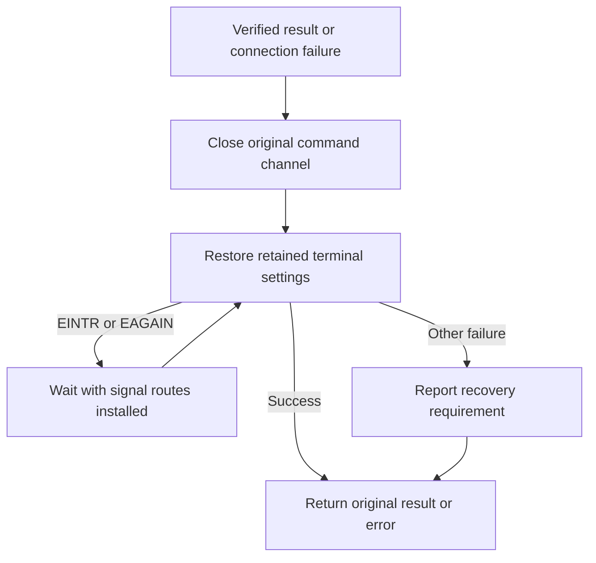

# CLI signal and wait owner

The native owner belongs to one CLI process and its main thread.
The SwiftUI app does not create this owner.
It captures local signals and waits for the original execution channel and independent terminal descriptor.
It does not consume Mach messages, approve commands, or execute targets.



## Wait and cleanup

The owner allocates its own kqueue, wake pipe, and Mach port set.
Attachment rejects a receive right that already belongs to another set.
Destroying the owned set detaches its members without closing the borrowed source.

Level readiness preserves a second queued message after the first message is consumed.
The loop disables sources that the relay cannot currently consume.
A wake event does not replace sender authentication or shorten its validation budget.

The handler preserves errno and performs only signal-safe work.
Atomic bits preserve signals when the pipe is full.
Job intent and pending job bits share one atomic update.
Reading pending events preserves the last stop or continue intent without creating an idle wake loop.

Cleanup first retires the wake destination and restores the previous handlers.
It then waits for entered handlers before closing descriptors.
A failed cleanup preserves native resources for another attempt.
The CLI-only Swift wrapper reports failed cleanup and retains those resources until process exit.

A verified terminal result closes command controls before terminal restoration.
Signals during restoration do not replace that result.
Before a result arrives, a connection failure closes the original channel and retains the saved terminal settings.
The loop retries restoration after EINTR or EAGAIN, then returns the original error.
Other restoration failures produce a recovery message.

Transient restoration failure during local suspension preserves the admitted channel.
The loop retries before forwarding SIGTSTP or attempting the local stop.
It does not reactivate over retained raw settings.



## Cooperative local stop

```mermaid
sequenceDiagram
    participant L as CLI loop
    participant T as Terminal lease
    participant N as Native signal owner
    participant K as Kernel
    L->>T: Restore saved settings
    T-->>L: Restoration succeeded
    L->>N: Observed local suspend; attempt cooperative stop
    N->>N: Reconcile entered handlers and latest recorded intent
    N->>K: Queue SIGTSTP on the masked main thread
    N->>N: Reconcile handlers again
    alt SIGCONT cancelled the intent
        N->>K: Cancel the pending stop with SIGCONT
    end
    N->>K: Atomically unmask during a positive bounded wait
    Note over K: Ordinary SIGTSTP stops this process; SIGCONT resumes it
    K-->>N: Resume, interruption, or orphaned-group timeout
    N-->>L: Restore the returning route and previous mask
    L->>T: Recheck foreground before fresh activation
```

The local operation requires an observed suspend event.
The separate confirmed operation requires a fresh verified ordinary target stop, a local signal ticket, and an unexpired deadline.
A historical target job frame alone permits neither operation.
The caller must restore terminal settings successfully before calling it.
The operation uses SIGTSTP and preserves the kernel's orphaned-group behavior.
It does not force a SIGSTOP or change terminal foreground ownership.

SIGCONT can arrive before queuing, after queuing, or while a handler runs on another thread.
Recorded continuation cancels a stop queued after that continuation's handler returned.
Kernel continuation also cancels a pending stop.
A positive wait bounds signal delivery when the group is orphaned.
It does not limit time spent stopped or the command's runtime.
Cleanup is required after any operation failure.

## Evidence and remaining gates

The two native fixtures compile for arm64 macOS 26 and run in disposable unprivileged processes.
The local runtime is macOS 27.0.1; deployment-target compilation is not macOS 26 runtime evidence.

| Fixture | Measured behavior |
| --- | --- |
| Runtime owner | Two queued Mach messages, disabled-source idle, exact binary input, saturated signal pipe, and independent source lifetime |
| Handler teardown | An entered handler keeps its descriptor alive; actual descriptor reuse leaves the replacement pipe untouched |
| Cooperative stop | Three deterministic cross-thread continuation cases cancel the stop |
| Confirmed stop | Changed tickets, background ownership and expiry prevent a stale stop; actual queuing followed by expiry cancels the stop |
| Private PTY | Actual SIGTSTP follows restoration; background resume refuses activation; foreground resume copies new dimensions |
| Orphaned group | The operation returns and restores its route without forcing a stop or hanging |

Sixteen focused native and relay tests pass after the Swift wrapper compiles.
A temporary negative control removes only continuation reconciliation.
It fails at stage 45 because the worker stops after an earlier continuation; the fixture reaps that worker.
Production source remains unchanged by this control.

The Debug-only composed fixture uses anonymous Mach endpoints and the actual serialized frontend loop.
The runner supplies actual empty and non-UTF8 process arguments, including a non-UTF8 environment addition.
The fixture copies C argv, parses both command aliases, captures its cwd, and resolves its executable claim through the supplied PATH.
It authenticates the current unprivileged fixture code through internal test seams.
The release frontend still requires the configured Root identity.
No fixture executes the requested target, registers a service, or accesses an existing terminal.

| Composed case | Measured behavior |
| --- | --- |
| Pipes | Fresh binding after a verified busy refusal; one admission; original input remains unread; synthetic verified exit 13 |
| Signal | Actual SIGINT becomes an authenticated control; the disposable frontend exits through native SIGINT |
| Private PTY | Exact binary input and output, output-drained acknowledgement, saved settings restored, original flags preserved |
| Result cleanup | One injected EAGAIN and actual SIGINT preserve the verified exit result through a restoration retry |
| Connection cleanup | An injected channel error and restoration failures retain raw settings until cleanup succeeds; the original error survives |
| Suspension retry | An injected restoration failure preserves the admitted channel; authenticated SIGTSTP and SIGCONT complete before exit |
| Confirmed target sample | Explicit profile 10 and a fresh query drive actual SIGTSTP; background resume preserves settings; foreground resume sends new dimensions |

The three cleanup regressions failed before their loop fixes and pass afterward.
Their injected failures wrap a real private terminal lease.
They do not prove actual foreground-loss scheduling in the composed loop.
The separate native fixture checks real foreground transitions.

`scripts/run-macos-frontend-composition.py` runs these seven cases within `scripts/check.sh`.
It records runtime, deployment target, native statuses, and observations in `.build/command-frontend/evidence.json`.
It removes previous success evidence before each run.
The confirmed-stop supervisor owns and reaps its direct child on success and failure.
All terminals and process groups belong to the disposable fixture.
The outer timeout kills only its explicitly created process group.

The tests pause an entered handler. They do not establish every possible kernel scheduling interleaving.
Installed service discovery, composed real-target reconciliation, nested job behavior, physical shell recovery, and privileged phone approval remain separate gates.
The Xcode target now builds and embeds the CLI.
Its loop is still being verified with composed authenticated traffic and complete job-control and cleanup behavior.
Packaging checks exercise help and syntax refusal without submitting a command or activating a service.
