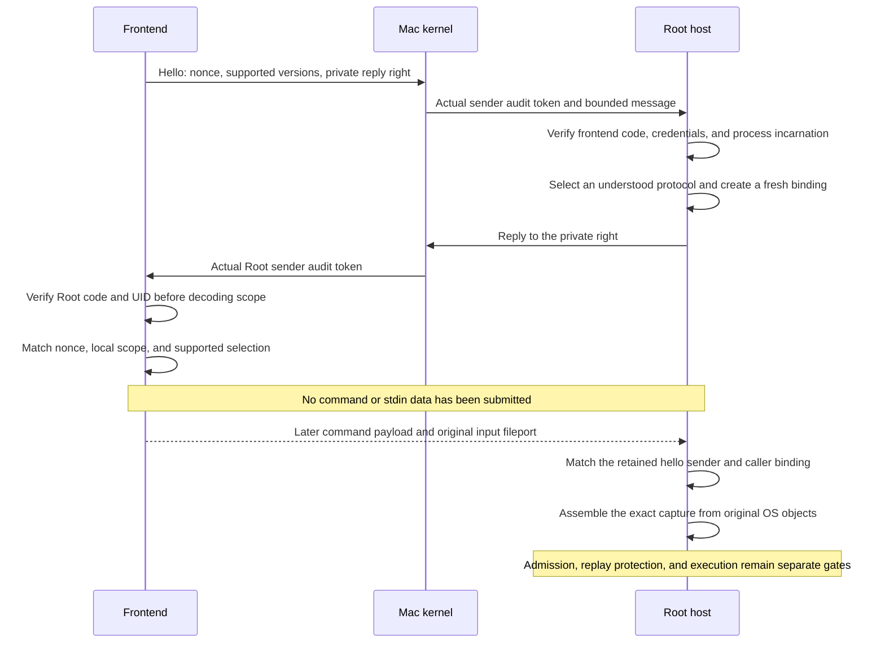

# Authenticated local command handshake

The command frontend sends only protocol metadata before authenticating Root.
`MachCommandHandshakeClient` creates a fresh nonce and private reply port for each attempt.
The reply receiver validates the actual sender against the configured release policy and UID zero before decoding the reply.
A port name or a payload label cannot supply that identity.

## Local protocol selection

The handshake envelope format is version 1. It is a Mac-local protocol, separate from the phone protocol.
The default profile implements wire version 1, command submission schema 1, and input carrier version 2.
An explicit [admission reply profile](macos-command-admission-replies.md) supports input carrier 3 and its private reply right. It does not negotiate retry authority.
The frontend advertises explicit sets. Root selects the highest common implemented wire/carrier pair.
The [typed result contract](macos-command-admission-results.md) uses wire 2 with input carrier 3; legacy combinations remain supported.
The explicit [I/O channel profile](macos-command-io-channels.md) uses wire 3 with carrier 4 and retains all three streams and a terminal reply.
The [PTY stream](macos-command-stream-channel.md) uses wire 4 with carrier 4.
[Pipe controls](macos-command-pipe-controls.md) use wire 5 with carrier 4 and preserve separate stdio.
Each control profile requires an explicit offer. Existing defaults remain unchanged.
There is no fallback to a carrier without the original input fileport.
An authenticated incompatibility reply creates no retained session.
Unknown fields, malformed sets, unsupported selections, changed scope, and wrong nonces fail without submitting a command.

The phone capture schema remains a separate negotiation.
This handshake cannot select a phone schema or relabel an unsupported input source.
It grants no automatic retry class. Future admission replies must define and negotiate those meanings explicitly.

| Message | ID | Header body | Payload limit |
| --- | --- | --- | --- |
| Hello | `0x524d0403` | One copied send right for a private reply port | 4 KiB |
| Hello reply | `0x524d0404` | No carried right | 4 KiB |

Both carriers use a big-endian version and byte count, followed by canonical CBOR and zero alignment padding.
The carrier version is 1. The existing submission and input message IDs retain their existing meanings.
Neither command carrier can substitute for a handshake carrier.
The receiver enforces the control limit before receipt and allocation, even when its command payload limit is larger.
It authenticates the queued sender before importing the reply right and matches the receipt's token and sequence to that preview.

The offer is `{0: format, 1: nonce, 2: capabilities}`.
The nonce has 32 bytes. Capabilities use keys 0, 1, and 2 for wire, submission, and input versions.
Each version array contains one to 16 sorted, unique integers from 1 to 65535.
The current server configuration cannot advertise a version its implementation does not support.

The reply is `{0: format, 1: offerNonce, 2: status, 3: profile}`.
Status 1 requires a profile; status 2 requires null and means incompatible.
Other statuses are rejected. A profile uses keys 0–5 for wire, submission, input, caller binding, Mac ID, and account ID.
Each scope ID and the caller binding has 16 bytes.
Scope comes from the trusted host configuration and must match the client's expected local scope.
A changed critical field or meaning requires an understood new format or wire version. Do not ignore it as display metadata.

## Retained process binding

`RetainedCommandHandshake` consumes the verified hello once and retains its original dynamic code reference and complete audit token.
`assemble` rechecks both that sender and the actual input-message sender under current protected policy.
It compares their complete audit bindings, including process incarnation and credentials.
A copied caller binding cannot make another process match.
It then uses the negotiated submission schema and original payload to construct `RetainedCommandCapture`.

The host supplies the resolved target, minimal environment, fresh stream binding, and phone capture schema.
Assembly does not read stdin. It changes no command, environment, or path semantics.
A rejected assembly closes the incoming caller and input; it does not close an earlier command capture.
Closing the session prevents further assembly. Existing command requests retain their own objects and follow their existing lifecycle.

The public server initializer and assembly API use Swift `sending` parameters.
The private reply right is released after its one reply, on rejection, or when an unused hello closes.
The client retains its owned reply port through the complete exchange and closes it on every return path.
A successful handshake also retains a reference to the negotiated authority destination until closure.
The client returns this handshake through an exclusive Swift `sending` transfer.
Recoverable send failure destroys pseudo-received Mach rights while preserving the caller's borrowed port rights.
The client uses one timeout budget across sending, receipt, and final validation. That budget does not shorten an admitted approval request.

## Evidence and remaining host work

Real Mach tests exchange hellos and replies, check fresh bindings, and assemble the exact invocation while retaining unread pipe bytes.
They compare port reference counts after discarded hellos, malformed descriptors, wrong senders, and full-queue send timeouts.
They reject another real process and an exec-changed incarnation, even when the PID or supplied binding matches.
Codec tests reject malformed capabilities, unknown critical fields, changed scope/nonces, and unsupported or contradictory replies.
External Swift compiler probes accept valid hello/input transfers and reject direct or retained-alias reuse after either transfer.

These tests use disposable ports, storage-free metadata, and explicit ad-hoc fixture policies under the test user's UID.
They do not prove a live Developer ID frontend-to-Root deployment or a pre-login listener.
The public client requires a release `XPCPeerPolicy` with expected UID zero. Product callers cannot select the ad-hoc test seam.

The Root host must validate current component roles and floors, reserve session capacity, own the registered receive port, and serialize its sole consumer.
The [session registry](macos-command-session-registry.md) now owns bounded retained sessions and their retirement.
The host must drive its serial receive loop and idle pruning, then recheck current protocol support before admission.
Submission replay reservation, authenticated no-admission replies, elevation policy, resource budgets, dispatch permits, and process I/O remain required.
A hello or profile is not an admission acknowledgment, execution permit, or proof that a command can be retried.
This change registers no service, selects no sudoers policy, and executes no approved command.

Mach rights follow Apple's [message declarations](https://github.com/apple-oss-distributions/xnu/blob/main/osfmk/mach/message.h).
Recoverable send cleanup follows Apple's [Mach message implementation](https://github.com/apple-oss-distributions/xnu/blob/main/libsyscall/mach/mach_msg.c).
